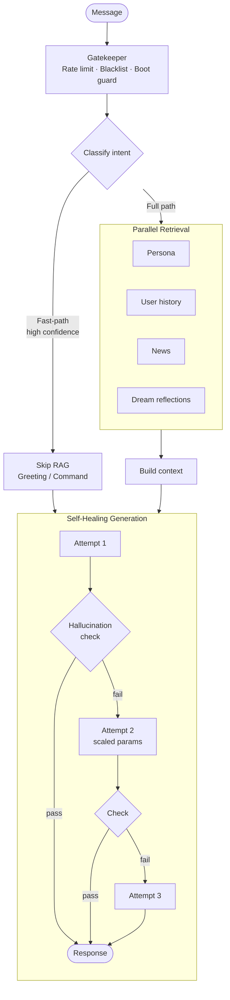
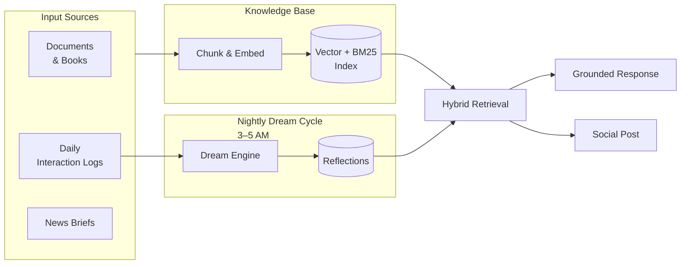
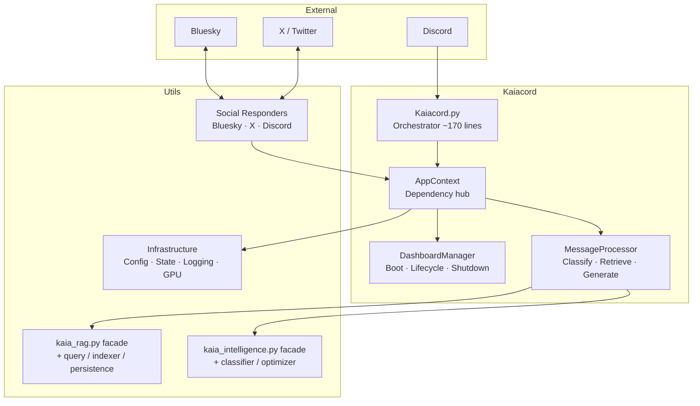

# Kaiacord — Docs / Tools / Scripts / README Audit
**Date:** March 9, 2026
**Reviewer:** Claude (Senior Principal Engineer)
**Scope:** docs/, tools/, scripts/, README.md — accuracy, staleness, missing content, formatting

---

## Executive Summary

The documentation structure is solid and clearly organized. The primary problem is **documentation drift** — many files accurately describe the architecture as of Phases 1–20 but haven't been updated to reflect the Phase 28 deep split, Phase 29 rollbacks, or Phase 30–31 fixes. The tools/ README and `procedures.md` reference several scripts that should be archived per `docs/reports/scripts_audit.md`, but the archiving apparently never happened. The README.md is functional but visually flat and contains a few factual errors. The `docs/03-architecture/overview.md` still says "Phases 1–15" and references the old monolithic file sizes.

Severity scale: 🔴 Wrong/Broken · 🟡 Stale/Misleading · 🔵 Missing · 💡 Enhancement

---

## Part 1 — docs/ Audit

### docs/README.md

**Status: ✅ Accurate — minor enhancement needed**

The index is correct and all links point to real files. One missing entry:

- 💡 `docs/04-development/` only lists "Testing Guide" — the `04-security/` directory (created Phase 28, contains `x-twikit-credentials.md`) is not listed at all. Add a `### 🔒 [04 - Security](04-security/)` section.
- 💡 The "Quick Links" table has 5 rows. Add one for "Commands" (`docs/02-user-guide/commands.md`) since it's the most-used reference.

---

### docs/03-architecture/overview.md

**Status: 🟡 Stale — multiple inaccuracies**

| Issue | Current Text | Should Say |
|-------|-------------|------------|
| 🟡 Phase count in subtitle | "after the latest refactors (Phases 1–15)" | "after Phase 31 refactors" |
| 🟡 `kaia_rag.py` listed as single file in Core Logic subgraph | `RAG[kaia_rag.py]` | Should reflect facade + 4 mixin modules (`kaia_rag.py`, `kaia_rag_query.py`, `kaia_rag_indexer.py`, `kaia_rag_persistence.py`, `kaia_rag_retriever.py`) |
| 🟡 `kaia_intelligence.py` listed as single file | `Intel[kaia_intelligence.py]` | Now a facade + `intent_classifier.py` + `context_optimizer.py` |
| 🔵 Missing social layer in diagram | No `social/` in mermaid graph | Add `Social[social_responder.py / bluesky / X]` node |
| 🔵 Missing `tools/` in directory tree | Directory tree omits `tools/` entirely | Add `tools/` block |
| 🟡 Phase 3 boot description | Correct but vague | Mention Dream Engine init now also happens in Phase 3 |

**Suggested mermaid fix for the system diagram** — replace the Core Logic subgraph with:
```
subgraph CL ["Core Logic"]
    RAG["kaia_rag.py (facade)\n+ query / indexer / persistence"]
    Intel["kaia_intelligence.py (facade)\n+ intent_classifier / context_optimizer"]
    Dream[kaia_dream.py]
    MP[message_processor.py]
end
```

---

### docs/03-architecture/utils-reference.md

**Status: 🟡 Stale — Phase 28 deep split not reflected**

The table for `utils/core/` lists `kaia_rag.py` and `kaia_intelligence.py` as single-purpose modules. After Phase 28 CQ-01 split, these are facades. The mixin modules are completely absent:

**Missing rows to add:**

| Module | Purpose |
|--------|---------|
| `kaia_rag_query.py` | Hybrid BM25+vector retrieval, scoring, identity resolution |
| `kaia_rag_indexer.py` | File indexing, BM25 build/persist, parallel ingestion |
| `kaia_rag_persistence.py` | RAG state persistence, pre-warming, interaction logging |
| `kaia_rag_retriever.py` | Lock decorator, read/write access control |
| `intent_classifier.py` | CPU-based intent classification (split from kaia_intelligence.py) |
| `context_optimizer.py` | Context window shaping (split from kaia_intelligence.py) |
| `context_enricher.py` | URL fetching, image attachment handling |
| `hallucination_detector.py` | Standalone canonical hallucination pattern detector |

Also: `social_bluesky_polling.py`, `social_x_polling.py`, `social_responder_core.py` (all split from `kaia_social_responder.py`) are absent.

`shutdown_fixed.py` listed in infrastructure — should be `shutdown_manager.py` or verify actual filename.

---

### docs/03-architecture/gpu-management.md

**Status: ✅ Mostly accurate — one stale reference**

- 🟡 The boot sequence description (Phase 1/2/3) is accurate and matches code.
- 🟡 VRAM table says `gemma3:12b` → `~8GB` — correct.
- 🔴 "Context window is set to **8K tokens**" — this matches current config (`max_context_tokens: 8192`). Confirm `kaia.yaml` agrees. Previous docs cited 20K/24K/28K; the fix-history says 8K was the hardware-balanced value. This is correct as written.
- 💡 Add a note about `BotState._write_lock` (Phase 31 fix) preventing JSON corruption under concurrent writes — the shutdown section doesn't mention it.

---

### docs/03-architecture/rag-system.md

**Status: 🟡 Stale (not fully reviewed — content not in project knowledge, but structure references are wrong based on overview.md drift)**

Based on the Phase 28 split, this doc almost certainly still describes `kaia_rag.py` as a monolith. Flag for Antigravity to review and update to reflect the 5-file split architecture.

**Recommended additions:**
- BM25 persistence via pickle (implemented Phase 26, PF-01)
- User isolation model (per-user retrieval, identity registry)
- `_FILENAME_REF_PATTERNS` fast path for filename-based queries
- Adaptive skip for high-confidence SOCIAL_GREETING/COMMAND_EXECUTION (bypasses RAG entirely)

---

### docs/03-architecture/intelligence-layer.md

**Status: 🟡 Stale (same issue as rag-system.md)**

Almost certainly describes the monolithic `kaia_intelligence.py`. After Phase 28, the split is:
- `kaia_intelligence.py` — 35-line facade
- `intent_classifier.py` — CPU regex + LLM classification
- `context_optimizer.py` — context window shaping

The `!think` command and `_THINK_BLOCK_PATTERN` were added (Phase 27) then fully removed (Phase 29). Verify this doc doesn't mention `!think` or Qwen-specific logic.

---

### docs/02-user-guide/commands.md

**Status: 🟡 Stale — references removed commands, missing restored ones**

- 🔴 `!think` command: Was added Phase 27, **rolled back Phase 29**. If this file mentions `!think`, it must be removed.
- 🔵 `!snapshot`, `!audit`/`!flag`, `!explain` — restored in Phase 26 (Tier 1 Commands) but the command reference may not reflect them depending on when it was last edited. Verify these are listed.
- 💡 The `!download <url>` command added in Phase 28 (CQ-01 work) may be missing if the doc predates that.
- 💡 Add "Conversational Triggers" section if not already present — "status", "what's new", etc.

---

### docs/02-user-guide/social-media.md

**Status: ✅ Accurate and well-written**

Good detail on circuit breakers, 401 recovery, and session handling. One item:
- 💡 Add the `memory/social_replied_ids.json` mention in Files Reference — it's already there ✅
- 🔵 Doesn't mention the `social.admin_handles` config key in the Configuration section — add it for completeness since it's mentioned in the tech detail section but not the config block.

---

### docs/05-maintenance/procedures.md

**Status: 🔴 Stale — references archived/deprecated tools as active**

Per `docs/reports/scripts_audit.md`, `refresh_news.py` was flagged for archiving. `procedures.md` still lists it:

```
### `refresh_news.py`
**Purpose**: Quick refresh of news content
**Usage**: `python tools/maintenance/refresh_news.py`
```

**Changes needed:**
- 🔴 Remove `refresh_news.py` entry (archived per scripts_audit.md)
- 🔴 Remove `generate_user_profiles.py` path shows `tools/development/` — verify actual path (some docs say `tools/development/`, others say it's directly in `tools/`)
- 🟡 `proper_fix.py` — document that it raises `SystemExit` at `tools/legacy/` and that the active version is a surgical hallucination removal tool, not a boilerplate fixer
- 🔵 Add `ingest_manual_news.py` to the Maintenance section (it's in the TUI but not in procedures.md)
- 🔵 Add `rebuild_rag_gpu.py` to the Maintenance section — it's surfaced in the TUI as a core recovery tool

---

### docs/05-maintenance/fixes-history.md

**Status: 🟡 Incomplete — stops at Phase 25**

The fixes history documents Phases 1–25 well. Phases 26–31 are summarized in MASTER_REPORT but not in fixes-history. For future maintainers or AI agents, it's useful to have this filled in.

**Recommended additions:**
- Phase 26: Claude Review (16 fixes), Tier 1 commands, roleplay regression fix
- Phase 27: Qwen migration (and note it was rolled back)
- Phase 28: CQ-01 deep split
- Phase 29: Qwen rollback details
- Phase 30: 9 targeted code quality fixes
- Phase 31: 5 silent bug fixes (config mismatches, broken import, gather safety, atomic writes)

---

### docs/archive/v1/ARCHITECTURE-old.md and REFACTORING_SUMMARY.md

**Status: 🔵 Warning banners need to move to line 1**

Per finding DC-07 from the original Feb 26 audit (still open): the `[!WARNING]` blocks are embedded in the document body, not at the very top. An AI agent skimming quickly might miss them.

**Fix:** Both files should have the `> [!WARNING]` block as the absolute first content, before any `---` or heading.

Both files already have the warnings — this is a one-line move per file.

---

### docs/04-security/ (missing from docs/README.md index)

**Status: 🔵 Missing from index**

Phase 28 created `docs/04-security/x-twikit-credentials.md`. This directory and file are not listed in `docs/README.md`. Add:

```markdown
### 🔒 [04 - Security](04-security/)
- [X/twikit Credentials & Risk Notice](04-security/x-twikit-credentials.md)
```

---

### docs/reports/scripts_audit.md

**Status: 🟡 Prescribed actions appear unexecuted**

The audit file exists and documents which scripts to archive. The archive `mv` commands are all written out. But based on the current state of `tools/README.md` and `procedures.md` still referencing archived scripts, the physical moves and doc updates were likely never executed.

**This is a task backlog item, not a doc fix — flag for Antigravity to execute.**

---

## Part 2 — tools/ Audit

### tools/README.md

**Status: 🟡 Stale — references tools that should be archived, missing new tools**

**Stale entries (reference scripts flagged for archiving):**

| Entry | Status | Action |
|-------|--------|--------|
| `tools/recovery/clean_hallucinated_logs.py` | In README as active | Remove — archived per scripts_audit.md |
| `tools/recovery/emergency_hallucination_cleanup.py` | In README as active | Remove — subsumed by proper_fix.py |
| `tools/diagnostics/trigger_rag_refresh.py` | In README as active | Remove — duplicate of force_reindex.py |
| `tools/development/profile_generator.py` | In README as active | Remove — subsumed by generate_user_profiles.py |
| `tools/maintenance/refresh_news.py` | In README as active | Remove — background-only, subsumed |

**Missing entries (tools that exist but aren't documented):**

- 🔵 `tools/maintenance/ingest_manual_news.py` — surfaced in TUI, not documented
- 🔵 `tools/rebuild_rag_cpu.py` — exists in project knowledge but not in README quick-reference table (only GPU version listed)
- 🔵 `tools/storage/` — index_store.json lives here; mention the storage directory

**Accuracy issues:**

- 🔴 The `find_contamination.py` description says "Scan for known hallucination patterns (Juanita, Deane, etc.)" — these were specific early contamination names that have since been cleaned. The description should be more generic: "Scans user logs and knowledge base for known hallucination patterns."
- 🟡 The Quick Reference table header says "Tool" but lists paths with directory prefixes inconsistently — some have `tools/` prefix, most don't.
- 🟡 The recovery workflow shows `proper_fix.py --dry-run` — verify this flag actually exists (the archived version at `tools/legacy/` raises SystemExit immediately; the active version needs `--dry-run` support documented or removed from examples).

---

### tools/tests/ (the test suite docs)

**Status: 🟡 18 known failing tests undocumented in tools/**

The MASTER_REPORT notes "18 pre-existing test failures" in `tools/tests/`. The `tools/README.md` test section doesn't mention this. Add a known issues note:

```markdown
> **Note**: 18 tests in `tools/tests/` have pre-existing failures unrelated to recent development.
> These are tracked but not blocking. Run `pytest -q 2>&1 | tail -30` to see current status.
```

---

### tools/legacy/

**Status: 🔴 Not all flagged-for-archive scripts have been moved**

Per `docs/reports/scripts_audit.md`, 8 tools were flagged for archiving to `tools/legacy/`. Based on `procedures.md` and `tools/README.md` still referencing them as active, the moves haven't happened. The `tools/legacy/` directory exists (proper_fix.py is confirmed there with SystemExit guard) but is incomplete.

**Pending moves (from scripts_audit.md):**
```bash
mv tools/maintenance/refresh_news.py tools/legacy/
mv tools/trigger_reindex.py tools/legacy/
mv tools/diagnostics/trigger_rag_refresh.py tools/legacy/
mv tools/diagnostics/repro_rag_failure.py tools/legacy/
mv tools/diagnostics/repro_bluesky_timeout.py tools/legacy/
mv tools/development/profile_generator.py tools/legacy/
mv tools/recovery/clean_hallucinated_logs.py tools/legacy/
mv tools/recovery/emergency_hallucination_cleanup.py tools/legacy/
```

---

## Part 3 — scripts/ Audit

### scripts/README.md

**Status: 🟡 Sparse — typo and missing detail**

- 🔴 Typo: "Interactive **Whiltail** TUI" → should be "**Whiptail** TUI"
- 🔵 `run_finetune.sh` is listed but has no description of what the fine-tune pipeline does or what dependencies it needs. Add: "Runs the Kaia LoRA fine-tune pipeline using Unsloth/PEFT. Requires a compatible GPU and fine-tune dataset. See script header for setup."
- 🔵 No mention of `kaia-tools.sh` requiring `whiptail` to be installed (`sudo apt install whiptail`)
- 💡 Add a one-line note about what `kaia-tools.sh` covers at a high level — new contributors won't know this is the main maintenance interface.

**Suggested replacement for the Active Scripts table:**

```markdown
| Script | Purpose | Requires |
|:-------|:--------|:---------|
| `kaia-tools.sh` | Interactive whiptail TUI — bot lifecycle, RAG management, news, recovery, diagnostics | `whiptail` (Ubuntu/Debian default) |
| `run_finetune.sh` | LoRA fine-tune pipeline automation | GPU + Unsloth/PEFT dependencies |
```

---

### scripts/kaia-tools.sh

**Status: ✅ Well-implemented — two robustness issues**

The TUI itself is solid — good structure, double-confirm on nuclear reset, `--dry-run` for surgical fix. Two issues:

- 🔴 **Hardcoded dual-path fallback for diagnostics tools** — e.g.:
  ```bash
  if   [[ -f tools/diag_rag_index.py ]]; then ...
  elif [[ -f tools/diagnostics/diag_rag_index.py ]]; then ...
  ```
  This dual-path check exists in 3 places in the RAG diagnostics menu. It's a sign that the script was written before the tools were finalized in `tools/diagnostics/`. Once scripts_audit.md archiving is done and tools are in their canonical locations, these should be simplified to single-path calls.

- 🟡 **`set -uo pipefail` but not `set -e`** — the script uses `set -uo pipefail` (undefined variable checking + pipe failure propagation) but doesn't set `-e` (exit on error). For a maintenance TUI where most operations are intentionally error-tolerant this is acceptable, but worth noting. The `run_tool` function handles missing files gracefully.

- 🔵 **No `kaia-tools.sh --help`** — add a short help block at top for non-interactive invocation:
  ```bash
  if [[ "${1:-}" == "--help" ]]; then
      echo "Usage: bash scripts/kaia-tools.sh"
      echo "Interactive whiptail TUI for Kaiacord maintenance."
      exit 0
  fi
  ```

---

## Part 4 — README.md Rewrite

### Current State Assessment

The README is functional but has several problems:
- The three mermaid diagrams have structural issues (broken subgraph nesting in the "Architecture" diagram)
- Language is bland in places ("Kaia is a self-hosted Discord AI bot")
- The GPU table is the best section — clear and useful
- The project structure tree has a typo: "Bash automation & interactve TUI" (missing 'i' in interactive)
- "Custom Persona" section points to `knowledge_base/kaia_persona.md` but actual path is `config/kaia_persona.md`
- Testing section says `python tools/rebuild_rag.py` — this path doesn't exist (should be `tools/rebuild_rag_gpu.py` or `tools/rebuild_rag_cpu.py`)

### Rewrite

Below is a complete replacement README.md. Goals: accurate, visually clean, more personality, better diagrams, professional but grounded in the project's actual aesthetic (lowercase, direct, technical).

---

```markdown
<div align="center">

# KAIACORD

**A self-hosted Discord AI with persistent memory, local inference, and a real personality.**

*Built for an RTX 3060 12GB. No cloud required. No subscriptions. No tracking.*

[](https://python.org)
[](https://ollama.com)
[](https://discordpy.readthedocs.io)
[](LICENSE)

</div>

---

Kaia is a Discord bot that actually remembers you. She builds a personal knowledge base from your conversations, dreams about them at night, and grounds every response in what actually happened — not what a cloud model guesses.

She has a persona (blunt, lowercase, technically precise), cross-posts to Bluesky and X, monitors forums, and generates daily news briefs via Gemini. The whole stack runs locally with Ollama.

---

## How it works

```
Message arrives → classify intent → retrieve memory → generate response → validate → send
```

Three stages, all local:

**1. Classify** — a lightweight CPU model (gemma2:2b) decides what kind of question this is. Fast-path regex for simple cases, full LLM for ambiguous ones.

**2. Retrieve** — hybrid BM25 + vector search across persona, user history, news, dreams, and knowledge docs. Identity-aware: forum and Discord profiles merge into one context.

**3. Generate** — gemma3:12b produces the response in Kaia's voice. A 3-pass self-healing loop catches bad output. Hallucination detection strips fabrications before they reach the user.

---

## Processing pipeline



---

## Memory & Reflection

Kaia doesn't just retrieve — she reflects. Every night (3–5 AM) the Dream Engine processes the day's conversations into associative summaries that get re-injected into the RAG index.



---

## Architecture



---

## Quick start

```bash
# 1. Clone and install
git clone https://github.com/your-repo/Kaiacord.git
cd Kaiacord
pip install -r requirements.txt

# 2. Pull models
ollama pull gemma3:12b            # Chat (~8GB VRAM)
ollama pull gemma2:2b             # Intent classifier (CPU)
ollama pull nomic-embed-text-cpu  # Embeddings (CPU)

# 3. Configure
cp .env.example .env
# Edit .env — add DISCORD_TOKEN at minimum

# 4. Launch
python Kaiacord.py

# With TUI dashboard (default)
python Kaiacord.py

# Without curses UI (log-only mode)
python Kaiacord.py --no-gui
```

First message: `@kaia status` in Discord to verify she's running.

---

## Features

| | Feature | Detail |
|:--|:--------|:-------|
| 💬 | **Local inference** | gemma3:12b via Ollama, 8K context, fully offline |
| 🧠 | **Persistent memory** | RAG-backed knowledge base, per-user profiles, conversation history |
| 🌙 | **Dream Engine** | Nightly associative recall — processes daily logs into reflections |
| 🔍 | **Hybrid retrieval** | BM25 + vector search with reciprocal rank fusion |
| 🛡️ | **Hallucination guard** | Adversarial self-check, knowledge boundary enforcement |
| 🔄 | **Self-healing** | 3-pass generation loop with automatic parameter scaling |
| 📰 | **Daily news** | Auto-generated tech briefs via Gemini API, 14-day retention |
| 🐦 | **Social media** | Cross-posts to Bluesky and X, replies to mentions |
| 🏛️ | **Forum integration** | VBulletin scraping, Discord ↔ Forum identity linking |
| 📊 | **Curses dashboard** | Real-time VRAM/GPU stats, live log stream |
| ⚡ | **Circuit breakers** | Automatic failure isolation for all external APIs |

---

## Commands

| Command | Description | Who |
|:--------|:------------|:----|
| `!news [category]` | Fetch news briefs (`today`, `technology`, `security`, `hacking`, `politics`, `business`, `science`, `culture`) | All |
| `!download <url>` | Ingest a URL into the knowledge base | All |
| `!quip` | Trigger a social media post (10m cooldown) | All |
| `!forum link <uid>` | Link Discord identity to forum profile | All |
| `!dreams list` | Show recent dream reflections | Admin |
| `!dreams generate` | Force a dream cycle | Admin |
| `!cache clear` | Wipe response cache | Admin |
| `!forum scrape` | Manually scrape configured subforum | Admin |
| `!snapshot` | Save current conversation context | Admin |
| `!flag` / `!audit` | Flag a response for review | Admin |

Kaia also responds naturally (no `!`) to: `status`, `stats`, `what's new`, `how are you`, and direct questions.

---

## GPU budget

Kaia manages a single 12GB VRAM budget. Classification and embeddings are hard-pinned to CPU.

| Model | Role | Device | VRAM |
|:------|:-----|:-------|:----:|
| `gemma3:12b` | Chat & generation | GPU | ~8 GB |
| `gemma2:2b` | Intent classification | CPU (`num_gpu: 0`) | 0 |
| `nomic-embed-text-cpu` | RAG embeddings | CPU (`num_gpu: 0`) | 0 |

Context window: **8,192 tokens** (~1GB KV cache). Configurable in `config/kaia.yaml`.

See: [`docs/03-architecture/gpu-management.md`](docs/03-architecture/gpu-management.md)

---

## Configuration

### `.env`
```env
DISCORD_TOKEN=your_discord_bot_token
GEMINI_API_KEY=your_key           # Optional — required for news generation
BLUESKY_HANDLE=yourbot.bsky.social  # Optional — for social posting
BLUESKY_APP_PASSWORD=xxxx-xxxx-xxxx-xxxx
X_USERNAME=YourUsername            # Optional — unofficial API (see security notice)
X_PASSWORD=YourPassword
```

### `config/kaia.yaml`
```yaml
discord:
  blacklisted_channels: "general,announcements"

models:
  chat: "gemma3:12b"

performance:
  max_memory_messages: 30
  max_context_tokens: 8192
  requests_per_minute: 30

bluesky:
  enabled: false
  reply_to_mentions: false

x_twitter:
  enabled: false
  reply_to_mentions: false
```

Full config reference: [`config/default_config.yaml`](config/default_config.yaml)

---

## Project structure

```
Kaiacord/
├── Kaiacord.py              # Orchestrator (~170 lines)
├── config/                  # YAML config, persona, entity databases
├── knowledge_base/          # RAG document storage (books, news, user logs)
├── memory/                  # Persistent state (bot_state.json, rag_storage/)
├── logs/                    # Consolidated log: kaiacord.log
├── utils/
│   ├── core/                # RAG, Intelligence, Dream Engine, MessageProcessor
│   ├── infrastructure/      # AppContext, Dashboard, Logging, Config, GPU
│   ├── social/              # Bluesky, X, Social Responders
│   ├── commands/            # Discord command handlers
│   └── news/                # News retrieval & management
├── tools/
│   ├── maintenance/         # update_kaia_news.py, health_check.py, force_reindex.py
│   ├── diagnostics/         # RAG index scanning, embedding verification
│   ├── recovery/            # find_contamination.py, nuclear_reset.py
│   ├── development/         # generate_user_profiles.py
│   ├── rebuild_rag_gpu.py   # Full GPU-accelerated RAG rebuild
│   └── tests/               # pytest suite (unit / verification / integration)
├── scripts/
│   └── kaia-tools.sh        # Interactive whiptail TUI for all maintenance
└── docs/                    # Full documentation
```

---

## Maintenance

The fastest way to manage everything is the TUI:

```bash
bash scripts/kaia-tools.sh
```

Direct commands:
```bash
# Verify environment
python tools/maintenance/health_check.py

# Update today's news
python tools/maintenance/update_kaia_news.py

# Force RAG re-index
python tools/maintenance/force_reindex.py

# Full RAG rebuild (GPU — bot must be stopped)
python tools/rebuild_rag_gpu.py --clear
```

---

## Testing

```bash
# Health check first
python tools/maintenance/health_check.py

# Unit tests
PYTHONPATH=. pytest tools/tests/unit/ -q

# Verification tests
PYTHONPATH=. pytest tools/tests/verification/ -q
```

`pytest.ini` at project root handles async automatically. No `@pytest.mark.asyncio` needed.

---

## Persona

Edit `config/kaia_persona.md` to change her personality. She re-reads it on every restart.

The persona shapes tone, not facts. Memory comes from the knowledge base.

---

## Documentation

Full docs: [`docs/README.md`](docs/README.md)

| Topic | Link |
|:------|:-----|
| Quick Start | [`docs/01-getting-started/quick-start.md`](docs/01-getting-started/quick-start.md) |
| Commands | [`docs/02-user-guide/commands.md`](docs/02-user-guide/commands.md) |
| Architecture | [`docs/03-architecture/overview.md`](docs/03-architecture/overview.md) |
| GPU Management | [`docs/03-architecture/gpu-management.md`](docs/03-architecture/gpu-management.md) |
| RAG System | [`docs/03-architecture/rag-system.md`](docs/03-architecture/rag-system.md) |
| Social Media Setup | [`docs/02-user-guide/social-media.md`](docs/02-user-guide/social-media.md) |
| X Security Notice | [`docs/04-security/x-twikit-credentials.md`](docs/04-security/x-twikit-credentials.md) |
| Testing | [`docs/04-development/testing.md`](docs/04-development/testing.md) |
| Troubleshooting | [`docs/06-troubleshooting/common-issues.md`](docs/06-troubleshooting/common-issues.md) |
| Tools Reference | [`tools/README.md`](tools/README.md) |
| Reports & Planning | [`docs/reports/README.md`](docs/reports/README.md) |

---

## License

[MIT](LICENSE)

---

<div align="center">
<sub>
Built by Ekco · engineered with Claude, Gemini/Antigravity, Deepseek — local AI, no cloud required
<br>
Optimized for RTX 3060 12GB · gemma3:12b · Python 3.11
</sub>
</div>
```

---

## Summary of All Actions for Antigravity

### Immediate (doc-only edits, 30 min)

1. **`docs/README.md`** — Add `04-security/` section, add Commands quick-link
2. **`docs/03-architecture/overview.md`** — Update phase count, fix mermaid to reflect Phase 28 splits
3. **`docs/03-architecture/utils-reference.md`** — Add 8 missing module entries for Phase 28 split files
4. **`docs/02-user-guide/commands.md`** — Remove `!think` if present, verify `!snapshot`/`!flag`/`!explain`/`!audit` are listed, add `!download`
5. **`scripts/README.md`** — Fix "Whiltail" typo, add `whiptail` dependency note
6. **`docs/archive/v1/` both files** — Move `[!WARNING]` to absolute line 1
7. **`README.md`** — Replace with the rewrite above

### Short-term (file moves + doc updates, 1 hr)

8. Execute all `mv` commands from `docs/reports/scripts_audit.md`
9. Update `docs/05-maintenance/procedures.md` — remove archived tools, add missing ones
10. Update `tools/README.md` — remove archived tool entries, add missing tools, fix typos
11. Update `scripts/kaia-tools.sh` — consolidate dual-path diagnostic fallbacks to canonical paths

### Medium-term (content work)

12. **`docs/03-architecture/rag-system.md`** — Full rewrite to reflect 5-file split, BM25 persistence, identity isolation
13. **`docs/03-architecture/intelligence-layer.md`** — Update to reflect facade + split modules, remove any Qwen/`!think` references
14. **`docs/05-maintenance/fixes-history.md`** — Add Phases 26–31 entries

---

*End of Audit · March 9, 2026*
