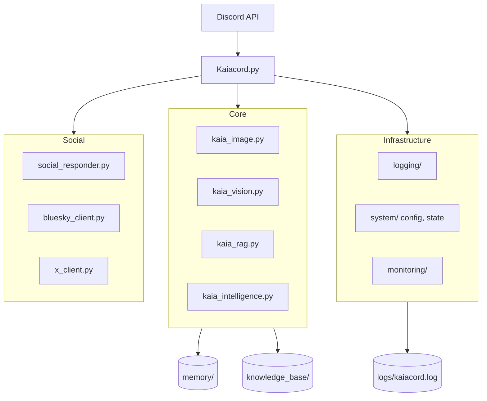

<h1 align="center">Kaiacord 🤖</h1>

<p align="center">
  
  
  
  
  
  
  
  
</p>

<p align="center">
  <strong>A Linux-native, self-hosted AI chatbot for Discord with local inference, memory, vision, and image generation.</strong>
</p>

---

## 🚀 Quick Start (5 Minutes)

### Prerequisites
- **Python** 3.9+
- **GPU** with 8GB+ VRAM (12GB recommended for RTX 3060)
- **Discord Bot Token** ([Get one here](https://discord.com/developers/applications))
- **Ollama** installed ([Download](https://ollama.ai))

### Installation
```bash
# 1. Clone and setup
git clone https://github.com/YOUR_USERNAME/Kaiacord.git
cd Kaiacord
python -m venv venv
source venv/bin/activate
pip install -r requirements.txt

# 2. Pull AI models (this will take a while)
ollama pull gemma3:12b           # Chat model (8GB)
ollama pull llama3.2-vision:11b  # Vision model (7.5GB)
ollama pull nomic-embed-text     # Embedding model

# 3. Configure
cp .env.example .env  # Create from example, or:
echo "DISCORD_TOKEN=your_token_here" > .env
echo "GEMINI_API_KEY=your_key_here" >> .env  # Optional: for news generation

# 4. Launch!
python Kaiacord.py
```

**First message**: `@kaia status` in Discord to verify it's working!

---

## 🎉 What's New in v2.1

**v2.1** introduces a **Major Architectural Refactor** and **Hardened Logging**:

✅ **Deep Modularization**: Clean separation into `utils/core`, `utils/infrastructure`, and `utils/social`.  
✅ **Logging Consolidation**: Programmatic interception of `stdout/stderr`. All output now flows to `logs/kaiacord.log`.  
✅ **Directory Cleanup**: Legacy `bot/` dissolved; `storage/` moved to `memory/`.  
✅ **Unified GPU Manager**: Priority-based VRAM reservation with automatic preemption.  
✅ **Improved News Pipeline**: Automated conversion of manual/weekly briefs into RAG-compliant Markdown.  
✅ **Natural Mention Engine**: A core RAG enhancement. Kaia now "sees" snippets of newly added files across all corpora (Books, User Logs, News). Asking triggers like "what's new?" or "what's on your mind?" prompts an organic discussion of her entire evolving knowledge base.  
✅ **RAG Echo Chamber Guard**: Hardened semantic cache and persona instructions to prevent repetitive "parrot" responses from history logs.  
✅ **Self-Aware Logging**: Idle and manual quips are now persisted to Kaia's specialized user log for RAG reflection.  
✅ **Sanitized Output**: Automatic ANSI color stripping for background log files.  
✅ **Dream Mode (Associative Memory)**: Nightly deep-processing of archived knowledge (files > 2 days old) into persona-grounded reflections. This allows Kaia to recall older topics with more human-like, organic context during trigger-based responses.  

---

## ✨ Features

| Category | Features | Status |
|:---------|:---------|:-------|
| **🤖 Core AI** | Local Inference (Ollama), Multi-Model Support (`gemma3:12b`) | ✅ |
| **⚡ Performance** | VRAM Management (12GB), Model Unload/Reload, Rate Limiting | ✅ |
| **📊 Interface** | Curses Dashboard (btop-style), Discord Bot, Consolided Logging | ✅ |
| **🧠 Memory** | RAG with File Indexing, User Profiles, Semantic Cache, Natural Mention | ✅ |
| **🎯 Intelligence** | Query Classification, Personalization, Hallucination Prevention | ✅ |
| **💭 Dream Mode** | Associative memory recall (nightly 3-5 AM); processes archived knowledge into persona-deep reflections for more natural, organic RAG callbacks | ✅ |
| **🌐 Social Media** | Cross-post to Bluesky & X, Auto-reply to mentions, Memory Mirror | ✅ |
| **📰 News** | Daily Briefs, Manual Retrieval, Ingestion of manual/weekly briefs | ✅ |
| **👁️ Vision** | Image Analysis (`llama3.2-vision`), Object Detection, Text Extraction | ✅ |
| **🎨 Generation** | FLUX Image Generation (`FLUX.1-schnell` 4-bit), Prompt Refinement | ✅ |

---

## 🏗️ Architecture Overview



**Key Principle**: Chat model (8GB) unloads before vision (7.5GB) or image gen (6-8GB) to prevent VRAM overflow on 12GB GPUs.

---

## 📋 Usage Examples

### 💬 Basic Chat
```
User: @kaia what's Python?
Kaia: programming language. general purpose. readable syntax. popular for automation and data work.
```

### 🎨 Image Generation
```
User: kaia draw a cyberpunk cityscape at night
Kaia: flickering the screen...
[Sends FLUX-generated image]
```

### 👁️ Vision Analysis
```
User: [Uploads image] kaia what do you see?
Kaia: looking... server racks. messy cable management.
```

### 📰 News Retrieval
```
User: !news technology
Kaia: 📰 **Technology News**
[Briefings from daily/weekly ingestion]
```

**Categories**: `technology`, `security`, `hacking`, `politics`, `business`, `science`, `culture`, `general`

**Features**:
- Auto-generates daily on boot (requires `GEMINI_API_KEY`)
- 14-day retention → Auto-archives to `knowledge_base/news/archive/`
- Weekly summaries from archived news

### 🌐 Social Media
Kaia can cross-post to Bluesky and X, and reply to mentions:
```
# Idle quips auto-post to:
# - @kaiakuroshi.bsky.social (Bluesky)
# - @Nokifusignal (X)

# When someone mentions Kaia on Bluesky or X,
# she replies using her AI persona (checked every 5 min)

# Memory Mirror:
# Idle quips are now grounded in Kaia's actual past conversations,
# making her "skeets" and posts feel like genuine personal reflections.
```

**Setup**: See [`docs/SOCIAL_MEDIA_SETUP.md`](docs/SOCIAL_MEDIA_SETUP.md)

## 📊 Monitoring & Logging

### Consolidated Log
All output (bot logs, system errors, library tracebacks) is consolidated into:
`logs/kaiacord.log`

### Curses Dashboard
```bash
python Kaiacord.py  # Launches dashboard
```
- **Real-time VRAM/GPU monitoring**
- **Active Model tracking**
- **Live log stream with automatic color-to-plain conversion for file persistence**

---

## ⚙️ Configuration

### Quick Config (`.env`)
```env
DISCORD_TOKEN=your_discord_bot_token
GEMINI_API_KEY=your_api_key  # Optional: for news generation
```

### Advanced Config (`config/kaia.yaml`)
```yaml
# Override defaults hierarchically
discord:
  blacklisted_channels: "general,announcements"

models:
  chat: "gemma3:12b"
  vision: "llama3.2-vision:11b"

gpu:
  image_gen_min_vram_gb: 8.0  # Minimum VRAM for image gen

performance:
  max_memory_messages: 30
  requests_per_minute: 30
```


---

## 🎛️ Advanced Features

### Custom Persona
Edit `knowledge_base/kaia_persona.md` to customize personality:
```markdown
# Kaia's Persona

You are Kaia, a blunt, grounded AI with technical expertise.
- Use lowercase for casual tone
- Be direct and concise
- Focus on facts over fluff
```

### Knowledge Base Management
```bash
# Add documents (auto-indexed)
cp my_docs.pdf knowledge_base/
# Kaia automatically detects and indexes new files

# Force re-index
python tools/maintenance/refresh_rag_index.py
```

### GPU Management (12GB VRAM)
Kaia automatically manages VRAM:
1. **Chat**: gemma3:12b loaded (8GB)
2. **Image/Vision**: Unload chat → Load vision/flux → Process → Reload chat
3. **Monitor**: `watch -n 1 nvidia-smi` to see VRAM usage

**See**: [`docs/VRAM_MANAGEMENT.md`](docs/VRAM_MANAGEMENT.md) for details

---

## 🧪 Testing

```bash
# Run all tests
pytest tests/ -v

# Run specific suites
pytest tests/unit/ -v           # Fast unit tests
pytest tests/integration/ -v    # End-to-end tests
pytest tests/verification/ -v   # System checks

# Health check
python tools/health_check.py
```

---

## 🛠️ Troubleshooting

### Common Issues

| Issue | Solution |
|:------|:---------|
| **Vision timeout (5+ min)** | Model load timeout. Increase timeout in `utils/gpu_manager.py:118` to 90s |
| **CUDA Out of Memory** | Chat model not unloading. Check logs for "Unloading chat model" |
| **stats_poller NameError** | Fixed in v2.0. Update to latest version |
| **!news not working** | Fixed in v2.0. Use `!news technology`, `!news security`, etc. |
| **Dashboard crashes** | Try `KAIA_DASHBOARD=simple python Kaiacord.py` for fallback mode |

**Full Guide**: [`TROUBLESHOOTING.md`](TROUBLESHOOTING.md)

---

## 📁 Project Structure

```
Kaiacord/
├── Kaiacord.py              # Main bot entry point
├── utils/                   # NEW: Deeply modularized logic
│   ├── core/                # RAG, Vision, Image, Intelligence
│   ├── infrastructure/      # Logging, System (Config/State), Monitoring
│   └── social/              # Twitter/X, Bluesky, Social Responders
├── config/                  # Configuration & Personas
├── knowledge_base/          # RAG text storage (News, User Logs)
├── memory/                  # Persistent JSON data (Cache, State)
├── logs/                    # ONE LOG FILE: kaiacord.log
├── tools/                   # Standalone utilities
│   ├── maintenance/         # RAG refresh, News cleanup
│   ├── diagnostics/         # System checks
│   └── tests/               # Dedicated verification scripts
├── tests/                   # Pytest suite
└── docs/                    # Detailed documentation
```

---

## 📚 Documentation

All docs are organized in [docs/](docs/README.md).

### 🎯 Essentials
- **[Quick Start](docs/01-getting-started/quick-start.md)** - Get running in 5 minutes
- **[Command Reference](docs/02-user-guide/commands.md)** - Full list of commands and triggers

### 🏗️ Technical
- **[System Overview](docs/03-architecture/overview.md)** - System design & data flows
- **[GPU Management](docs/03-architecture/gpu-management.md)** - VRAM for RTX 3060 (12GB)
- **[Vision Guide](docs/02-user-guide/vision-analysis.md)** - Vision system details
- **[Social Media](docs/02-user-guide/social-media.md)** - Bluesky & X integration
- **[Testing Guide](docs/04-development/testing.md)** - Testing infrastructure

### 🔧 Maintenance
- **[tools/README.md](tools/README.md)** - Maintenance tools reference
- **[Procedures](docs/05-maintenance/procedures.md)** - Backup & update procedures
- **[Troubleshooting](docs/06-troubleshooting/common-issues.md)** - Common issues

---


---

## 📄 License

This project is licensed under the [MIT License](LICENSE).

---

<p align="center">
  <sub>Built with ❤️ for local AI enthusiasts | GPU-optimized for RTX 3060 12GB</sub>
</p>
