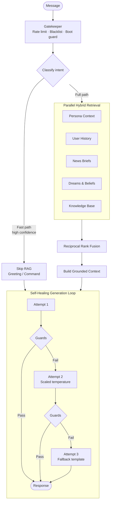

<div align="center">

# 🌌 KAIACORD

**A self-hosted Discord AI persona with cognitive persistence, hybrid RAG, and fully local inference.**

[](https://python.org)
[](https://ollama.com)
[](https://discordpy.readthedocs.io)
[](https://ollama.com/library/gemma3)
[](#gpu-budget)
[](#testing)
[](LICENSE)

[Overview](#overview) · [Cognitive Pipeline](#cognitive-pipeline) · [Architecture](#architecture) · [Install](#installation) · [Configuration](#configuration) · [Operations](#operations) · [Docs](#documentation)

</div>

---

## Overview

Kaia is a local Discord bot with a memory that persists.

She runs entirely on local hardware, with no cloud APIs, telemetry, or per-token billing. She carries an emotional state from one conversation to the next, develops different relationships with different people, forms beliefs that can later change, and turns the day's conversations into long-term memory each night.

The result is continuity across conversations. Things that happen are retained and can matter later: shared events, periods of absence, changes in a relationship, or beliefs formed during earlier conversations.

**What makes it different from a chat wrapper**

| | |
|:--|:--|
| **Runs entirely offline** | One 12 GB consumer GPU. Inference and embeddings are local; intent classification is plain regex. |
| **State survives restarts** | Mood, relationships, beliefs, and episodic anchors are persisted atomically to disk. |
| **Deterministic where it matters** | Combat maths, budgeting, and safety filtering are plain Python. The LLM is used for language, not arithmetic. |
| **Grounded by default** | Hybrid BM25 + vector retrieval over a curated Markdown knowledge base, fused with Reciprocal Rank Fusion. |
| **Guarded output** | A ten-layer post-generation pipeline strips hallucinations, roleplay artifacts, and prompt echoes before anything reaches Discord. |

---

## Cognitive Pipeline

Every message flows through a deterministic feature layer before generation. These are
heuristics in Python, not auxiliary model calls, so they add context without costing VRAM.

```
                      ┌────────────────────────┐
                      │      Message Input     │
                      └───────────┬────────────┘
                                  │
             ┌────────────────────▼─────────────────────┐
             │  Behavioural Injection Layer              │
             │  Mood · Stance · History · Relationships │
             └────────────────────┬─────────────────────┘
                                  │
             ┌────────────────────▼─────────────────────┐
             │  System Prompt Assembly & Hybrid RAG     │
             └────────────────────┬─────────────────────┘
                                  │
                      ┌───────────▼────────────┐
                      │ Local Inference Engine │
                      └────────────────────────┘
```

### Core subsystems

- **Persistent emotional arc** — mood tracked as a `valence / arousal / energy` vector with
  6-hour decay, modulating vocabulary, reaction frequency, and Discord status text.
- **Staged relationships** — per-user event logs across five familiarity levels
  (`stranger` → `inner_circle`), with behavioural gating and trust thresholds.
- **Nightly dream cycle** — between 03:00 and 05:00 the engine aggregates the day's logs,
  extracts assertions into a 100-entry revisable belief store, and updates a rolling identity
  journal.
- **Memory anchors** — up to 100 weighted episodic memories with exponential decay, enabling
  callbacks to events from weeks earlier.
- **Passive inner monologue** — background commentary from room observation, woven into the
  active context as private intuition.
- **Proactive initiation** — a multi-source trigger engine (absence, beliefs, dreams, mood,
  curiosity, memory, silence, anchors, observation digest), rate-capped to a lifelike
  frequency. The desire gate and its threshold are config-tunable, and deliberately so: the
  gate once sat high enough that she spoke first *once in 102 evaluations*.
- **One system for everything she says unasked** — proactive openers, quips and quip
  threads, observations of conversations she watched, and her inner monologue share one
  `unprompted:` config block: a switch per source, one daily limit and gap for all of them,
  one set of posting hours, and a per-source list of what also goes to Bluesky. Each post
  wears a label that fits it — 🪡 **Unspooling** when she questions an earlier view,
  🌀 **Down the rabbit hole** for something she read, 📜 **Long thought** for a long one —
  with a little chance mixed in.
- **Temporal awareness** — time-of-day adjustments, fatigue multipliers on long threads, and
  reunion detection when a user returns after an absence.
- **Consistency watchdog** — compares each response against active high-confidence beliefs and
  corrects capitulation before the message is sent.

---

## Architecture

Kaiacord uses a **classify → retrieve → generate** flow, keeping latency low by skipping
retrieval entirely on high-confidence fast paths.



**1 · Intent classification (CPU).** Deterministic regex matchers label the query — greeting,
command, recap, diagnostic, dream recall — so the primary model is never woken just to label a
message. No auxiliary model is involved; the secondary classifier (`gemma2:2b`) was removed
entirely after measurement showed it contributed nothing.

**2 · Hybrid retrieval.** BM25 lexical search and dense vectors (`nomic-embed-text-cpu`) run in
parallel over the Markdown knowledge base, then merge via Reciprocal Rank Fusion. Sources
include the persona file, curated books and articles, daily news briefs, dream reflections, and
per-user conversation history.

**3 · Guarded generation.** Two temperatures are used: `0.70` for conversation, `0.35` for
document-grounded answers. `optimize_context` allocates the whole window; a rejected answer is
salvaged and re-run rather than becoming silence. Output then passes the post-generation
pipeline, which removes prompt echoes, roleplay artefacts, fabricated citations, parroted user
phrasing, sycophancy and stale clock times before delivery.

---

## Installation

### Prerequisites

| Requirement | Notes |
|:--|:--|
| **OS** | Linux (developed on Arch; Ubuntu/Debian fine) |
| **GPU** | NVIDIA, 12 GB VRAM (RTX 3060 or better) |
| **Python** | 3.12+ |
| **[Ollama](https://ollama.com)** | Local inference runtime |
| **pandoc**, **poppler** | Optional — only for importing EPUB/PDF into the knowledge base |

### Setup

```bash
git clone https://github.com/Ekco-S64QTN6/Kaiacord.git
cd Kaiacord

python3 -m venv venv
source venv/bin/activate
pip install -r requirements.txt
```

### Pull the models

```bash
ollama pull gemma3:12b            # chat, narration, vision  (GPU)
ollama pull nomic-embed-text-cpu  # RAG embeddings           (CPU)
```

### Configure

```bash
cp .env.example .env
```

`DISCORD_TOKEN` is the only required value. Everything else is optional: Bluesky, X, and the
Project 1999 forum each need both credentials **and** their `enabled` flag in
`config/kaia.yaml`. `GEMINI_API_KEY` is used only by background summarisation tasks — leave it
blank to run fully offline.

### Run

```bash
python Kaiacord.py            # curses dashboard (default)
python Kaiacord.py --no-gui   # headless, for systemd
```

---

## Configuration

Settings resolve in order: **environment variables** → `config/kaia.yaml` (your overrides) →
`config/default_config.yaml` (defaults). Edit `kaia.yaml`; leave the defaults file alone.

### Notable toggles

| Key | Default | Effect |
|:--|:--|:--|
| `features.self_model_injection` | `false` | Skips injecting `memory/kaia_self_model.md` (~900 tokens/turn). Its content duplicates the relationship manager, personalisation engine, and per-user profile documents already in RAG. |
| `features.constitution_injection` | `true` | Injects `memory/kaia_constitution.md` (~2,400 tokens/turn). Disable to reclaim the largest single block of per-turn budget for retrieval. |
| `generation.max_response_tokens` | `1024` | Reserved from the context window every turn. Measured maximum response across 352 generations: 852 tokens. |
| `generation.base_temperature` | `0.70` | Conversational generation. |
| `generation.rag_temperature` | `0.35` | Document-grounded generation only. |
| `unprompted.sources.<name>` | `proactive`, `quip`, `observation` on; `monologue` off | Which sources may post unprompted. Off, the monologue still thinks and the digest is still written. |
| `unprompted.max_per_day` / `min_interval_minutes` | `8` / `90` | One allowance shared by every unprompted post. `0` for the daily limit removes it. |
| `unprompted.respect_quiet_hours` | `false` | When true, nothing unprompted posts outside `quiet_hour_start`–`quiet_hour_end`. |
| `unprompted.bluesky.<name>` | `quip` only | Which sources are also posted to her Bluesky feed. Observations and openers can name people from the server. |
| `unprompted.rotate` / `labels` | `true` / nine labels | Whether labels rotate to fit each post, and their wording. |
| `desires.gate_enabled` | `true` | Enables the desire engine; `desires.initiate_threshold` sets how readily she speaks first. |
| `bluesky.enabled` / `x_twitter.enabled` | `false` | With both disabled the social mention poller is never started. |

<a name="gpu-budget"></a>

### GPU budget

The build targets a single 12 GB card. Classification and embeddings are hard-pinned to CPU so
the full context window stays available to the chat model.

| Model | Role | Device | VRAM | Host RAM |
|:--|:--|:--:|--:|--:|
| `gemma3:12b` | Chat, narration, vision | **GPU** | ~8.2 GB | ~1.2 GB KV cache |
| `nomic-embed-text-cpu` | RAG embeddings | CPU | — | ~500 MB |

> [!NOTE]
> `performance.max_context_tokens` is **16,384**. The per-turn budget reserves
> `system_reserve_tokens` and `max_response_tokens` before allocating the remainder to
> retrieval and history, so raising the identity-injection blocks directly reduces RAG recall.

---

## Operations

### Interactive tool panel

```bash
bash scripts/kaia-tools.sh
```

### Maintenance

```bash
# Health check: Ollama, models, GPU, knowledge base, config
venv/bin/python3 tools/maintenance/health_check.py

# Incremental RAG re-index against the running bot
venv/bin/python3 tools/maintenance/reindex_rag.py --trigger

# Full vector database wipe and rebuild. Refused while the bot is running —
# she holds memory/rag_storage open, and a second writer corrupts the manifest.
# Stop her first, or use --trigger above. (--force overrides, if you mean it.)
venv/bin/python3 tools/maintenance/reindex_rag.py --clear
```

> [!TIP]
> With the bot stopped, a full rebuild embeds on the GPU automatically (~14 min on the current
> corpus, against ~2 hours on CPU). While she is running it stays on CPU so the chat model keeps
> its VRAM. `--cpu-embed` forces CPU either way.

### Adding books and documents

```bash
# Interactive picker over ~/Downloads (EPUB · PDF · TXT · HTML)
bash knowledge_base/epub-to-md.sh

# Or convert directly
venv/bin/python3 tools/maintenance/ebook_to_kb_md.py ~/Downloads/book.epub \
  --outdir knowledge_base/books --category "Science Fiction" \
  --title "Title" --author "Author" --summary "One paragraph…" --keywords "a,b,c"
```

The converter strips pandoc/Calibre artifacts, rebuilds paragraph and chapter structure, and
writes the project's frontmatter schema. Naming follows the existing conventions:
`books/` uses `Book - <Title> by <Author>.md`, `documents/` uses `<Topic> - <Title>.md`
(`--prefix`). A hand-written `--summary` improves retrieval considerably over the auto-extracted
fallback. Re-index afterwards.

To repair structure in books whose source file is gone:

```bash
venv/bin/python3 tools/maintenance/repair_kb_book_structure.py          # dry run
venv/bin/python3 tools/maintenance/repair_kb_book_structure.py --apply
```

### Behavioural probes

```bash
./scripts/run_jspace_probe.sh full         # static probes + log replay
./scripts/run_jspace_probe.sh static-only
```

<a name="testing"></a>

### Testing

```bash
venv/bin/python3 -m pytest -q -m "not ollama and not gpu and not slow"
# 2026-09-22: 1,696 passed, 9 skipped, 85 deselected, 1 xfailed.
# Re-run rather than trusting this line — the count moves every phase.
```

> [!TIP]
> Test runs write to `logs/kaiacord.test.log`, never to the production telemetry log
> `logs/kaiacord.log`. Override with `KAIACORD_LOG_FILE=/path/to.log`.

---

## Additional Systems

<details>
<summary><b>⚔️ Aethelgard TTRPG engine</b></summary>

<br>

A deterministic, persistent turn-based RPG. All combat maths and state transitions are computed
in Python; the LLM is used only for narration.

- **77-floor mega-dungeon** ("Spine of the World") with Resonance Lift checkpoints and per-floor
  encounter pools.
- **369 monsters** (44 bosses), **453 equipment items** across 7 tiers, 248 fish, 12 quests.
- **10 classes** with distinct progression, passive buffs, and triggerable combat procs.
- Housing, procedural farming, pets, and alchemy.
- Defence soft-cap `min(10, raw) + max(0, raw - 10) // 2` and absolute stat budgets prevent
  scaling breakage.

See [`docs/ttrpg/aethelgard_system.md`](docs/ttrpg/aethelgard_system.md).

</details>

<details>
<summary><b>🎨 Fractal art engine</b></summary>

<br>

A CPU-rendered fractal flame generator based on the Electric Sheep algorithm: 20 variation
functions, 10 curated colour LUTs, adaptive density estimation, 1080² output. Kaia **decides a
piece before it is drawn**: from your words, her mood, or the colours of an attached image she
picks a palette, symmetry, lead shapes and a title from the renderer's own menus — then
remembers what she made.

`!art mandelbrot` renders the Mandelbrot set instead, with the iteration budget scaled to the
zoom depth, mirrored palette cycling, and 2x2 supersampling. Pass a
[weirdly.net](http://weirdly.net/webtoys/mandelbrot/) config URL — `!art <url>` — and it renders
those exact coordinates, so a location someone shares can be reproduced rather than transcribed.

```
!art                          # her choice, from her mood
!art a cold storm over the sea  # she reads the brief and picks to match
!art                          # with an image attached: its colours, her composition
!art mandelbrot --palette void --seed 42
!art http://weirdly.net/webtoys/mandelbrot/index.html?config=v1,-1.768941,...
```

</details>

<details>
<summary><b>🎧 Live-coded music engine</b></summary>

<br>

`!music on` puts Kaia in a voice channel **DJing a live-coded set**. Every genre is an arranged
track with a full groove from bar one: intro, groove, a build with a snare roll and riser, the
kick cutting out before the drop, a breakdown, a second build and a bigger drop. Levels are
measured, not guessed — every part was soloed and calibrated in the real engine — and an energy
curve makes the drops the loudest thing in the track.

```
!music on                  # she picks a genre for her mood and the hour, and says why
!music on --psytrance      # or you pick
!music techno              # switch genre without leaving
!music darker · faster · drop · more bass · bring in the vocals   # requests
!music status · genres · off
```

Fourteen genres — `acid` `ambient` `berlinschool` `breakbeat` `deephouse` `drumnbass` `dub`
`house` `lofi` `psytrance` `synthwave` `techno` `trance` `triphop`. Her arousal nudges the tempo;
requests edit the parts that are playing without losing the song's place.

The sound engine is [Strudel](https://codeberg.org/uzu/strudel) (AGPL-3.0), running its own REPL
in a local browser and captured off a PipeWire null sink into Discord voice. Strudel is fetched
at install time — none of it is vendored here. `music.show_window: true` to watch the code play.

**GPU cost is zero** — synthesis happens in the browser, so the chat model keeps all of its VRAM.

Setup: `venv/bin/python3 tools/maintenance/fetch_music_assets.py` (needs `ffmpeg` and `pactl`).
Tuning: `tools/maintenance/audition_tracks.py` plays, measures and calibrates every part.

</details>

<details>
<summary><b>📻 Shortwave — EAMs and number stations</b></summary>

<br>

Kaia keeps an ear on the strange end of the HF bands.

```
!skyking                   # latest military Emergency Action Messages off the HFGCS net
!skyking 3                 # one in full, with a recording when someone captured it
!skyking classic           # an old Skyking broadcast from the archive, read the way it sounded
!numbers                   # number stations on the air in the next 6 hours, with listen links
!numbers e11               # when the "Oracle" is next on
!radio hfgcs               # play the HFGCS net live in your voice channel
!radio                     # what Kaia has heard, and how right she was
!tacamo                    # are the EAM relay planes up?
!buzzer                    # UVB-76, The Buzzer, live
!beacons                   # which continents she can hear on the worldwide beacon chain
!overnight                 # what her night shift saw, written up (she posts one each morning)
!nightshift                # everything in this theme
```

EAMs come from [eam.watch](https://eam.watch/)'s volunteer log of the USAF High Frequency Global
Communications System (8992 / 11175 kHz USB) — callsign, preamble and the encrypted message.
Skyking itself is defunct; the command is an homage. The number-station schedule comes from
[Priyom](https://priyom.org/), and every listen link opens the
[UTwente WebSDR](http://websdr.ewi.utwente.nl:8901/) already tuned. Both feeds are read-only,
polled every 6 hours and cached — they are volunteer services. Nothing here decodes anything:
the messages are encrypted, and Kaia says so.

**Kaia listens, too.** Four times a day she records the HFGCS net from a public
[KiwiSDR](http://kiwisdr.com/) receiver, and she tunes in for the number stations she follows.
She transcribes EAMs on the CPU (faster-whisper), turns the phonetic alphabet back into the
message — marking anything she's unsure of with `?` rather than guessing — and checks herself
against eam.watch's human copy of the same broadcast. Catches and clips go to `#kaia-opolis`;
the history stays in `memory/radio/`, outside her searchable memory. Setup:
`venv/bin/python3 tools/maintenance/fetch_radio_assets.py` (kiwiclient, faster-whisper, ~3 GB model).

</details>

<details>
<summary><b>🛰️ Overhead — the ISS, NASA, the sky tonight</b></summary>

<br>

```
!iss                       # where the station is, who's in orbit, when it passes over you
!nasa                      # picture of the day + which probe the Deep Space Network is talking to now
!earth                     # the whole sunlit Earth, from a million miles out
!spaceweather              # the sun, geomagnetic storms, HF conditions
!rocks · !launch · !quake  # close asteroids, the next rockets, the ground moving
!sky                       # tonight: moon, planets, meteor showers
!nightshift                # every radio and sky command
```

All public data (NASA, NOAA, JPL, USGS, Launch Library 2, CelesTrak), fetched when asked and
cached; positions and passes are computed locally with Skyfield. Passes and `!sky` need
`sky.location` set in `config/kaia.yaml`.

</details>

<details>
<summary><b>🏟️ Project 1999 forum integration</b></summary>

<br>

Periodic scraping of Off-Topic and Technical Discussion forums, with a Discord moderation queue
offering Accept/Reject on drafted replies, RAG-grounded support answers, and profile caching to
model active users.

It also has a tech-knowledge synthesiser that extracts and categorises issues from
Technical Discussion threads into the knowledge base, profile compaction that distils scattered
forum-user logs into single grounded cards, and scrape-watermark persistence so compacted users
are not redundantly re-scraped.

See [`docs/02-user-guide/forum-integration.md`](docs/02-user-guide/forum-integration.md).

</details>

<details>
<summary><b>🖥️ Curses dashboard</b></summary>

<br>

A three-pane terminal UI — **System Stats**, **Bot Status**, and **Cognitive Pipeline** — showing
live CPU/GPU metrics, cognitive counters (beliefs, anchors, affinity), and a stream of elevated
log events.

See [`docs/02-user-guide/dashboard.md`](docs/02-user-guide/dashboard.md).

</details>

---

## Repository Layout

```
Kaiacord/
├── Kaiacord.py               Entry point and orchestrator
├── CLAUDE.md                 Developer instructions & runtime constraints
├── config/                   YAML configuration (kaia.yaml overrides defaults)
├── knowledge_base/           Grounding corpus
│   ├── books/                Long-form reference works
│   ├── documents/            Articles, specs, scraped reports
│   ├── wiki/                 Project 1999 wiki articles
│   └── troubleshooting/      Synthesised support guides
├── memory/                   Runtime state — never committed
│   ├── beliefs.json          100-entry revisable belief store
│   ├── bot_state.json        Mood, familiarity, global variables
│   ├── anchors.json          100-entry episodic callbacks with decay
│   ├── identity_stream.md    Rolling identity journal
│   └── relationships/        Per-user trust events
├── utils/
│   ├── core/                 Cognitive layer
│   │   ├── message_processor.py   Primary intelligence flow
│   │   ├── safety_pipeline.py     10-layer post-generation guard
│   │   ├── response_filter.py     Persona & bot-speak filtering
│   │   ├── context_optimizer.py   Token budgeting
│   │   ├── kaia_rag*.py           Retrieval, indexing, scoring
│   │   └── kaia_dream.py          Nightly consolidation
│   ├── ttrpg/                Combat, dungeon, housing state
│   ├── commands/             Discord command routers
│   ├── social/               Forum crawler & social responders
│   ├── audio/                !music: arranged tracks, the DJ, the Strudel engine
│   ├── radio/                !skyking, !numbers, !radio: feeds, KiwiSDR listening, transcription
│   ├── sky/                  !iss, !nasa, !sky …: space feeds and local sky computation
│   └── infrastructure/       DI context, dashboard, logging, GPU pinning
├── tools/
│   ├── maintenance/          Health checks, re-indexing, KB ingestion, dream curation,
│   │                         profile compaction, document retitling
│   ├── diagnostics/          RAG deep-dive and index health
│   ├── development/          Self-model and profile utilities
│   ├── social/               Tech-knowledge synthesiser
│   └── tests/                Unit and integration suites
├── finetune/                 LoRA pipeline for Gemma 3 12B
└── docs/                     Technical and gameplay documentation
```

---

## Documentation

| Topic | Reference |
|:--|:--|
| Installation | [`docs/01-getting-started/installation.md`](docs/01-getting-started/installation.md) |
| Quick start | [`docs/01-getting-started/quick-start.md`](docs/01-getting-started/quick-start.md) |
| Commands | [`docs/02-user-guide/commands.md`](docs/02-user-guide/commands.md) |
| Persona system | [`docs/02-user-guide/persona.md`](docs/02-user-guide/persona.md) |
| Curses dashboard | [`docs/02-user-guide/dashboard.md`](docs/02-user-guide/dashboard.md) |
| News system | [`docs/02-user-guide/news-system.md`](docs/02-user-guide/news-system.md) |
| Social integrations | [`docs/02-user-guide/social-media.md`](docs/02-user-guide/social-media.md) |
| Forum integration | [`docs/02-user-guide/forum-integration.md`](docs/02-user-guide/forum-integration.md) |
| User profiling | [`docs/02-user-guide/user-profiling.md`](docs/02-user-guide/user-profiling.md) |
| Architecture overview | [`docs/03-architecture/overview.md`](docs/03-architecture/overview.md) |
| RAG grounding layer | [`docs/03-architecture/rag-system.md`](docs/03-architecture/rag-system.md) |
| Intelligence layer | [`docs/03-architecture/intelligence-layer.md`](docs/03-architecture/intelligence-layer.md) |
| GPU & VRAM tuning | [`docs/03-architecture/gpu-management.md`](docs/03-architecture/gpu-management.md) |
| `utils/` reference | [`docs/03-architecture/utils-reference.md`](docs/03-architecture/utils-reference.md) |
| Testing | [`docs/04-development/testing.md`](docs/04-development/testing.md) |
| Maintenance procedures | [`docs/05-maintenance/procedures.md`](docs/05-maintenance/procedures.md) |
| Troubleshooting | [`docs/06-troubleshooting/common-issues.md`](docs/06-troubleshooting/common-issues.md) |
| Aethelgard TTRPG | [`docs/ttrpg/aethelgard_system.md`](docs/ttrpg/aethelgard_system.md) |

> Operational audit reports live in `docs/reports/`, which is git-ignored — they contain
> transcript excerpts and runtime telemetry, so they stay local to a deployment.

---

## License

Released under the [MIT License](LICENSE) — use it, fork it, ship it.

Kaiacord depends on other open-source projects, all under permissive licenses (MIT, Apache-2.0,
BSD). The one exception is `browser_cookie3` (LGPL), used only for optional X/Twitter cookie
import; it is imported dynamically and carries no copyleft obligation for this project. The
models themselves ship under their own terms — see
[Gemma](https://ai.google.dev/gemma/terms) and [Nomic Embed](https://huggingface.co/nomic-ai/nomic-embed-text-v1.5).

---

<div align="center">
<sub>

Built by **Ekco** · Local AI, no cloud required.

</sub>
</div>
