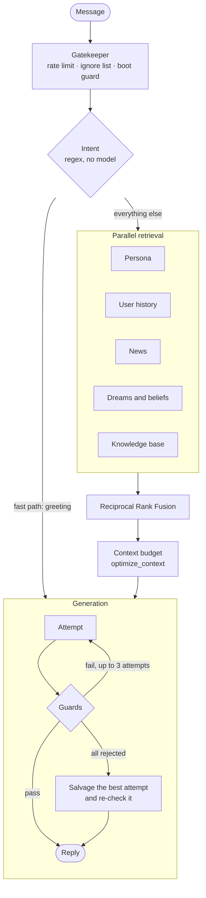

<div align="center">

# Kaiacord

**A self-hosted Discord bot with a persistent inner life, running on one consumer GPU.**

[](https://python.org)
[](https://discordpy.readthedocs.io)
[](https://ollama.com)
[](https://ollama.com/library/gemma3)
[](LICENSE)

[Overview](#overview) · [How she works](#how-she-works) · [Install](#installation) · [Configuration](#configuration) · [Operations](#operations) · [Features](#features) · [Docs](#documentation)

</div>

---

## Overview

Kaia is a Discord bot built to feel less like a chatbot and more like someone who lives in the
server. She remembers. Her mood carries from one conversation to the next, she knows each person
differently, she forms opinions and sometimes changes them, and every night she turns the day's
conversations into long-term memory.

Everything that thinks runs on your own hardware: a single 12 GB GPU serves the language model,
and embeddings run on the CPU. There is no hosted model and no per-token bill. The network is used
only for things that live out there: the daily news brief, Bluesky if you turn it on, and the
public radio and space feeds behind her night-shift commands.

| | |
|:--|:--|
| **Continuity** | Mood, relationships, beliefs and episodic memories are persisted to disk and survive restarts. |
| **Grounded answers** | Hybrid BM25 and vector retrieval over a curated Markdown knowledge base, merged with Reciprocal Rank Fusion. |
| **Deterministic where it matters** | Game maths, budgets and filtering are plain Python. The model writes language; it never does arithmetic. |
| **Guarded output** | A post-generation pipeline removes prompt echoes, bot-speak, fabricated citations and sycophancy, and keeps the original sentence whenever a cut would break it. |
| **More than chat** | A persistent RPG, a fractal art engine, live-coded music in voice, shortwave radio monitoring, and a view of the night sky. |

---

## How she works

### A message, start to finish



1. **Intent** is decided by regex matchers on the CPU, so the model is never woken just to
   label a message.
2. **Retrieval** runs BM25 and dense vectors (`nomic-embed-text-cpu`) in parallel over the
   persona, books and articles, news briefs, her dream reflections and each person's
   conversation history.
3. **Context** is budgeted once, by `optimize_context`: a system reserve and the reply are set
   aside, and what remains is split between retrieval and conversation history.
4. **Generation** uses two temperatures: 0.70 for conversation and 0.35 for answers grounded in
   documents. A reply the guards reject is regenerated; if every attempt is rejected, the best one
   is repaired and must pass the full pipeline on its own before it is used.

### What persists between conversations

- **Mood.** A valence, arousal and energy vector with a six-hour half-life. It shapes her
  vocabulary, how often she reacts, and the status line under her name.
- **Relationships.** Per-person event logs across five familiarity stages, from stranger to
  inner circle.
- **Beliefs.** A store of up to 100 positions with confidence, formed and revised overnight.
- **Memory anchors.** Up to 100 weighted episodic memories that fade over time, so she can bring
  up something from weeks ago.
- **Dreams.** Between 03:00 and 05:00 she reads over the day, writes reflections, extracts
  beliefs and updates a rolling identity journal.

### Speaking first

Kaia sometimes speaks without being asked: an opener when she has something on her mind, an
idle remark when a channel has gone quiet, an observation about a conversation she followed, a
passing thought, and a morning write-up of what her night shift saw. All of these go through one
gate with one daily limit, one minimum gap and one set of posting hours, configured in a single
`unprompted:` block. Each post carries a short label that fits it (*Unspooling* when she revisits
an earlier view, *Down the rabbit hole* for something she read), and you choose which kinds also
go to her Bluesky feed.

A consistency check compares each reply with her strongest beliefs and her own recent messages,
and corrects a reply that simply caves before it is sent.

---

## Installation

### Requirements

| | |
|:--|:--|
| **OS** | Linux (developed on Arch; Debian and Ubuntu work) |
| **GPU** | NVIDIA with 12 GB of VRAM (RTX 3060 or better) |
| **Python** | 3.12 |
| **[Ollama](https://ollama.com)** | Local inference runtime |
| **pandoc**, **poppler** | Optional, for importing EPUB and PDF into the knowledge base |
| **ffmpeg**, **pactl** | Optional, for `!music` and `!radio` in voice |

### Setup

```bash
git clone https://github.com/Ekco-S64QTN6/Kaiacord.git
cd Kaiacord
python3 -m venv venv
venv/bin/pip install -r requirements.txt

ollama pull gemma3:12b             # chat, narration, vision (GPU)
ollama pull nomic-embed-text-cpu   # retrieval embeddings (CPU)

cp .env.example .env
```

`DISCORD_TOKEN` is the only required value. Bluesky, X and the Project 1999 forum each need their
credentials **and** their `enabled` flag in `config/kaia.yaml`. `GEMINI_API_KEY` is used only for
the daily news brief. `NASA_API_KEY` (free) lifts `!nasa` and `!earth` off NASA's shared demo key.

Optional assets, fetched rather than vendored:

```bash
venv/bin/python3 tools/maintenance/fetch_music_assets.py   # Strudel, for !music
venv/bin/python3 tools/maintenance/fetch_radio_assets.py   # kiwiclient and faster-whisper, for !radio (~3 GB)
```

### Run

```bash
venv/bin/python3 Kaiacord.py            # with the terminal dashboard
venv/bin/python3 Kaiacord.py --no-gui   # headless, for systemd
```

Started under any other interpreter, `Kaiacord.py` re-launches itself in the virtualenv.

---

## Configuration

Settings resolve in order: environment variables, then `config/kaia.yaml` (your overrides), then
`config/default_config.yaml` (the defaults). Edit `kaia.yaml` and leave the defaults file alone.

| Key | Default | Effect |
|:--|:--|:--|
| `performance.max_context_tokens` | `16384` | The context window. Larger costs VRAM; check `nvidia-smi` after changing it. |
| `features.constitution_injection` | `true` | Injects her constitution, about 2,400 tokens a turn that would otherwise go to retrieval. |
| `features.self_model_injection` | `false` | Injects her self-model, about 900 tokens a turn. |
| `generation.max_response_tokens` | `1024` | Reserved for the reply every turn. |
| `generation.base_temperature` / `rag_temperature` | `0.70` / `0.35` | Conversation, and answers grounded in documents. |
| `unprompted.sources.<name>` | all on except `monologue` | Which kinds of unprompted post may appear. A kind switched off still runs; nobody sees it. |
| `unprompted.max_per_day` / `min_interval_minutes` | `8` / `90` | One allowance shared by every unprompted post. |
| `unprompted.bluesky.<name>` | `quip` only | Which kinds are also posted to Bluesky. |
| `desires.gate_enabled` / `initiate_threshold` | `true` | Whether, and how readily, she speaks first. |
| `bluesky.enabled` / `x_twitter.enabled` | `false` | Turns each integration on. Credentials alone do nothing. |
| `sky.location` | unset | `"lat, lon"`; a city is enough. ISS passes and `!sky` need it. |
| `radio.hfgcs_windows_utc` / `radio.follow` | four windows / E07, V07, S11a, M12, E11 | When she records the HFGCS net, and which number stations she tunes in for — one recording per station a day, six in all, rotating. |
| `radio.overnight_time` | `08:30` | When the morning write-up of her night shift is posted. |
| `radio.poll_hours` | `6` | How often the volunteer radio feeds are polled. |

### Hardware budget

The build targets one 12 GB card. Embeddings are pinned to the CPU so the whole card belongs to
the chat model and its context.

| Model | Role | Device | Memory |
|:--|:--|:--:|:--|
| `gemma3:12b` | Chat, narration, vision | GPU | about 9.1 GB at 24,576 context, 9.4 GB at 32,768 (q8_0 KV cache) |
| `nomic-embed-text-cpu` | Retrieval embeddings | CPU | about 500 MB of RAM |

---

## Operations

Most maintenance is behind one interactive menu:

```bash
bash scripts/kaia-tools.sh
```

The direct commands:

```bash
venv/bin/python3 tools/maintenance/health_check.py          # Ollama, models, GPU, knowledge base, config
venv/bin/python3 tools/maintenance/reindex_rag.py --trigger # incremental re-index of the running bot
venv/bin/python3 tools/maintenance/reindex_rag.py --clear   # full rebuild; refused while she is running
venv/bin/python3 tools/maintenance/audit_knowledge_base.py  # every known corpus fault, read-only
```

A full rebuild with the bot stopped embeds on the GPU (about 14 minutes on the current corpus,
against about two hours on the CPU).

### Adding books and documents

Use `kaia-tools.sh` → Documents & Ingestion, or convert directly:

```bash
venv/bin/python3 tools/maintenance/ebook_to_kb_md.py ~/Downloads/book.epub \
  --outdir knowledge_base/books --category "Science Fiction" \
  --title "Title" --author "Author" --summary "One paragraph…" --keywords "a,b,c"
```

The converter removes pandoc and Calibre artefacts, rebuilds paragraphs and chapters, and writes
the project's frontmatter. Books are named `Book - <Title> by <Author>.md`, documents
`<Topic> - <Title>.md`. A hand-written summary retrieves much better than the automatic one.
In Discord, `!download <url>` and `!youtube <url>` stage a page or transcript and file it straight
away; the hourly ingest pass retries anything that failed.

### Testing

```bash
venv/bin/python3 -m pytest -q -m "not ollama and not gpu and not slow"
```

Only a handful of tests need Ollama or the GPU; the rest run anywhere. Test runs log to
`logs/kaiacord.test.log`, never to the production log.

---

## Features

### Aethelgard

A persistent, turn-based RPG in its own channel. Python computes every roll, stat and state
change; the model only narrates.

- The Spine of the World, a 77-floor dungeon with checkpoints and per-floor encounters.
- 369 monsters (44 bosses), 395 pieces of gear across seven tiers plus 58 consumables, 248 fish
  and 12 quests.
- Ten advanced classes with passives and combat procs; housing, farming, pets and alchemy.

See [`docs/ttrpg/aethelgard_system.md`](docs/ttrpg/aethelgard_system.md).

### Art

`!art` renders a fractal flame in the style of Electric Sheep, on the CPU at 1080². Kaia decides
the piece before it is drawn: from your words, her mood or the colours of an attached image, she
picks a palette, symmetry, shapes and a title from the renderer's own options, and remembers what
she made. `!art mandelbrot` renders the Mandelbrot set, and a
[weirdly.net](http://weirdly.net/webtoys/mandelbrot/) link reproduces those exact coordinates.

```
!art                               her choice
!art a cold storm over the sea     she reads the brief
!art mandelbrot --palette void --seed 42
```

### Music

`!music on` brings Kaia into a voice channel to DJ a live-coded set. Each of the fourteen genres is
an arranged track (intro, build, drop, breakdown, second drop), with levels measured rather than
guessed. With no genre named she picks one for her mood and the hour; requests such as
`!music darker`, `faster` or `drop` edit the parts that are playing without losing the song's place.

The sound comes from [Strudel](https://codeberg.org/uzu/strudel) running in a local browser,
captured into Discord voice. No model is involved and no VRAM is used.

### Night shift: radio and sky

`!nightshift` lists every command in this set.

| Command | What it does |
|:--|:--|
| `!skyking` | The latest military Emergency Action Messages from the HFGCS net, via eam.watch |
| `!numbers` | Number stations on the air soon, via Priyom, each with a tuned listening link |
| `!radio` | What Kaia has recorded and how accurate she was; `!radio hfgcs` plays the net live in voice |
| `!buzzer` | UVB-76, live |
| `!tacamo` | Whether the E-6B and E-4B relay aircraft are broadcasting their position |
| `!beacons` | Which continents she can hear on the worldwide beacon chain |
| `!overnight` | A write-up of what her night shift saw (she also posts one each morning) |
| `!iss` | The station, its crew, and its next visible pass over you |
| `!nasa` · `!earth` | The astronomy picture of the day, the Deep Space Network, and the whole sunlit Earth |
| `!spaceweather` | The sun, geomagnetic storms and HF conditions |
| `!rocks` · `!launch` · `!quake` | Close asteroids, upcoming launches, recent earthquakes |
| `!sky` | Tonight's moon, planets and meteor showers |

Four times a day Kaia records the HFGCS net from a public [KiwiSDR](http://kiwisdr.com/),
transcribes it on the CPU, marks anything she is unsure of with `?`, and checks herself against
the volunteer log. The messages are encrypted and she never claims to decode one. The feeds are
volunteer services, polled every six hours and cached; radio history is kept in `memory/radio/`,
outside her searchable memory. Sky positions are computed locally with Skyfield.

### Project 1999 forum

Optional scraping of the Off-Topic and Technical Discussion forums. Every reply she drafts waits
in a Discord moderation queue for a person to accept or reject it. See
[`docs/02-user-guide/forum-integration.md`](docs/02-user-guide/forum-integration.md).

### Dashboard

A terminal dashboard shows system load, who is active, her cognitive counters, retrieval health,
alerts and a live log. See [`docs/02-user-guide/dashboard.md`](docs/02-user-guide/dashboard.md).

---

## Repository layout

```
Kaiacord/
├── Kaiacord.py              entry point
├── config/                  default_config.yaml (defaults), kaia.yaml (your overrides)
├── knowledge_base/          the retrieval corpus; layout in knowledge_base/README.md
├── memory/                  runtime state, never committed
├── utils/
│   ├── core/                message processing, retrieval, memory, safety pipeline
│   ├── ttrpg/               Aethelgard
│   ├── audio/               !music
│   ├── radio/               !skyking, !numbers, !radio and scheduled listening
│   ├── sky/                 !iss, !nasa, !sky and the other space commands
│   ├── social/              forum, Bluesky, X
│   ├── commands/            command handlers
│   └── infrastructure/      configuration, logging, GPU guard, dashboard
├── tools/                   maintenance, diagnostics and tests
├── finetune/                LoRA pipeline for gemma3:12b
└── docs/
```

---

## Documentation

| Topic | Reference |
|:--|:--|
| Installation | [`docs/01-getting-started/installation.md`](docs/01-getting-started/installation.md) |
| Quick start | [`docs/01-getting-started/quick-start.md`](docs/01-getting-started/quick-start.md) |
| Commands | [`docs/02-user-guide/commands.md`](docs/02-user-guide/commands.md) |
| Persona | [`docs/02-user-guide/persona.md`](docs/02-user-guide/persona.md) |
| Dashboard | [`docs/02-user-guide/dashboard.md`](docs/02-user-guide/dashboard.md) |
| News | [`docs/02-user-guide/news-system.md`](docs/02-user-guide/news-system.md) |
| Social integrations | [`docs/02-user-guide/social-media.md`](docs/02-user-guide/social-media.md) |
| Forum integration | [`docs/02-user-guide/forum-integration.md`](docs/02-user-guide/forum-integration.md) |
| User profiling | [`docs/02-user-guide/user-profiling.md`](docs/02-user-guide/user-profiling.md) |
| Architecture | [`docs/03-architecture/overview.md`](docs/03-architecture/overview.md) |
| Retrieval | [`docs/03-architecture/rag-system.md`](docs/03-architecture/rag-system.md) |
| Intelligence layer | [`docs/03-architecture/intelligence-layer.md`](docs/03-architecture/intelligence-layer.md) |
| GPU and VRAM | [`docs/03-architecture/gpu-management.md`](docs/03-architecture/gpu-management.md) |
| `utils/` reference | [`docs/03-architecture/utils-reference.md`](docs/03-architecture/utils-reference.md) |
| Testing | [`docs/04-development/testing.md`](docs/04-development/testing.md) |
| Maintenance | [`docs/05-maintenance/procedures.md`](docs/05-maintenance/procedures.md) |
| Troubleshooting | [`docs/06-troubleshooting/common-issues.md`](docs/06-troubleshooting/common-issues.md) |
| Aethelgard | [`docs/ttrpg/aethelgard_system.md`](docs/ttrpg/aethelgard_system.md) |
| Contributing | [`CONTRIBUTING.md`](CONTRIBUTING.md) |

---

## License

[MIT](LICENSE).

Dependencies are under permissive licences (MIT, Apache-2.0, BSD), with three exceptions that
carry no obligation for this project: `browser_cookie3` (LGPL), imported only for optional X
cookie import; and Strudel (AGPL-3.0) and kiwiclient (partly GPL), which are fetched at install
time, never vendored, and only driven from here. The models are under their own terms:
[Gemma](https://ai.google.dev/gemma/terms) and
[Nomic Embed](https://huggingface.co/nomic-ai/nomic-embed-text-v1.5).
