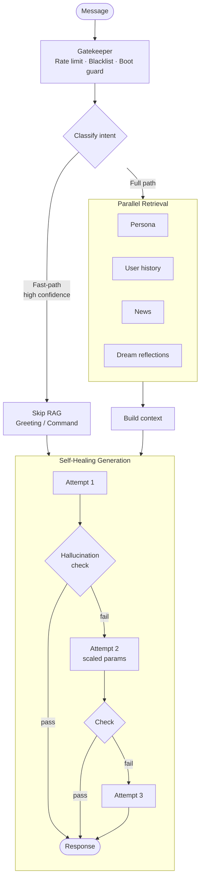
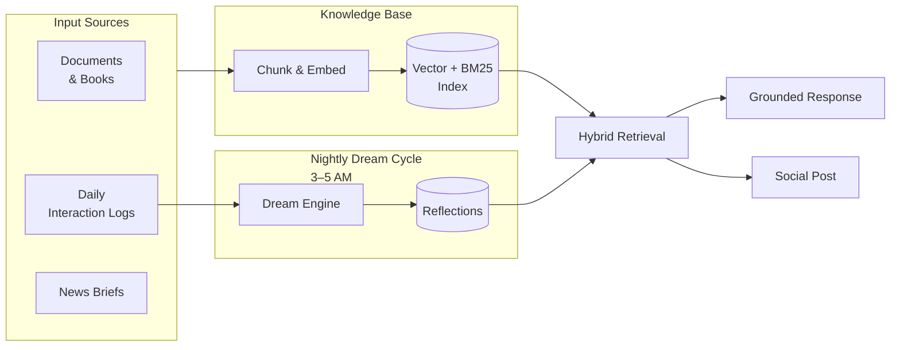
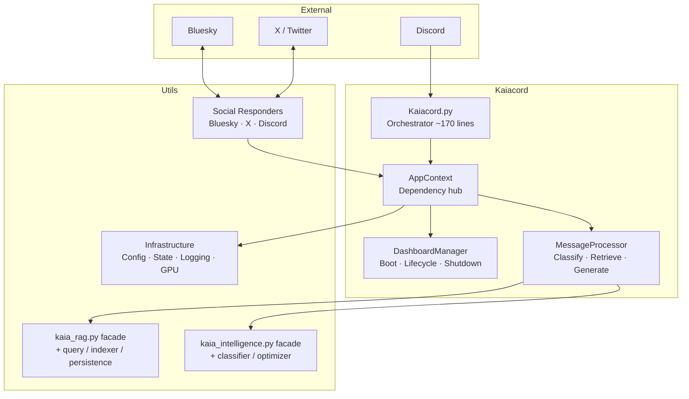

<div align="center">

# KAIACORD

**A self-hosted Discord AI with persistent memory, local inference, and a real personality.**

*Built for an RTX 3060 12GB. No cloud required. No subscriptions. No tracking.*

[](https://python.org)
[](https://ollama.com)
[](https://discordpy.readthedocs.io)
[](LICENSE)

</div>

---

Kaia is an autonomous AI agent that actually remembers and evolves. She builds a personal knowledge base from your conversations, dreams about them at night, and develops her own beliefs over time. Her lifelike presence system includes reading pauses, mood-driven Discord statuses, conversational fatigue, and callbacks to past interactions.

She has a persona (blunt, lowercase, technically precise), cross-posts to Bluesky and X, monitors forums, and generates daily news briefs via Gemini. The whole stack runs locally with Ollama.

---

## How it works

```
Message arrives → classify intent → retrieve memory → generate response → validate → send
```

Three stages, all local:

**1. Classify** — a lightweight CPU model (gemma2:2b) decides what kind of question this is. Fast-path regex for simple cases, full LLM for ambiguous ones.

**2. Retrieve** — hybrid BM25 + vector search across persona, user history, news, dreams, and knowledge docs. Identity-aware: forum and Discord profiles merge into one context.

**3. Generate** — gemma3:12b produces the response in Kaia's voice. A 3-pass self-healing loop catches bad output. Hallucination detection strips fabrications before they reach the user.

---

## Processing pipeline



---

## Memory & Reflection

Kaia doesn't just retrieve — she reflects. Every night (3–5 AM) the Dream Engine processes the day's conversations into associative summaries that get re-injected into the RAG index.



---

## Architecture



---

## Quick start

```bash
# 1. Clone and install
git clone https://github.com/your-repo/Kaiacord.git
cd Kaiacord
pip install -r requirements.txt

# 2. Pull models
ollama pull gemma3:12b            # Chat (~8GB VRAM)
ollama pull gemma2:2b             # Intent classifier (CPU)
ollama pull nomic-embed-text-cpu  # Embeddings (CPU)

# 3. Configure
cp .env.example .env
# Edit .env — add DISCORD_TOKEN at minimum

# 4. Launch
python Kaiacord.py

# With TUI dashboard (default)
python Kaiacord.py

# Without curses UI (log-only mode)
python Kaiacord.py --no-gui
```

First message: `@kaia status` in Discord to verify she's running.

---

## Features

| | Feature | Detail |
|:--|:--------|:-------|
| 💬 | **Local inference** | gemma3:12b via Ollama, 8K context, fully offline |
| 🧠 | **Persistent memory** | RAG-backed knowledge base, per-user profiles, conversation history |
| 🌙 | **Dream Engine** | Nightly associative recall — processes daily logs into reflections |
| 🎭 | **Lifelike presence** | Reading pauses, mood-based Discord status, emoji reactions |
| 🌱 | **Character growth** | Evolving beliefs, self-model regeneration, interactive milestones |
| 🕰️ | **Temporal awareness**| Time-of-day personality modulation, conversational fatigue |
| 💬 | **Deep continuity** | Tone mirroring, open loop callbacks to past unfinished threads |
| 💭 | **Inner monologue** | Private thought stream from passive observation, injected as context |
| 🫂 | **Relationship stages**| stranger→inner_circle behavioral gating per user |
| 🎯 | **Conversational stance**| High-confidence beliefs expressed as active opinions |
| 😊 | **Emotional arc** | Persistent mood vector (valence/arousal/energy) with 6h decay |
| 📡 | **Proactive initiation**| Speaks first — absence check-ins, knowledge triggers, dream insights |
| 🔗 | **Episodic memory** | Dream-extracted thematic anchors for cross-session callbacks |
| 🔍 | **Hybrid retrieval** | BM25 + vector search with reciprocal rank fusion |
| 🛡️ | **Hallucination guard**| Adversarial self-check, knowledge boundary enforcement |
| 🔄 | **Self-healing** | 3-pass generation loop with automatic parameter scaling |
| 📰 | **Daily news** | Auto-generated tech briefs via Gemini API, 14-day retention |
| 🐦 | **Social media** | Cross-posts to Bluesky and X, replies to mentions |
| 🏛️ | **Forum integration** | VBulletin scraping, Discord ↔ Forum identity linking |
| 📊 | **Curses dashboard** | Real-time VRAM/GPU stats, RAG health, live log stream |
| ⚡ | **Circuit breakers** | Automatic failure isolation for all external APIs |
| ⚔️ | **Aethelgard TTRPG** | Persistent text RPG with combat, housing, fishing, and LLM narration |

---

## Commands

| Command | Description | Who |
|:--------|:------------|:----|
| `!news [category]` | Fetch news briefs (`today`, `technology`, `security`, `hacking`, `politics`, `business`, `science`, `culture`) | All |
| `!download <url>` | Ingest a URL into the knowledge base | All |
| `!quip` | Trigger a social media post (10m cooldown) | All |
| `!rpg` | Open the Aethelgard TTRPG HUD and play | All |
| `!forum link <uid>` | Link Discord identity to forum profile | All |
| `!dreams list` | Show recent dream reflections | Admin |
| `!dreams generate` | Force a dream cycle | Admin |
| `!cache clear` | Wipe response cache | Admin |
| `!forum scrape` | Manually scrape configured subforum | Admin |
| `!snapshot` | Save current conversation context | Admin |
| `!flag` / `!audit` | Flag a response for review | Admin |

Kaia also responds naturally (no `!`) to: `status`, `stats`, `what's new`, `how are you`, and direct questions.

---

## GPU budget

Kaia manages a single 12GB VRAM budget. Classification and embeddings are hard-pinned to CPU.

| Model | Role | Device | VRAM |
|:------|:-----|:-------|:----:|
| `gemma3:12b` | Chat & generation | GPU | ~8 GB |
| `gemma2:2b` | Intent classification | CPU (`num_gpu: 0`) | 0 |
| `nomic-embed-text-cpu` | RAG embeddings | CPU (`num_gpu: 0`) | 0 |

Context window: **8,192 tokens** (~1GB KV cache). Configurable in `config/kaia.yaml`.

See: [`docs/03-architecture/gpu-management.md`](docs/03-architecture/gpu-management.md)

---

## Configuration

### `.env`
```env
DISCORD_TOKEN=your_discord_bot_token
GEMINI_API_KEY=your_key           # Optional — required for news generation
BLUESKY_HANDLE=yourbot.bsky.social  # Optional — for social posting
BLUESKY_APP_PASSWORD=xxxx-xxxx-xxxx-xxxx
X_USERNAME=YourUsername            # Optional — unofficial API (see security notice)
X_PASSWORD=YourPassword
```

### `config/kaia.yaml`
```yaml
discord:
  blacklisted_channels: "general,announcements"

models:
  chat: "gemma3:12b"

performance:
  max_memory_messages: 30
  max_context_tokens: 8192
  requests_per_minute: 30

bluesky:
  enabled: false
  reply_to_mentions: false

x_twitter:
  enabled: false
  reply_to_mentions: false
```

Full config reference: [`config/default_config.yaml`](config/default_config.yaml)

---

## Project structure

```
Kaiacord/
├── Kaiacord.py              # Orchestrator (~170 lines)
├── config/                  # YAML config, persona, entity databases
├── knowledge_base/          # RAG document storage (books, news, user logs)
├── memory/                  # Persistent state (bot_state.json, rag_storage/)
├── logs/                    # Consolidated log: kaiacord.log
├── utils/
│   ├── core/                # RAG, Intelligence, Dream Engine, MessageProcessor
│   ├── infrastructure/      # AppContext, Dashboard, Logging, Config, GPU
│   ├── social/              # Bluesky, X, Social Responders
│   ├── commands/            # Discord command handlers
│   └── news/                # News retrieval & management
├── tools/
│   ├── maintenance/         # update_kaia_news.py, health_check.py, force_reindex.py
│   ├── diagnostics/         # RAG index scanning, embedding verification
│   ├── recovery/            # find_contamination.py, nuclear_reset.py
│   ├── development/         # generate_user_profiles.py
│   ├── rebuild_rag_gpu.py   # Full GPU-accelerated RAG rebuild
│   └── tests/               # pytest suite (unit / verification / integration)
├── scripts/
│   ├── kaia-tools.sh        # Interactive whiptail TUI for all maintenance
│   └── backfill_relationships.py  # Populate relationship data from user logs
└── docs/                    # Full documentation
```

---

## Maintenance

The fastest way to manage everything is the TUI:

```bash
bash scripts/kaia-tools.sh
```

Direct commands:
```bash
# Verify environment
python tools/maintenance/health_check.py

# Update today's news
python tools/maintenance/update_kaia_news.py

# Force RAG re-index
python tools/maintenance/force_reindex.py

# Full RAG rebuild (GPU — bot must be stopped)
python tools/rebuild_rag_gpu.py --clear
```

---

## Testing

```bash
# Health check first
python tools/maintenance/health_check.py

# Unit tests
PYTHONPATH=. pytest tools/tests/unit/ -q

# Verification tests
PYTHONPATH=. pytest tools/tests/verification/ -q
```

`pytest.ini` at project root handles async automatically. No `@pytest.mark.asyncio` needed.

---

## Persona

Edit `config/kaia_persona.md` to change her personality. She re-reads it on every restart.

The persona shapes tone, not facts. Memory comes from the knowledge base.

---

## Documentation

Full docs: [`docs/README.md`](docs/README.md)

| Topic | Link |
|:------|:-----|
| Quick Start | [`docs/01-getting-started/quick-start.md`](docs/01-getting-started/quick-start.md) |
| Commands | [`docs/02-user-guide/commands.md`](docs/02-user-guide/commands.md) |
| Architecture | [`docs/03-architecture/overview.md`](docs/03-architecture/overview.md) |
| GPU Management | [`docs/03-architecture/gpu-management.md`](docs/03-architecture/gpu-management.md) |
| RAG System | [`docs/03-architecture/rag-system.md`](docs/03-architecture/rag-system.md) |
| Social Media Setup | [`docs/02-user-guide/social-media.md`](docs/02-user-guide/social-media.md) |
| X Security Notice | [`docs/04-security/x-twikit-credentials.md`](docs/04-security/x-twikit-credentials.md) |
| Testing | [`docs/04-development/testing.md`](docs/04-development/testing.md) |
| Troubleshooting | [`docs/06-troubleshooting/common-issues.md`](docs/06-troubleshooting/common-issues.md) |
| Tools Reference | [`tools/README.md`](tools/README.md) |
| Reports & Planning | [`docs/reports/README.md`](docs/reports/README.md) |

---

## License

[MIT](LICENSE)

---

<div align="center">
<sub>
Built by Ekco · engineered with Claude, Gemini/Antigravity, Deepseek — local AI, no cloud required
<br>
Optimized for RTX 3060 12GB · gemma3:12b · Python 3.14+
</sub>
</div>
