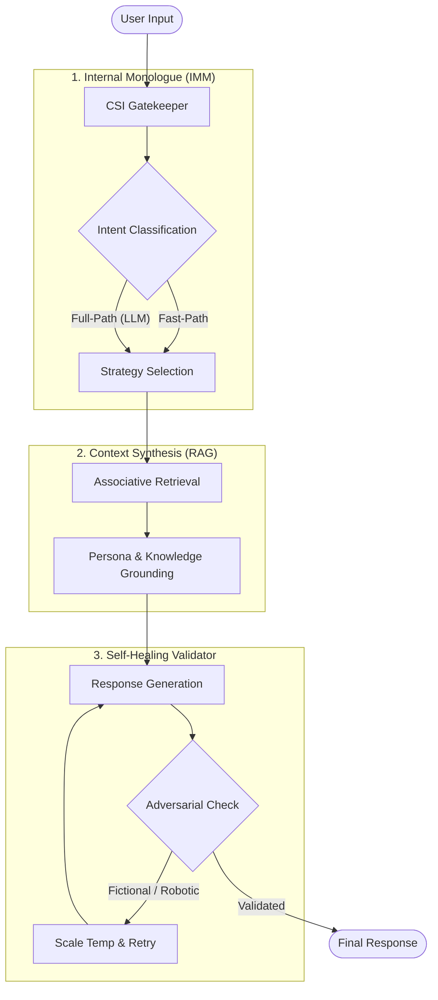
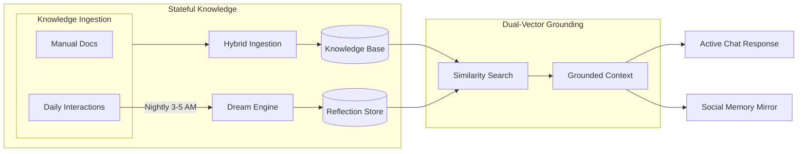
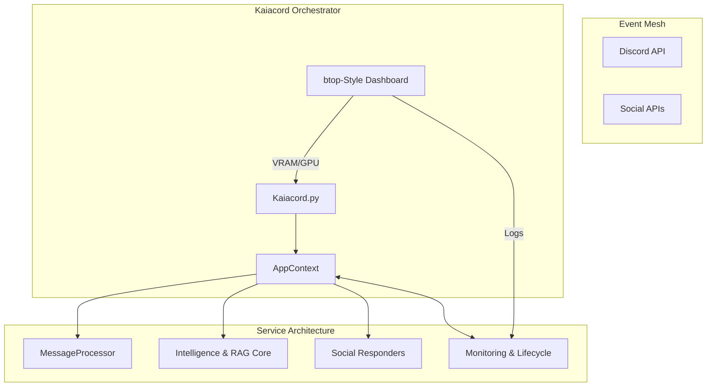

<h1 align="center">Kaiacord 🤖</h1>

<p align="center">
  
  
  
  
  
  
  
</p>

<p align="center">
  <strong>Kaia is a stateful autonomous agent for Discord that maintains continuity through a multi-layered memory architecture bridging short-term context with long-term RAG knowledge.</strong>


</p>

---

## 🚀 Quick Start (5 Minutes)

### Prerequisites
- **Python** 3.9+
- **GPU** with 8GB+ VRAM (12GB recommended for RTX 3060)
- **Discord Bot Token** ([Get one here](https://discord.com/developers/applications))
- **Ollama** installed ([Download](https://ollama.ai))

### Installation
```bash
# 1. Clone and setup
git clone https://github.com/YOUR_USERNAME/Kaiacord.git
cd Kaiacord
python -m venv venv
source venv/bin/activate
pip install -r requirements.txt

# 2. Pull AI models (this will take a while)
ollama pull gemma3:12b           # Chat model (8GB)
ollama pull nomic-embed-text     # Embedding model

# 3. Configure
cp .env.example .env  # Create from example, or:
echo "DISCORD_TOKEN=your_token_here" > .env
echo "GEMINI_API_KEY=your_key_here" >> .env  # Optional: for news generation

# 4. Launch!
python Kaiacord.py
```

**First message**: `@kaia status` in Discord to verify it's working!

---

## ✨ Features

| Category | Features | Status |
|:---------|:---------|:-------|
| **🤖 Core AI** | Local Inference (Ollama), Multi-Model Support (`gemma3:12b`), Identity Anchor (Non-truncating persona core protection) | ✅ |
| **⚡ Performance** | Smart VRAM Management (Auto-unloading models for 12GB GPUs), Optimized 28k Context Scaling, Rate Limiting | ✅ |
| **📊 Interface** | Curses Dashboard (btop-style), Discord Bot, Consolidated Logging | ✅ |
| **🧠 Memory** | RAG with File Indexing, User Profiles, Semantic Cache, Natural Mention | ✅ |
| **🎯 Intelligence** | Query Classification, Personalization, Temporal Calibration | ✅ |
| **💭 Dream Mode** | Associative memory recall (nightly 3-5 AM); processes archived knowledge into persona-deep reflections for more natural, organic RAG callbacks | ✅ |
| **🔄 Self-Healing** | 3-pass generation loop with automatic parameter scaling to recover from LLM failures or hallucinations | ✅ |
| **🌐 Social Media** | Cross-post to Bluesky & X, Auto-reply to mentions, Memory Mirror | ✅ |
| **🏟️ Forums** | VBulletin 3.x Client, Deep Thread Scraping, Unified Identity Linking (Discord <-> Forum)| ✅ |
| **📰 News** | Daily Briefs, Manual Retrieval, Ingestion of manual/weekly briefs | ✅ |
---

# 🧠 Cognitive Architectures & Synthetic Consciousness
### Advanced Systems for Human-Emulating AI Agents

## 1. Cognitive Processing Pipeline
The processing pipeline is the central nervous system of Kaia, orchestrated by the `MessageProcessor`. It manages the logical transition from pre-conscious filtering to intent classification and multi-stage self-healing.



## 2. Memory & Reflection Architecture
Kaia employs a dual-vector memory system. Raw daily logs are processed nightly into **Deep Reflections**—associative memory nodes that are re-injected into her active RAG context to ground both her conversations and social media presence.



---

## 🏗️ Architecture Overview
Kaia is built with a modular service architecture optimized for local GPU inference.



---

## 📋 Usage Examples

### 💬 Basic Chat
```
User: @kaia what's Python?
Kaia: programming language. general purpose. readable syntax. popular for automation and data work.
```

### 📰 News Retrieval
```
User: !news technology
Kaia: 📰 **Technology News**
[Briefings from daily/weekly ingestion]
```

**Categories**: `technology`, `security`, `hacking`, `politics`, `business`, `science`, `culture`, `general`

**Features**:
- Auto-generates daily on boot (requires `GEMINI_API_KEY`)
- 14-day retention → Auto-archives to `knowledge_base/news/archive/`
- Weekly summaries from archived news
- Supports manual ingestion of briefings via `tools/maintenance/ingest_manual_news.py`

### 🏟️ Forum Archaeology
Kaia can deep-scrape VBulletin forums to build high-density knowledge bases:
```
 Unified Identity Linking:
 !forum link <forum_id>
 Associates your Discord identity with your forum profile for cross-platform 
 personality dossiers.

 Technical Knowledge Expansion:
 Kaia deep-scrapes subforums (like Technical Discussion) and synthesizes
 community-vetted solutions into searchable Cheat Sheets.

 Safe Interaction:
 Quoting support with [QUOTE] BBCode and thread-specific allowlists
 ensure Kaia only interacts where she belongs.
```
**References**:  
- [`docs/02-user-guide/forum-integration.md`](docs/02-user-guide/forum-integration.md)

### 🌐 Social Media
Kaia can cross-post to Bluesky and X, and reply to mentions:
```
 Idle quips auto-post to:
 - @kaiakuroshi.bsky.social (Bluesky)
 - @Nokifusignal (X)

 When someone mentions Kaia on Bluesky or X,
 she replies using her AI persona (checked every 5 min)

 Memory Mirror:
 Idle quips are now grounded in Kaia's actual past conversations,
 making her "skeets" and posts feel like genuine personal reflections.
```

**Setup**: See [`docs/02-user-guide/social-media.md`](docs/02-user-guide/social-media.md)

## 📊 Monitoring & Logging

### Consolidated Log
All output (bot logs, system errors, library tracebacks) is consolidated into:
`logs/kaiacord.log`

### Curses Dashboard
```bash
python Kaiacord.py  # Launches dashboard
```
- **Real-time VRAM/GPU monitoring**
- **Active Model tracking**
- **Live log stream with automatic color-to-plain conversion for file persistence**

---

## ⚙️ Configuration

### Quick Config (`.env`)
```env
DISCORD_TOKEN=your_discord_bot_token
GEMINI_API_KEY=your_api_key  # Optional: for news generation
```

### Advanced Config (`config/kaia.yaml`)
```yaml
# Override defaults hierarchically
discord:
  blacklisted_channels: "general,announcements"

models:
  chat: "gemma3:12b"

performance:
  max_memory_messages: 30
  max_context_tokens: 28000     # Hardware-optimized context (RTX 3060 12GB default)
  requests_per_minute: 30
```


---

## 🎛️ Advanced Features

### Custom Persona
Edit `knowledge_base/kaia_persona.md` to customize personality:
```markdown
# Kaia's Persona

You are Kaia, a blunt, grounded AI with technical expertise.
- Use lowercase for casual tone
- Be direct and concise
- Focus on facts over fluff
```

### Knowledge Base Management
```bash
# Add documents (auto-indexed)
cp my_docs.pdf knowledge_base/
# Kaia automatically detects and indexes new files

# Force re-index
# Force re-index
python tools/maintenance/reindex_rag.py
```

### GPU Management (12GB VRAM)
Kaia automatically manages VRAM:
1. **Chat**: gemma3:12b loaded (8GB)
2. **Context**: 28,000 token context window (~2.3GB) optimized for 12GB cards.
3. **Monitor**: `watch -n 1 nvidia-smi` to see VRAM usage

**See**: [`docs/03-architecture/gpu-management.md`](docs/03-architecture/gpu-management.md) for details

---

## 🧪 Testing

```bash
# Verification scripts
# Verification scripts
python tools/maintenance/health_check.py
python scripts/test_md_logging.py
python scripts/test_skepticism.py
python scripts/verify_filter_fix.py

# System health check
python tools/maintenance/health_check.py
```

---

## 📁 Project Structure

```
Kaiacord/
├── Kaiacord.py              # Minimal Orchestrator
├── utils/                   # Deeply modularized logic
│   ├── core/                # RAG, Intelligence, Dream, MessageProcessor
│   ├── infrastructure/      # AppContext, DashboardManager, Logging, System
│   ├── social/              # Twitter/X, Bluesky, Social Responders
│   ├── commands/            # Extracted command handlers
│   └── news/                # News retrieval & management
├── config/                  # Configuration & Personas
├── knowledge_base/          # RAG text storage (News, User Logs)
├── memory/                  # Persistent JSON data (Cache, State)
├── logs/                    # ONE LOG FILE: kaiacord.log
├── tools/                   # Standalone utilities
│   ├── maintenance/         # RAG refresh, News cleanup, Health check
│   ├── diagnostics/         # Categorized scan & trigger tools
│   ├── tests/               # Dedicated Pytest suite & verification scripts
│   │   ├── unit/            # Component unit tests
│   │   ├── integration/     # End-to-end flow tests
│   │   ├── verification/    # Logic & isolation verification
│   │   └── archive/         # Legacy & reference tests
├── docs/                    # Detailed documentation
```

---

## 📚 Documentation

All docs are organized in [docs/](docs/README.md).

### 🎯 Essentials
- **[Quick Start](docs/01-getting-started/quick-start.md)** - Get running in 5 minutes
- **[Command Reference](docs/02-user-guide/commands.md)** - Full list of commands and triggers

### 🏗️ Technical
- **[System Overview](docs/03-architecture/overview.md)** - System design & data flows
- **[GPU Management](docs/03-architecture/gpu-management.md)** - VRAM for RTX 3060 (12GB)
- **[Social Media](docs/02-user-guide/social-media.md)** - Bluesky & X integration
- **[Testing Guide](docs/04-development/testing.md)** - Testing infrastructure

### 🔧 Maintenance
- **[tools/README.md](tools/README.md)** - Maintenance tools reference
- **[Procedures](docs/05-maintenance/procedures.md)** - Backup & update procedures
- **[Troubleshooting](docs/06-troubleshooting/common-issues.md)** - Common issues

---


---

## 📄 License

This project is licensed under the [MIT License](LICENSE).

---

<p align="center">
  <sub>Built with ❤️ by Gemini & Claude for local AI enthusiasts | GPU-optimized for RTX 3060 12GB</sub>
</p>
