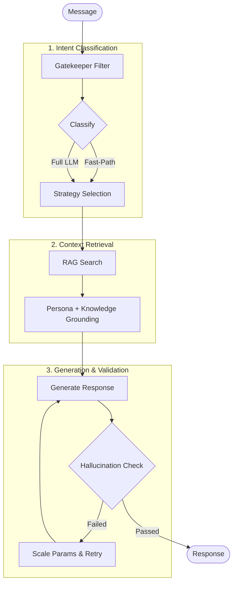
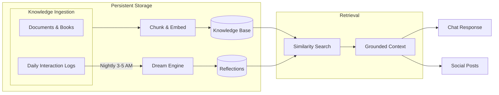
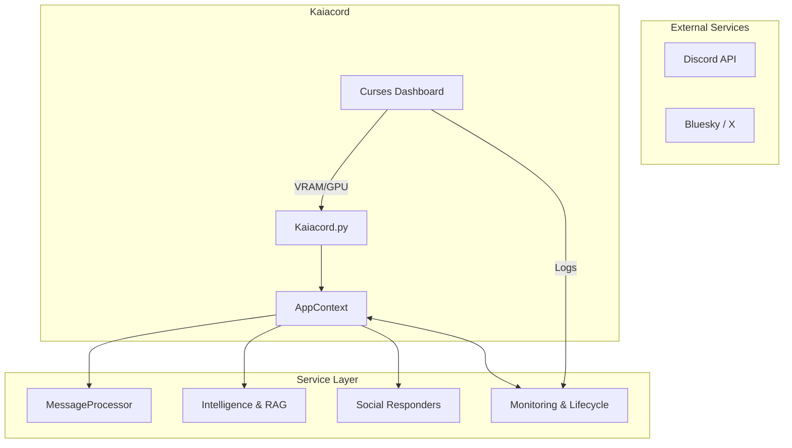

<h1 align="center">Kaiacord</h1>

<p align="center">
  
  
  
  
  
  
  
</p>

<p align="center">
  <strong>Kaia is a locally-hosted Discord bot with persistent memory, social media cross-posting, and a personality. She runs entirely on Ollama, uses RAG for knowledge retrieval, and doesn't need cloud APIs to function.</strong>
</p>

---

## Quick Start

### Prerequisites
- **Python** 3.9+
- **GPU** with 8GB+ VRAM (12GB recommended for RTX 3060)
- **Discord Bot Token** ([Get one here](https://discord.com/developers/applications))
- **⚠️ REQUIRED:** Enable all 3 **Privileged Gateway Intents** (Presence, Server Members, Message Content) in the Discord Developer Portal.
- **Ollama** installed ([Download](https://ollama.ai))

### Installation
```bash
# 1. Clone and setup
git clone https://github.com/YOUR_USERNAME/Kaiacord.git
cd Kaiacord
python -m venv venv
source venv/bin/activate
pip install -r requirements.txt

# 2. Pull AI models
ollama pull gemma3:12b           # Chat model (~8GB VRAM)
ollama pull gemma2:2b            # Intent classifier (CPU)
ollama pull nomic-embed-text-cpu # Embedding model (CPU)

# 3. Configure
cp .env.example .env  # Create from example, or:
echo "DISCORD_TOKEN=your_token_here" > .env
echo "GEMINI_API_KEY=your_key_here" >> .env  # Optional: for news generation

# 4. Launch
python Kaiacord.py
```

**First message**: `@kaia status` in Discord to verify she's running.

---

## Features

| Category | What it does |
|:---------|:-------------|
| **Chat** | Local inference via Ollama (`gemma3:12b`), persona-anchored responses, configurable 8K context window |
| **Memory** | RAG-backed knowledge base, per-user profiles, conversation snapshots, interaction logging |
| **Intelligence** | Intent classification, user personalization, temporal awareness |
| **Hallucination Guard** | Adversarial self-check with tracer phrases, knowledge boundary enforcement, hazy memory detection |
| **Dream Mode** | Nightly (3–5 AM) associative recall — processes daily logs into reflections that feed back into RAG |
| **Self-Healing** | 3-pass generation loop with automatic parameter scaling when the LLM produces bad output |
| **Resilience** | Circuit breakers for external APIs, 401 auto-retry for X auth, ordered shutdown |
| **Social Media** | Cross-posts to Bluesky & X, replies to mentions, memory-grounded idle quips |
| **Forums** | VBulletin 3.x scraping, deep thread indexing, Discord ↔ Forum identity linking |
| **News** | Daily auto-generated briefs (via Gemini API), 14-day retention with archive |
| **Dashboard** | Curses-based TUI with real-time VRAM/GPU stats, live log stream |

---

## How It Works

### Processing Pipeline

When a message comes in, Kaia runs it through a three-stage pipeline: classify intent, retrieve context from RAG, then generate and validate the response.



### Memory & Reflection

Kaia logs daily interactions and processes them overnight into associative reflections. These reflections are re-injected into her RAG index, grounding both her conversations and social media posts in actual past experience.



---

## Architecture



---

## Usage

### Chat
```
User: @kaia what's Python?
Kaia: programming language. general purpose. readable syntax. popular for automation and data work.
```

### News
```
User: !news technology
Kaia: 📰 Technology News
[Briefings from daily/weekly ingestion]
```

**Categories**: `technology`, `security`, `hacking`, `politics`, `business`, `science`, `culture`, `general`

- Auto-generates daily on boot (requires `GEMINI_API_KEY`)
- 14-day retention → auto-archives to `knowledge_base/news/archive/`
- Supports manual ingestion via `tools/maintenance/ingest_manual_news.py`

### Forum Integration
```
!forum link <forum_id>     # Link Discord identity to forum profile
```
Kaia deep-scrapes VBulletin subforums and synthesizes community knowledge into searchable cheat sheets.

See: [`docs/02-user-guide/forum-integration.md`](docs/02-user-guide/forum-integration.md)

### Social Media
Kaia cross-posts idle quips to Bluesky and X, and replies to mentions every 5 minutes. Posts are grounded in her actual conversation history via the Memory Mirror system.

See: [`docs/02-user-guide/social-media.md`](docs/02-user-guide/social-media.md)

---

## Configuration

### `.env`
```env
DISCORD_TOKEN=your_discord_bot_token
GEMINI_API_KEY=your_api_key  # Optional: for news generation
```

### `config/kaia.yaml`
```yaml
# Override defaults hierarchically
discord:
  blacklisted_channels: "general,announcements"

models:
  chat: "gemma3:12b"

performance:
  max_memory_messages: 30
  max_context_tokens: 8192      # Unified CONTEXT_WINDOW_TOKENS for RTX 3060 12GB
  requests_per_minute: 30
```

---

## GPU Management

Kaia manages a single 12GB VRAM budget:

| Model | Role | Runs on | VRAM |
|:------|:-----|:--------|:-----|
| `gemma3:12b` | Chat | GPU | ~8 GB |
| `gemma2:2b` | Intent classifier | CPU (`num_gpu: 0`) | 0 |
| `nomic-embed-text-cpu` | Embeddings | CPU (`num_gpu: 0`) | 0 |

Context window is set to 8K tokens (~1 GB KV cache), configurable in `config/kaia.yaml`.

See: [`docs/03-architecture/gpu-management.md`](docs/03-architecture/gpu-management.md)

---

## Monitoring

All output goes to `logs/kaiacord.log`. The curses dashboard shows real-time VRAM usage, active models, and a live log stream.

```bash
python Kaiacord.py  # Launches with dashboard
```

---

## Custom Persona

Edit `knowledge_base/kaia_persona.md`:
```markdown
# Kaia's Persona

You are Kaia, a blunt, grounded AI with technical expertise.
- Use lowercase for casual tone
- Be direct and concise
- Focus on facts over fluff
```

## Knowledge Base

```bash
# Add documents (auto-indexed on next boot or file change)
cp my_docs.pdf knowledge_base/

# Force re-index
python tools/rebuild_rag.py
```

---

## Testing

Kaia uses a modernized, 100% stable `pytest` suite. The `pytest.ini` automatically handles all asynchronous standalone module testing.

```bash
# Health check (Run this first to verify environment)
python tools/maintenance/health_check.py

# Run unit tests (Core logic, DB, intent parsers)
PYTHONPATH=. pytest tools/tests/unit/ -q

# Run verification tests (Integration sanity checks)
PYTHONPATH=. pytest tools/tests/verification/ -q
```

---

## Project Structure

```
Kaiacord/
├── Kaiacord.py              # Entry point & orchestrator
├── config/                  # YAML config, persona, entity databases
├── knowledge_base/          # RAG document storage (books, news, user logs)
├── memory/                  # Persistent state (cache, profiles, RAG index)
├── logs/                    # Consolidated log: kaiacord.log
├── utils/
│   ├── core/                # RAG, Intelligence, Dream Engine, MessageProcessor
│   ├── infrastructure/      # AppContext, Dashboard, Logging, Config
│   ├── social/              # X, Bluesky, Social Responders
│   ├── commands/            # Discord command handlers
│   └── news/                # News retrieval & management
├── tools/
│   ├── maintenance/         # RAG refresh, news update, health check
│   ├── diagnostics/         # Index scanning, model inspection
│   ├── recovery/            # Hallucination cleanup, nuclear reset
│   ├── social/              # X auth, cookie extraction
│   └── tests/
│       ├── unit/            # Component tests
│       ├── integration/     # End-to-end flow tests
│       └── verification/    # Logic verification & smoke tests
├── scripts/                 # Maintenance & diagnostic scripts
└── docs/                    # Full documentation
```

---

## Documentation

All docs: [`docs/README.md`](docs/README.md)

| Topic | Link |
|:------|:-----|
| Quick Start | [`docs/01-getting-started/quick-start.md`](docs/01-getting-started/quick-start.md) |
| Commands | [`docs/02-user-guide/commands.md`](docs/02-user-guide/commands.md) |
| Architecture | [`docs/03-architecture/overview.md`](docs/03-architecture/overview.md) |
| GPU Management | [`docs/03-architecture/gpu-management.md`](docs/03-architecture/gpu-management.md) |
| Social Media | [`docs/02-user-guide/social-media.md`](docs/02-user-guide/social-media.md) |
| Testing | [`docs/04-development/testing.md`](docs/04-development/testing.md) |
| Troubleshooting | [`docs/06-troubleshooting/common-issues.md`](docs/06-troubleshooting/common-issues.md) |
| Tools Reference | [`tools/README.md`](tools/README.md) |
| Reports & Planning | [`docs/reports/README.md`](docs/reports/README.md) |

---

## License

This project is licensed under the [MIT License](LICENSE).

---

<p align="center">
  <sub>Built by Ekco, Claude, Gemini, Deepseek, and Antigravity — local AI, no cloud required | Optimized for RTX 3060 12GB</sub>
</p>
