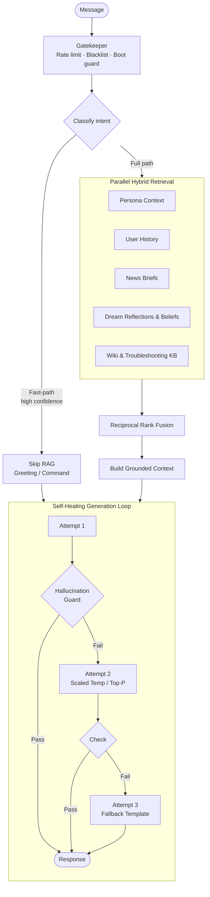

<div align="center">

# 🌌 KAIACORD

### **A Production-Grade, Self-Hosted Discord AI Agent with Cognitive Persistence, Hybrid RAG, and Local Inference**


[](https://python.org)
[](https://ollama.com)
[](https://discordpy.readthedocs.io)
[](LICENSE)

---

**Kaia** is not a simple chatbot; she is an autonomous local AI persona designed to maintain deep conversational continuity, persistent emotional states, and genuine situational awareness. Running entirely on local hardware, she is capable of episodic memory consolidation, nightly dream reflections, belief revisions, and natural, multi-threaded communication.

[Core Architecture](#-core-architecture) • [Cognitive Pipeline](#-the-cognitive-pipeline) • [Aethelgard TTRPG](#-aethelgard-ttrpg-engine) • [Quick Start](#-installation--quick-start) • [GPU Budget](#-gpu-budgeting--performance) • [Folder Map](#-system-topology)

</div>

---

## 🧠 The Cognitive Pipeline (28 Core Systems)

Kaia’s lifelike presence is managed through a fully deterministic, 28-feature Python cognitive layer that modules the system prompt dynamically based on heuristics—**without incurring VRAM-heavy auxiliary LLM calls**.

```
                           ┌────────────────────────┐
                           │      Message Input     │
                           └───────────┬────────────┘
                                       │
                  ┌────────────────────▼────────────────────┐
                  │ 28-Feature Lightweight Cognitive Filter │
                  │  (Mood · Stance · History · Relationships)│
                  └────────────────────┬────────────────────┘
                                       │
                  ┌────────────────────▼────────────────────┐
                  │   System Prompt Customization & RAG     │
                  └────────────────────┬────────────────────┘
                                       │
                           ┌───────────▼────────────┐
                           │ Local Inference Engine │
                           └────────────────────────┘
```

### Key Cognitive Subsystems

*   **🎭 Persistent Emotional Arc**: Tracks mood across a three-dimensional vector (`valence`, `arousal`, `energy`) with natural 6-hour decay, modulating her vocabulary, reaction frequency, and Discord status text.
*   **🫂 Staged Relationships**: Maintains per-user event logs and tracks familiarity across 5 progression levels (from `stranger` to `inner_circle`), complete with behavioral gating and trust thresholds.
*   **🌙 Nightly Dream Cycle**: Between 3:00 AM and 5:00 AM, the dream engine runs. It aggregates the day's logs, extracts key assertions, compiles them into a 50-cap revisable belief store (`beliefs.json`), and updates a rolling identity stream journal.
*   **🕰️ Temporal & Fatigue Awareness**: Dynamic time-of-day conversational adjustments, fatigue multipliers for long threads, and natural reunion detection (acknowledging absences when users return).
*   **💭 Passive Inner Monologue**: Generates a running background commentary from passive room observation, which is woven directly into active context windows as private intuition.
*   **📡 Proactive Initiation**: An autonomous 7-source trigger engine (absence, beliefs, dreams, mood, curiosity, memory, silence) that lets Kaia initiate conversations naturally, capped to a lifelike frequency.
*   **Gamified Memory Analytics (`!scores`)**: Ranks user affinity bonds, active beliefs, memory anchor salience, coherence ratings, and operational telemetry via interactive Discord Embed category dropdowns (`!scores`, `!stats`, `!leaderboard`).
*   **🫂 Memory Anchors**: Captures up to 50 highly weighted cross-session episodic memories with natural exponential decay, enabling organic conversational callbacks to past events weeks later.
*   **🏟️ Project 1999 Forum Integration**: Periodic scraping loops (6h interval) scanning Off-Topic (Forum 19) and Technical Discussion (Forum 40). Features a Discord moderation queue in `#kaia-opolis` with interactive Accept/Reject buttons, zero-hallucination support answers from RAG, and profile caching to model active users.
*   **🖥️ Symmetrical Curses Dashboard**: A three-pane terminal TUI (**SYSTEM STATS**, **BOT STATUS**, and **COGNITIVE PIPELINE & FORUMS**) providing real-time CPU/GPU metrics, bot metrics, cognitive stats (beliefs, anchors, affinity), and a live stream of elevated logging events (monologue, dream insights, scans).

---

## 🏗️ Core Architecture

Kaia implements a highly optimized **Classify-Retrieve-Generate** architecture to keep latency low and local execution deterministic.



### 1. Intent Classification (CPU)
To conserve VRAM, incoming messages are routed through a highly optimized dual-path intent classifier. Common patterns hit fast-path regex matchers, while ambiguous inputs utilize a CPU-pinned lightweight model (`gemma2:2b`) to classify intent without waking the primary generation model.

### 2. Hybrid RAG & Reciprocal Rank Fusion
Kaia searches a structured, offline Markdown knowledge base using combined **BM25 lexical search** and **dense vector embeddings** (via `nomic-embed-text-cpu`). Results are blended using Reciprocal Rank Fusion (RRF) to merge:
*   Static persona configurations (`kaia_persona.md`)
*   Daily aggregated news briefs and historical conversation logs
*   **Vetted Wiki Guides**: The complete Project 1999 Wikipedia articles covering setups, mechanics, and rules (`knowledge_base/wiki/`).
*   **Synthesized Troubleshooting Indices**: Structured, category-based troubleshooting guides synthesized from 4,500+ technical community reports (`knowledge_base/troubleshooting/`).

### 3. Self-Healing Generation & Grounding
*   **3-Pass Generation Loop**: Automatically catches invalid formats or truncated replies, scaling generation parameters (temperature, top-P) dynamically between attempts.
*   **Hallucination Detector**: Validates final outputs against real channel-scoped facts and RAG context, stripping out ungrounded fabrications or bot-speak roleplay tags before they reach the API.

---

## ⚔️ Aethelgard TTRPG Engine

Built into the bot is a fully deterministic, persistent turn-based RPG. All combat calculations and state transitions are handled mathematically in Python, using the LLM exclusively for dramatic narrations.

*   **Mega-Dungeon Progression**: A 77-floor procedural dungeon ("Spine of the World") equipped with Resonance Lift checkpoints and custom floor encounter pools.
*   **Rich Class Mechanics**: 10 advanced classes featuring distinct progression stats, passive buffs, and unique triggerable combat procs.
*   **Deep Economy & Customization**: Features an inventory system with 452 balanced equipment items across 7 tiers, complete with housing, procedural farming, pets, and alchemy.
*   **System Integrity**: Employs a defense soft-cap (`min(10, raw) + max(0, raw-10)//2`) and absolute stat budgeting targets to prevent game state scaling breakages.

---

## 🎨 Fractal Art Engine

Kaia features a custom CPU-rendered **Fractal Flame Generator** based on the Electric Sheep algorithm.
*   **Mathematical Variety**: Supports 20 variation functions, 10 curated color LUT palettes, and adaptive density estimation to keep images crisp.
*   **Narration**: Accompanies every generated image with artistic and psychological analysis driven by Kaia's persistent emotional vector.

---

## 🚀 Installation & Quick Start

### 1. Prerequisites
*   **OS**: Linux (Ubuntu/Debian recommended)
*   **Hardware**: NVIDIA RTX 3060 12GB VRAM (or equivalent/better)
*   **Software**: Python 3.14+, [Ollama](https://ollama.com)

### 2. Environment Setup
```bash
# Clone the repository
git clone https://github.com/your-repo/Kaiacord.git
cd Kaiacord

# Initialize and activate virtual environment
python3.14 -m venv venv
source venv/bin/activate

# Install required dependencies
pip install -r requirements.txt
```

### 3. Fetch Local Models
Ensure Ollama is running, then pull the required models:
```bash
ollama pull gemma3:12b            # Primary Chat & Narration (Pinned to GPU)
ollama pull gemma2:2b             # Intent Classifier (Pinned to CPU)
ollama pull nomic-embed-text-cpu  # Embedding Model (Pinned to CPU)
```

### 4. Configuration
Copy the template `.env` and fill in your details:
```bash
cp .env.example .env
# Edit .env and supply your DISCORD_TOKEN at a minimum.
```

### 5. Execution Modes
Kaiacord supports both a stunning real-time curses terminal dashboard and a headless server mode:

```bash
# Launch with Curses TUI Dashboard (Default)
python Kaiacord.py

# Launch in Headless Log-Only Mode (Recommended for systemd/daemons)
python Kaiacord.py --no-gui
```

---

## 📊 GPU Budgeting & Performance

Kaia is strictly budgeted to run on a single 12GB consumer graphics card. Classification and embeddings are hard-pinned to CPU to preserve VRAM for the primary LLM context.

| Model | Task | Target Device | VRAM Allocated | Memory Overhead |
|:------|:-----|:--------------|:--------------:|:----------------|
| `gemma3:12b` | Chat, Narration & Reasoning | GPU | ~8.2 GB | ~1.2 GB KV Cache |
| `gemma2:2b` | Real-time Intent Classification | CPU | 0 MB | ~1.6 GB System RAM |
| `nomic-embed-text-cpu` | High-fidelity RAG Embedding | CPU | 0 MB | ~500 MB System RAM |

> [!TIP]
> Keep the context window (`max_context_tokens`) around **8,192 tokens** to ensure the RTX 3060 12GB does not hit out-of-memory errors during long conversations.

---

## 📂 System Topology

```
Kaiacord/
├── Kaiacord.py                  # Bot entry point & central orchestrator
├── AGENTS.md                    # Crucial developer instructions & runtime constraints
├── config/                      # YAML configuration files & persona definitions
├── knowledge_base/              # Grounding documents (books, news, scraped logs)
│   ├── wiki/                    # 13 high-value Project 1999 Wikipedia articles
│   └── troubleshooting/          # Synthesized, category-based troubleshooting guides
├── memory/                      # Persistent runtime state (never commit)
│   ├── ttrpg/characters/        # User characters sheets
│   ├── relationships/           # trust events & user interactions
│   ├── beliefs.json             # 50-cap revisable belief store
│   ├── bot_state.json           # global persistent variables, familiarity, mood
│   ├── identity_stream.md       # 3000-char capping rolling identity log
│   └── memory_anchors.json      # episodic callbacks with weight decay
├── finetune/                    # LoRA Fine-Tuning & Model Compilation (Gemma 3 12B)
│   ├── 01e_preprocess_logs.py   # Speaker turn aggregation and sequence grouping
│   ├── 03_train.py              # LoRA adapter training script (optimized for 12GB GPU)
│   ├── 04_merge_export.py       # Combines base weights and outputs Q4_K_M GGUF
│   └── Modelfile                # Ollama persona setup and inference configuration
├── tools/                       # Utility scripts and offline diagnostic suites
│   ├── diagnostics/             # Probing tools (jspace_probe.py for behavioral audits)
│   └── maintenance/             # Health check and re-indexing controls
├── utils/
│   ├── core/                    # Core cognitive features (mood, dreams, monologue, RAG)
│   │   ├── message_processor.py # Primary intelligence flow manager (~2166 lines)
│   │   ├── safety_pipeline.py   # Post-generation 10-layer safety pipeline & dogtag replay
│   │   ├── kaia_dream.py        # Nightly consolidation engine
│   │   └── kaia_rag.py          # Vector/Lexical facade & query hub
│   ├── ttrpg/                   # Aethelgard combat, dungeon & housing state
│   ├── commands/                # Discord command routers & handlers (scores_handler.py, etc.)
│   ├── social/                  # Social responder (Bluesky, Twitter) & P99 Forum Crawler
│   │   ├── kaia_forum.py        # Project 1999 Forum Client, Scraper & Auto-responder
│   │   └── forum_tasks.py       # Scraper/Posting periodic task loop handlers
│   └── infrastructure/          # AppContext DI, curses dashboard, logger, GPU pinning
└── docs/                        # Complete technical and gameplay specs
```

---

## 🛠️ Verification & Maintenance

The repository features comprehensive tools to monitor, test, and rebuild the database:

### 1. Interactive Tool Panel
```bash
bash scripts/kaia-tools.sh
```

### 2. Maintenance & Operations Commands
```bash
# Verify system integrity & check GPU health
python tools/maintenance/health_check.py

# Force an incremental RAG database re-index
python tools/maintenance/force_reindex.py

# Full vector database wipe and rebuild (requires bot shutdown)
python tools/rebuild_rag_gpu.py --clear
```

### 3. J-Space Behavioral Probing
Verify persona boundary enforcement, apology suppression, and RAG grounding:
```bash
# Run full static probe battery and log replay audits
./scripts/run_jspace_probe.sh full

# Run static probes only (skip real-user log replay)
./scripts/run_jspace_probe.sh static-only
```

### 4. LoRA Fine-Tuning Pipeline
Train, merge, compile, and validate a custom model under 12GB VRAM constraints:
```bash
# Run the entire SFT, merge, export, and Ollama validation pipeline
./scripts/run_finetune.sh
```

### 5. Test Suites
```bash
# Execute fast unit tests
PYTHONPATH=. pytest tools/tests/unit/ -q

# Execute system integration tests
PYTHONPATH=. pytest tools/tests/verification/ -q
```

---

## 📜 Documentation Index

| System Category | Reference File |
|:----------------|:---------------|
| **Getting Started** | [`docs/01-getting-started/quick-start.md`](docs/01-getting-started/quick-start.md) |
| **Command Guides** | [`docs/02-user-guide/commands.md`](docs/02-user-guide/commands.md) |
| **Curses Dashboard**| [`docs/02-user-guide/dashboard.md`](docs/02-user-guide/dashboard.md) |
| **Forum Integration**| [`docs/02-user-guide/forum-integration.md`](docs/02-user-guide/forum-integration.md) |
| **Architecture Spec** | [`docs/03-architecture/overview.md`](docs/03-architecture/overview.md) |
| **VRAM & GPU Tuning** | [`docs/03-architecture/gpu-management.md`](docs/03-architecture/gpu-management.md) |
| **RAG Grounding Layer** | [`docs/03-architecture/rag-system.md`](docs/03-architecture/rag-system.md) |
| **Aethelgard TTRPG Specs**| [`docs/ttrpg/aethelgard_system.md`](docs/ttrpg/aethelgard_system.md) |
| **Project Status Reports**| [`docs/reports/master_report.md`](docs/reports/master_report.md) |
| **Unified Systems Audit** | [`docs/reports/audit_report.md`](docs/reports/audit_report.md) |
| **Jacobian Space Report** | [`docs/reports/Jspace.md`](docs/reports/Jspace.md) |
| **LoRA Fine-Tuning**      | [`docs/reports/LoRA.md`](docs/reports/LoRA.md) |
| **Review Prompt Directive**| [`docs/reports/coding_agent_reviewprompt.md`](docs/reports/coding_agent_reviewprompt.md) |

---

<div align="center">
<sub>
Built by Ekco · Developed in collaboration with Claude, Gemini/Antigravity, and Deepseek
<br>
Local AI, No Cloud Required.
</sub>
</div>
