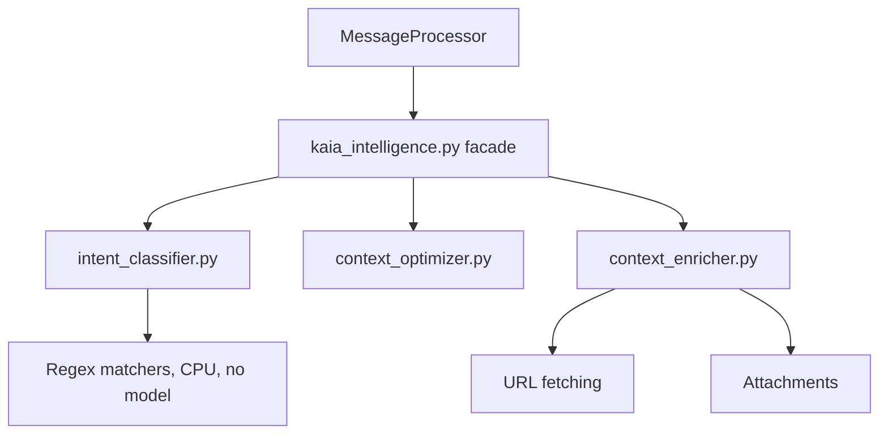

# Kaia Intelligence Layer

Everything between receiving a message and sending a reply: intent matching,
context budgeting, enrichment, generation and the guards on the way out.

> **September 2026.** This file described a `gemma2:2b` "deep-dive" classifier
> running on CPU for nuanced intents. That model was removed entirely — its
> verdict was dispatched fire-and-forget and never read, so `ctx.intent` only
> ever came from the regex fast path. The dispatch, the model, its warm-up and
> its config are all gone. Do not re-add a classification model without also
> consuming its result.

## Architecture

### 1 · Intent matching (`intent_classifier.py`)

`IntentParser.fast_parse` labels the message with regex before any retrieval or
inference — greeting, command, recap, diagnostic, dream recall. It produces a
`MessageIntent` that steers retrieval strategy and prompt construction.

There is no second pass and no auxiliary model. A high-confidence
`SOCIAL_GREETING` or `COMMAND_EXECUTION` takes the **Adaptive Skip** path in
`MessageProcessor.process`, which bypasses RAG entirely; everything else goes
through the full pipeline.

**The skip declines when the message is a reply carrying a quoted post.**
`fast_parse` only ever sees `ctx.sanitized_content` — the text after
`[USER_MESSAGE]` — so the quote is invisible to it, and replying to a post with
the single word "Kaia" scored `SOCIAL_GREETING` at confidence 1.0. Both gates
(`_perform_classification`'s early return and `_retrieve_and_generate`'s bypass)
now check `ctx.parent_context`. A one-word body on a reply is how you point at
the quote, not a greeting — and the quote is what the turn is about, so it is
exactly the turn that needs retrieval.

### 2 · Context budgeting (`context_optimizer.py`)

Allocates the 16,384-token window between persona, RAG context and history.
Lower-ranked RAG nodes and older history are pruned first; the persona is never
truncated.

The gemma3:12b split is `persona 0.10 / rag 0.40 / history 0.45 / system 0.05`.
It was `rag 0.50 / history 0.35`, which after persona and the system reserve came
off the top divided the remainder 59/41 in RAG's favour and left history 2,522
tokens — around 20 turns, not enough to recall what was said the day before.

`optimize_context` budgets with `performance.token_multiplier` and is the only
budget in the path. A second, post-assembly clamp was tried in September 2026 and
removed: a words-to-tokens ratio is per-turn and content-dependent, so every
version of it — 2.05 hardcoded, 1.75 "observed maximum", and finally a p90
calibrated on real `prompt_eval_count` values — overshot and cut history that fit.
The real token count is still logged as `[TOKEN_DEBUG]`; if replies start hitting
the ceiling, `max_response_tokens` and the system prompt's size are the levers.

`KaiaRAG` keeps exactly one retrieval per channel in
`_last_retrieval_results`, so the turn worth investigating is overwritten by the
next thing anyone says. `utils/infrastructure/monitoring/retrieval_trace.py` is a
small in-memory ring buffer alongside it: `!explain 3` reads the third-most-recent
retrieval, bare `!explain` still reads the live cache. In memory deliberately —
traces quote corpus text and user queries, and on disk that is user content
somewhere nobody prunes.

### 3 · Content enrichment (`context_enricher.py`)

Appends reply context, embeds, attachments and scraped pages to the message.

Everything it adds is wrapped in a labelled block (`[LINKED_WEB_CONTENT]`,
`[ATTACHED_EMBED_CONTEXT]`, …). Any check asking "what did the user actually
say" must measure `sanitizer.user_authored_text()` rather than
`sanitized_content`, or a one-word caption on a link looks like a two-hundred-word
message.

### 4 · Generation and salvage (`message_processor.py`)

`_generate_with_retries` runs up to `generation_max_retry_attempts` passes
(default 3). A rejected attempt is not discarded: the text is retained, its
ellipsis cadence defused with `EmergencyContaminationFilter.defuse_ellipsis_affect`,
and the **full pipeline is re-run** on the result. Salvaged text is used only if
it passes on its own merits.

This exists because exhaustion used to mean silence — three contemplative replies
to a question about her own code were each rejected for ellipsis drift, 35 s of
inference discarded, nothing delivered.

### 5 · Model warm pool

Keeps `gemma3:12b` resident in VRAM before the first message, and reloads it if
an external process evicts it. All Ollama calls go through `gpu_memory_manager`
with a `GPUTaskPriority`; background work yields to live chat.

### 6 · Output guards (`safety_pipeline.py`, `response_filter.py`)

Prompt echoes, roleplay artefacts, fabricated citations, sycophancy, bot-speak,
restatement of the user, and stale clock times are removed before delivery.

Three excision shapes, and confusing them has caused real damage:

| Mode | Offence | Action |
|:--|:--|:--|
| `clause` | a prefix on real content (`"you're right; <substance>"`) | excise the clause, keep the substance |
| `sentence` | the whole sentence is the artefact | drop it |
| substring | a span inside a clause | usually **wrong** — the span is carrying the grammar |

A guard that excises inside a sentence must call
`response_filter.excision_broke_grammar(before, after)` and keep the original when
it returns True. Two guards shipped `the is… concerning.` and
`theis unhelpful on its own.` before that existed.

**No guard may empty a good response.** An empty return costs a full inference
round-trip, and if every attempt is rejected she says nothing at all.

### 7 · Logging and monitoring

Core cognitive actions — monologues, dream summaries, belief shifts, memory
anchors, scraper runs, proactive triggers, mood transitions — are elevated to
`INFO`/`WARNING` so they surface on the dashboard. Forum draft, approval and
rejection counters are written to `memory/stats.json`.

Test runs write to `logs/kaiacord.test.log`, and `memory/` telemetry is
suffixed `.test`, so fixtures are never mistaken for production incidents.

## Interaction flow

1. **Gatekeeper** — rate limit and safety check
2. **Match** — `MessageIntent` by regex; high-confidence greetings skip RAG,
   unless the message quotes a post
3. **Enrich** — reply context, URLs, attachments
4. **Retrieve** — `KaiaRAG`, hybrid BM25 + vector with RRF
5. **Budget** — `optimize_context`
6. **Generate** — up to 3 passes with salvage
7. **Filter** — the guards above, then send

## See also

- [`rag-system.md`](rag-system.md) — indices and what is excluded from them
- [`gpu-management.md`](gpu-management.md) — VRAM budget and task priorities
- `CLAUDE.md` §5–6 — the cognitive pipeline contract and the call-path table
