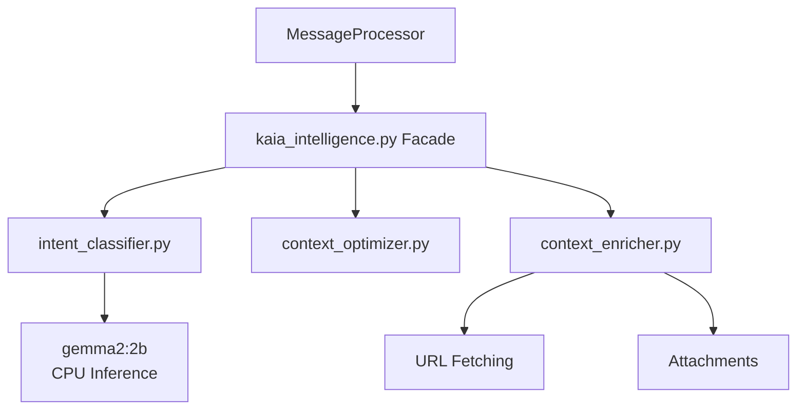

# Kaia Intelligence Layer

## Overview
The Intelligence Layer coordinates the cognitive logic between receiving a message and generating a response. It handles intent classification, context window optimization, content enrichment, and output validation.

## Architecture

### 1. Intent Classification (`intent_classifier.py`)
Before any RAG retrieval or LLM call, Kaia determines what the user actually wants. This prevents unnecessary work and optimizes the persona's response strategy.
- **Dual-Mode Detection**:
    - **Fast-Path**: Regex-based instant detection for commands, greetings, and simple identity questions.
    - **Deep-Dive**: Calls `gemma2:2b` on **CPU** for nuanced intents (e.g., `DIAGNOSTIC_DEEP_DIVE`, `DREAM_RECALL`).
- **Strategy Selection**: Produces a `MessageIntent` object that guides the downstream RAG retrieval and prompt construction.

### 2. Context Optimization (`context_optimizer.py`)
Manages the limited context window (KV cache) of the primary LLM.
- **Budgeting**: Allocates tokens between Persona, RAG Context, and Conversation History.
- **Ranked Pruning**: If context exceeds the limit, lower-ranked RAG nodes or older history are pruned first.
- **Anchor Nodes**: The persona and the 5 most recent messages are never pruned.

### 3. Content Enrichment (`context_enricher.py`)
Enhances the prompt with external information without manually re-coding `on_message`.
- **URL Fetching**: Automatically scrapes and summarizes links found in messages.
- **Attachment OCR**: Processes text attachments and small images.
- **Topic Extraction**: Identifies technical entities to trigger specific knowledge boundaries.

### 4. Self-Healing System (`utils/core/message_processor.py`)
A 3-pass loop that ensures high-quality output:
1. **Pass 1**: Standard generation.
2. **Pass 2 (Retry)**: Triggered if Pass 1 is hallucinated or cuts off. Regenerates with higher temperature and a "corrective" system prompt.
3. **Pass 3 (Fallback)**: If still failing, provides a pre-grounded "safe" response aligned with the persona.

### 5. Memory Model Warm Pool
- **Pre-warming**: Ensures `gemma3:12b` is resident in VRAM before the first message.
- **Recovery Reload**: If the model is swapped out by an external process, the intelligence layer detects the latency spike or 404 and triggers a recovery load.

### 6. Hallucination Guard (`hallucination_detector.py`)
Canonical detector for AI structural leaks.
- **Cleanup**: Strips technical artifacts (e.g., "AI Assistant:", "Think:") and known hallucinated names.
- **Adversarial Check**: Uses pattern matching to detect if the LLM is fabricating memories and strips contaminated lines.

## Interaction Flow

1. **Gatekeeper**: Rate limit and safety check.
2. **Classify**: Determines `MessageIntent` (CPU/Regex).
3. **Enriched**: Fetches URLs or attachments if needed.
4. **Retrieve**: Calls `KaiaRAG` with intent-specific strategy.
5. **Optimize**: Budgets tokens and constructs the prompt.
6. **Generate**: 3-pass self-healing loop via Ollama.
7. **Filter**: Cleans output before sending to Discord.
