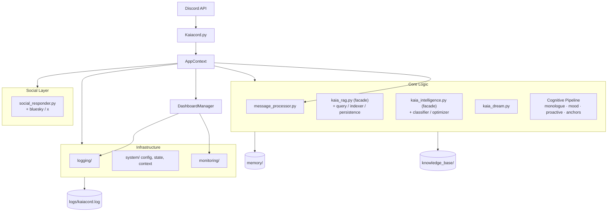
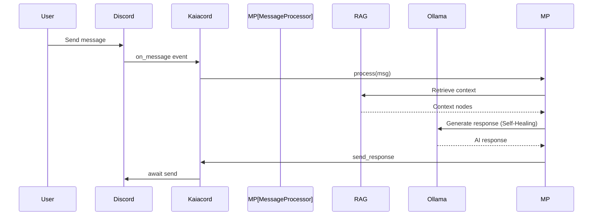

# Kaia Architecture Documentation

## Overview

Kaia is a self-hosted Discord AI bot with local inference and RAG-based memory. This document describes the technical architecture after Phase 53 refactors.

## System Architecture



## Directory Structure

```
Kaiacord/
├── Kaiacord.py              # Minimal Orchestrator (~170 lines)
├── utils/                   # Deeply modularized components
│   ├── core/                # RAG, Intelligence, Dream, Cognitive Pipeline, MessageProcessor
│   ├── infrastructure/      # AppContext, DashboardManager, Config, Monitoring
│   ├── social/              # Twitter/X, Bluesky & Social Responder
│   ├── commands/            # Specialized command handlers
│   └── news/                # News retrieval & management
├── config/                  # Configuration & Bot Persona
├── knowledge_base/          # RAG text storage (News, Interaction Logs)
├── memory/                  # Persistent data (bot_state.json, rag_storage/)
├── tools/                   # Utility & Maintenance Scripts
│   ├── maintenance/         # News, Indexing, Health checks
│   ├── diagnostics/         # RAG & Embedding verification
│   ├── recovery/            # Contamination & Hallucination fixes
│   └── tests/               # Pytest suite
├── docs/                    # Detailed technical documentation
└── logs/                    # Consolidated logging (kaiacord.log)
```

## Core Components

### 1. Bot Core (`Kaiacord.py`)

**Responsibility**: High-level orchestration, event routing, and bootstrapping the `AppContext`.

**Key Flow**:
1. Initializes `AppContext` with core singletons (config, bot, client).
2. Initializes `DashboardManager` and `MessageProcessor` by passing the context.
3. Routes events strictly to the processor, which accesses dependencies via the context.

---

### 1.1 Application Context (`utils/infrastructure/system/app_context.py`)

**Responsibility**: The "Single Source of Truth" for application dependencies.

**Features**:
- Holds shared instances (RAG, DreamEngine, OllamaClient, BotState).
- Replaces module-level globals to prevent circular imports.
- Provides an `asyncio.Event` for boot synchronization.

---

### 2. Dashboard & Lifecycle (`utils/infrastructure/system/dashboard_manager.py`)

**Responsibility**: Manages run modes (Curses/Simple), startup tasks, and clean shutdown.

**Features**:
- ✅ Phased boot sequence (Phase 1: Chat model GPU load -> Phase 2: Bot ready -> Phase 3: Background RAG/News).
- ✅ GPU semaphore guard for single-access GPU operations.
- ✅ Curses-based real-time dashboard.
- ✅ Ordered shutdown (cancel tasks → unload model → persist RAG → close clients → kill runners).

---

### 3. Message Pipeline (`utils/core/message_processor.py`)

**Responsibility**: Decomposes the complex `on_message` logic into a modular pipeline.

**Pipeline Stages**:
1. **Entry Checks**: Rate limiting, blacklist/whitelist, boot guard.
2. **Intelligence**: Classification, Hallucination detection.
3. **Retrieval**: Parallel RAG retrieval, News enhancement, Persona adaptation.
4. **Generation**: Self-healing prompt construction and multi-pass AI call.

---

### 4. Configuration System (`utils/infrastructure/system/yaml_config.py`)

**Responsibility**: Hierarchical configuration management.

---

### 5. State Management (`utils/infrastructure/system/bot_state.py`)

**Responsibility**: Bot state persistence and interaction tracking.

---

### 6. Logging System

**Responsibility**: Consolidated, color-coded, and hardened logging across all modules.

---

### 7. Cognitive Pipeline (Phase 53)

**Responsibility**: Autonomous personality systems that create the illusion of inner life.

| Module | Purpose |
|:-------|:--------|
| `kaia_mood.py` | Persistent emotional state vector (valence/arousal/social_energy) with 6h decay |
| `kaia_monologue.py` | Private thought stream from passive channel observation |
| `kaia_proactive.py` | Autonomous conversation initiation (absence check-ins, knowledge triggers) |
| `memory_anchors.py` | Dream-extracted thematic anchors for cross-session callbacks |
| `kaia_presence.py` | Mood-aware Discord status driven by emotional arc + engagement |
| `bot_state.py` | Relationship stages (stranger→inner_circle) with behavioral gating |

**Design rule**: Every cognitive injection is wrapped in `try/except Exception: pass`. Cognitive failures never block message generation.

---

## Data Flow

### Message Processing Flow



---

## GPU Memory Management Strategy

**Priority Levels**:
1. **CHAT** (P1): Main LLM (e.g., gemma3:12b) remains resident in VRAM for fast response.
2. **MAINTENANCE**: Periodic RAG re-indexing and nightly Dream cycles.

Kaia is optimized for 12GB VRAM GPUs (like the RTX 3060). Classification and embeddings run on CPU (`num_gpu: 0`), leaving the full GPU budget for the chat model and its 8K-token KV cache.

---

## Circuit Breakers & Self-Healing

### Social API Circuit Breakers
All social media API calls (Bluesky, X/Twitter) are wrapped in `CircuitBreaker` instances:
- Opens after 3 consecutive failures.
- Auto-resets after 5-minute timeout.
- Prevents cascade failures from taking down the main bot loop.

### Self-Healing Generation Loop
Kaia implements a 3-pass self-healing generation loop:
1. **Attempt 1**: Standard parameters.
2. **Attempt 2**: Temperature scaling on failure/hallucination.
3. **Attempt 3**: Fallback safety response if generation persists in failing.

---

## References

- [GEMINI Report](../reports/GEMINI_Report.md)
- [Claude Report](../reports/Claude_Report.md)
