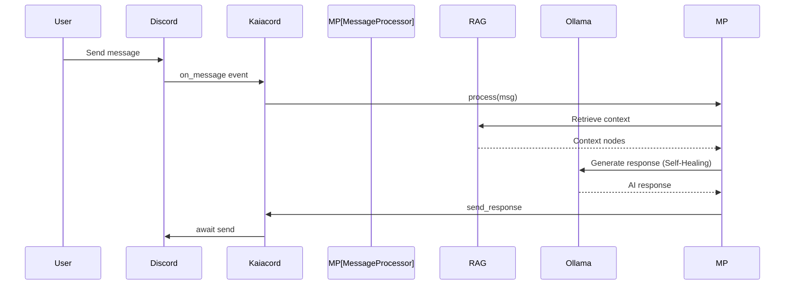

# Kaia Architecture Documentation

## Overview

Kaia is a self-hosted Discord AI bot with local inference and RAG-based memory. This document describes the technical architecture after the Phase 8 modular refactor.

## System Architecture

```mermaid
graph TB
    Discord[Discord API] --> Kaiacord[Kaiacord.py]
    Kaiacord --> Ctx[AppContext]
    Ctx --> DM[DashboardManager]
    Ctx --> MP[MessageProcessor]
    
    subgraph Core Logic
        RAG[kaia_rag.py]
        Intel[kaia_intelligence.py]
        Dream[kaia_dream.py]
    end
    
    subgraph Infrastructure
        Logging[logging/]
        System[system/ config, state, context]
        Monitoring[monitoring/]
    end
    
    Ctx --> Core Logic
    Ctx --> Infrastructure
    DM --> Logging
    DM --> Monitoring
    
    Infrastructure --> Logs[(logs/kaiacord.log)]
    Core Logic --> Memory[(memory/)]
    Core Logic --> KB[(knowledge_base/)]
```

## Directory Structure

```
Kaiacord/
├── Kaiacord.py              # Minimal Orchestrator (~170 lines)
├── utils/                   # Deeply modularized components
│   ├── core/                # Core AI logic (RAG, Intelligence, Dream, MessageProcessor)
│   ├── infrastructure/      # System foundations (AppContext, DashboardManager, Config)
│   ├── social/              # Twitter/X, Bluesky & Social Responder
│   ├── commands/            # Specialized command handlers
│   └── news/                # News retrieval & management
├── config/                  # Configuration & Bot Persona
├── knowledge_base/          # RAG text storage (News, Interaction Logs)
├── memory/                  # Persistent data (bot_state.json, semantic_cache.json)
├── tools/                   # Utility & Maintenance Scripts
├── tests/                   # Pytest suite
├── docs/                    # Detailed technical documentation
└── logs/                    # Consolidated logging (kaiacord.log)
```

## Core Components

### 1. Bot Core (`Kaiacord.py`)

**Responsibility**: High-level orchestration, event routing, and bootstrapping the `AppContext`.

**Key Flow**:
1. Initializes `AppContext` with core singletons (config, bot, client).
2. Initializes `DashboardManager` and `MessageProcessor` by passing the context.
3. Routes events strictly to the processor, which accesses dependencies via the context.

---

### 1.1 Application Context (`utils/infrastructure/system/app_context.py`)

**Responsibility**: The "Single Source of Truth" for application dependencies.

**Features**:
- Holds shared instances (RAG, DreamEngine, OllamaClient, BotState).
- Replaces module-level globals to prevent circular imports.
- Provides an `asyncio.Event` for boot synchronization.

---

### 2. Dashboard & Lifecycle (`utils/infrastructure/system/dashboard_manager.py`)

**Responsibility**: Manages run modes (Curses/Simple), startup tasks, and clean shutdown.

**Features**:
- ✅ Phased boot sequence (RAG -> News -> Model Warmup).
- ✅ Curses-based real-time dashboard.
- ✅ Graceful asynchronous cleanup.

---

### 3. Message Pipeline (`utils/core/message_processor.py`)

**Responsibility**: Decomposes the complex `on_message` logic into a modular pipeline.

**Pipeline Stages**:
1. **Entry Checks**: Rate limiting, blacklist/whitelist, boot guard.
2. **Intelligence**: Classification, Hallucination detection, Semantic Cache check.
3. **Retrieval**: Parallel RAG retrieval, News enhancement, Persona adaptation.
4. **Generation**: Self-healing prompt construction and multi-pass AI call.

---

### 4. Configuration System (`utils/infrastructure/system/yaml_config.py`)

**Responsibility**: Hierarchical configuration management.

---

### 5. State Management (`utils/infrastructure/system/bot_state.py`)

**Responsibility**: Bot state persistence and interaction tracking.

---

### 6. Logging System

**Responsibility**: Consolidated, color-coded, and hardened logging across all modules.

---

## Data Flow

### Message Processing Flow



---

## GPU Memory Management Strategy

**Priority Levels**:
1. **CHAT** (P1): Main LLM (e.g., gemma3:12b) remains resident in VRAM for fast response.
2. **MAINTENANCE**: Periodic RAG re-indexing and nightly Dream cycles.

Kaia is optimized for 12GB VRAM GPUs (like the RTX 3060), ensuring high-quality inference with enough headroom for the 28k context window.

---

## Circuit Breakers & Self-Healing

Kaia implements a 3-pass self-healing generation loop:
1. **Attempt 1**: Standard parameters.
2. **Attempt 2**: Temperature scaling on failure/hallucination.
3. **Attempt 3**: Fallback safety response if generation persists in failing.

---

## References

- [GEMINI_Report.md](../../GEMINI_Report.md)
- [task.md](../../.gemini/antigravity/brain/979b42e5-c563-4647-9547-8b696c335ae6/task.md)
