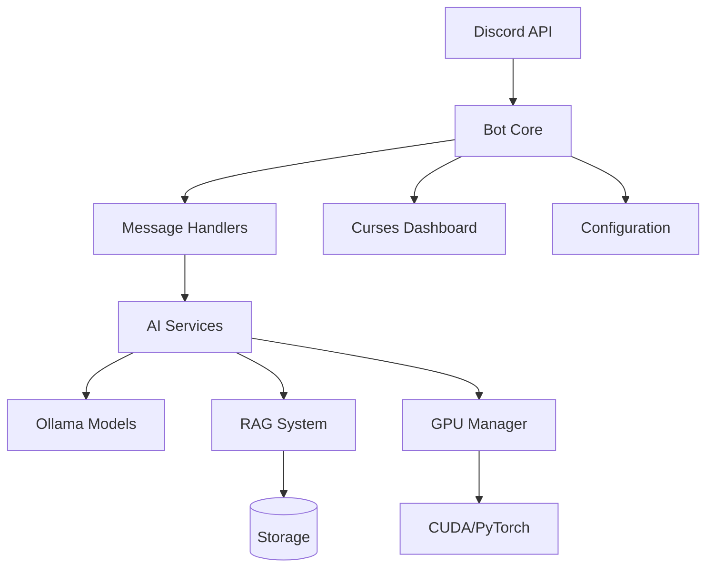
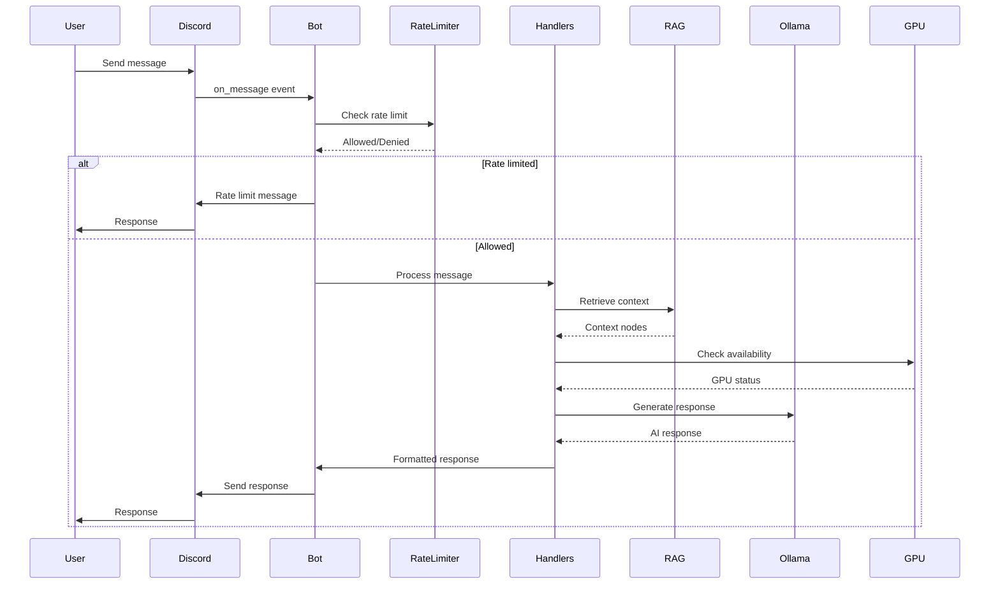

# Kaia Architecture Documentation

## Overview

Kaia is a self-hosted Discord AI bot with local inference, RAG-based memory, vision capabilities, and image generation. This document describes the technical architecture after the v2.1 modular refactor.

## System Architecture



## Directory Structure

```
Kaiacord/
├── Kaiacord.py              # Main entry point (~800 lines, down from 2390)
├── utils/                   # Deeply modularized components
│   ├── core/                # Core AI logic (RAG, Vision, Image, Intelligence)
│   ├── infrastructure/      # System foundations
│   │   ├── logging/         # Unified & Hardened Logging
│   │   ├── system/          # Config, State, Rate Limiting, Shutdown
│   │   └── monitoring/      # Dashboards & Stats
│   └── social/              # Twitter/X, Bluesky & Social Responder
├── config/                  # Configuration & Bot Persona
├── knowledge_base/          # RAG text storage (News, Interaction Logs)
├── memory/                  # Persistent data (bot_state.json, semantic_cache.json)
├── tools/                   # Utility & Maintenance Scripts
├── tests/                   # Pytest suite
├── docs/                    # Detailed technical documentation
└── logs/                    # Consolidated logging (kaiacord.log)
```

## Core Components

### 1. Bot Core (`Kaiacord.py`)

**Responsibility**: Discord bot initialization, event loop management

**Key Classes**:
- `KaiaBot`: Main bot class extending `discord.Client`

**Functions**:
- Bot initialization
- Event loop setup
- Startup/shutdown orchestration

---

### 2. Configuration System (`utils/infrastructure/system/yaml_config.py`)

**Responsibility**: Hierarchical configuration management

**Features**:
- ✅ Environment variable support
- ✅ Dataclass-based configuration
- ✅ YAML configuration loading
- ✅ Runtime validation
- ✅ Hot-reload for safe settings

**Configuration Hierarchy**:
1. `config/default_config.yaml` (defaults)
2. `config/kaia.yaml` (user overrides)
3. Environment variables (highest priority)

---

### 3. State Management (`utils/infrastructure/system/bot_state.py`)

**Responsibility**: Bot state persistence and channel memory

**State Tracked**:
- ✅ Channel memory (recent messages)
- ✅ Last interaction time  
- ✅ Consecutive quips counter
- ✅ Image generation status
- ✅ Active channel tracking

**Persistence**:
- JSON file (`memory/bot_state.json`)
- Automatic save on state changes

---

### 4. Rate Limiting (`utils/infrastructure/system/rate_limiter.py`)

**Responsibility**: Per-user rate limiting

**Features**:
- ✅ Sliding window (60 seconds)
- ✅ Per-user tracking
- ✅ Automatic cleanup of inactive users
- ✅ Configurable limits

---

### 5. GPU Memory Manager (`utils/infrastructure/system/gpu_memory_manager.py`)

**Responsibility**: Unified GPU memory management

**Features**:
- ✅ VRAM reservation system
- ✅ Priority queue (Chat > Vision > Image Gen)
- ✅ Preemption of lower-priority tasks
- ✅ Memory pressure monitoring

**Priority Levels**:
1. **CHAT** (Priority 1): Highest - chat model stays loaded
2. **VISION** (Priority 2): Medium - can preempt image gen
3. **IMAGE_GEN** (Priority 3): Lowest - yields to others

---

### 6. Exception Hierarchy (`utils/infrastructure/system/bot_exceptions.py`)

**Responsibility**: Centralized error handling

**Structure**:
```
KaiaError (base)
├── GPUError
├── ModelError
├── VisionError
├── ImageGenerationError
├── RAGError
├── ConfigError
├── RateLimitError
└── NewsError
```

---

### 7. Logging System

**Components**:
- ✅ `utils/infrastructure/logging/unified_logging.py`: Core logging infrastructure
- ✅ `utils/infrastructure/logging/kaia_logger.py`: Formatted logging functions
- ✅ `utils/infrastructure/logging/logging_bridge.py`: Logging abstraction
- ✅ `utils/infrastructure/monitoring/stats_helpers.py`: Safe stats_poller access

**Features**:
- ✅ Color-coded terminal output
- ✅ Dashboard integration via bridge pattern
- ✅ Programmatic interception of stdout/stderr (Consolidated)
- ✅ ANSI color stripping for log files

---

## Data Flow

### Message Processing Flow



---

## GPU Memory Management Strategy

### Priority-Based Reservation System

**Priority Levels**:
1. **CHAT** (P1): Always loaded
2. **VISION** (P2): Loaded on demand, can preempt image gen
3. **IMAGE_GEN** (P3): Loaded on demand, lowest priority

**Rules**:
- Chat model NEVER unloaded
- Image gen requires 8GB free VRAM
- Vision can preempt image gen if needed
- Lower priority tasks yield to higher priority

---

## Circuit Breakers

### Image Generation Circuit Breaker

**Purpose**: Prevent repeated CUDA OOM errors

**States**:
- `enabled`: Normal operation
- `disabled`: Circuit open, all requests fail fast
- `recovering`: Attempting GPU recovery

**Trigger**:
- `torch.cuda.OutOfMemoryError` exception

---

## Backward Compatibility

### Import Forwarding

All existing imports continue to work:

**Old (still works)**:
```python
from Kaiacord import config, bot_state, rate_limiter
```

**New (preferred)**:
```python
from utils.infrastructure.system.yaml_config import config
from utils.infrastructure.system.bot_state import bot_state
from utils.infrastructure.system.rate_limiter import RateLimiter
```

---

## Testing Strategy

### Unit Tests
- ✅ `tests/unit/test_stats_helpers.py`
- ✅ `tests/unit/test_logging_bridge.py`
- ✅ `tests/unit/test_rate_limiter.py`
- ✅ `tests/unit/test_yaml_config.py`

---

## Configuration Management

### Current Status

✅ **Implemented**:
- Dataclass-based `Config` class
- Hierarchical merge (defaults → user → env)
- YAML file loading
- Runtime validation
- Hot-reload support

---

## Troubleshooting

See [Common Issues](../06-troubleshooting/common-issues.md) for solutions.

---

## References

- [GEMINI_Report.md](../../GEMINI_Report.md)
- [MIGRATION_GUIDE.md](../../MIGRATION_GUIDE.md)
