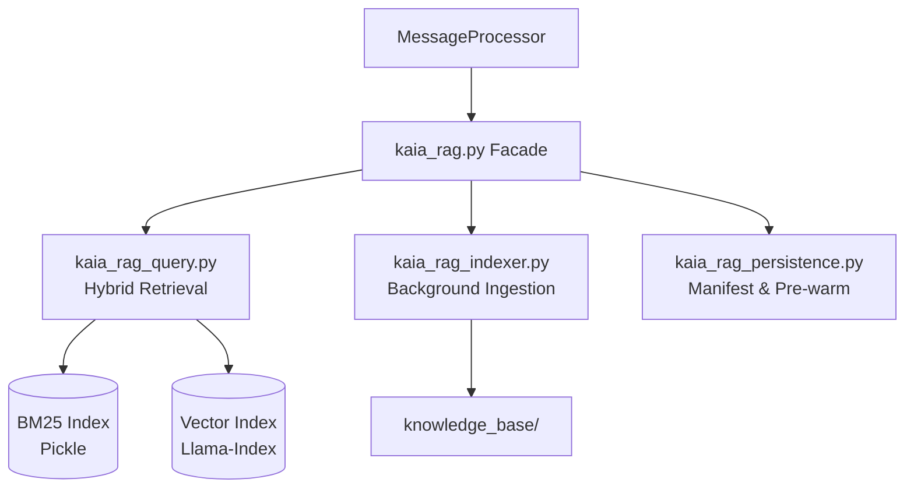

# Kaia RAG System Documentation

## Overview
The Retrieval-Augmented Generation (RAG) system is the core of Kaia's long-term memory. It allows her to recall past interactions, access uploaded documents, and maintain a consistent persona. After Phase 28, the system was split from a monolith into a modular architecture for better maintenance and performance.

## Architecture

### 1. Ingestion Pipeline (`kaia_rag_indexer.py`)
The ingestion pipeline handles the processing of files in `knowledge_base/`.
- **Parallel Processing**: Ingestion runs in a background thread to avoid blocking the Discord loop.
- **Text Extraction**: Converts PDFs and DOCX files to Markdown using `LlamaIndex` readers.
- **Chunking**: Splits text into configurable chunks (`config.rag_node_chunk_size`, default 1024) with overlap. Smaller book chunks were measured on 26 Sept 2026 (`tools/maintenance/compare_book_chunking.py`): 12/16 known answers in the top five at 1024, 13/16 at 512, 11/16 at 256 — not enough to justify a rebuild.
- **Her own notes**: `knowledge_base/kaia_notes/` is indexed like the rest of the corpus and reaches the prompt labelled `YOUR OWN NOTE`, so she treats it as something she wrote, not something she read.
- **Embedding**: Generates vector embeddings using `nomic-embed-text` on **CPU** (`num_gpu: 0`). Zero GPU impact.
- **Indexing**: Synchronizes both a vector index and a BM25 keyword index.

### 2. Hybrid Retrieval (`kaia_rag_query.py`)
When a user queries Kaia, the system performs a hybrid search:
- **Vector Search**: Semantic similarity search for conceptual matches.
- **BM25 Search**: Keyword-based search for exact names, commands, or rare terms.
- **Reciprocal Rank Fusion (RRF)**: Merges results from both searches into a single ranked list, prioritizing nodes that appear high in both.
- **Intent-Aware Routing**: The Intelligence layer provides an "Intent" that informs which indices to search (e.g., `DREAM_RECALL` targets the reflections index).

### 3. Identity & Privacy
- **Identity Resolution**: Forum IDs and Discord IDs are cross-referenced to retrieve the correct user profile.
- **Strict Partitioning**: User profiles, user logs and her own dreams are separate indices. The persona is not indexed at all: it is injected into every prompt whole.

### 4. Persistence & Pre-warming (`kaia_rag_persistence.py`)
- **JSON Manifest**: Tracks each file's mtime, size and node ids (logs also a byte offset and a hash of the indexed prefix). Nodes are only re-indexed if the file changes; a log rewritten in place is re-indexed whole.
- **Reconcile**: every refresh removes nodes with no embedding, no source file, a deleted or excluded file, or persona text — see CLAUDE.md §10, *The index*.
- **Consolidated Storage**: All indices are stored in `memory/rag_storage/`.
- **Pre-warming**: On startup, indices are loaded into memory. BM25 lives in memory only (no pickle): it is built from the docstore on first use, in a worker thread, and dropped from `bm25_cache` whenever its index changes.

### 5. Smart Filtering & Hallucination Guard
- **Fiction Filter**: Regex-based blocks for fictional story patterns during ingestion.
- **Adversarial Check**: Responses are scanned for hallucinated entities (e.g., "Juanita") before output.
- **Recency Boost**: Temporal nodes (user logs from the last 7 days) are given a retrieval boost.

## RAG Index Types

| Index Type | Source Path | Purpose |
|:-----------|:------------|:--------|
| `user_profiles` | `knowledge_base/user_logs/*/user_profile.md` | Summarised facts about specific users, Discord and forum |
| `logs` | `knowledge_base/user_logs/` | Raw conversation history |
| `dreams` | `knowledge_base/kaia_dreams/` | Nightly reflections, plus `consolidated/` — one document per book, person and topic |
| `knowledge` | everything else indexed: `books/`, `documents/`, `news/`, `wiki/`, `troubleshooting/`, `transcripts/`, `runtime/` | Manual uploads, scrapes and her own snapshots |

There are four populated indices, not one per folder — `index_types` in
`kaia_rag_indexer` still creates a fifth, `persona`, which stays empty because the
persona is injected whole rather than retrieved. An earlier
version of this table named `knowledge_base/user_profiles/`,
`knowledge_base/general/` and `knowledge_base/reflections/`, none of which have
ever existed; the folder layout is in `knowledge_base/README.md` and the code
wins over both.

Three trees are deliberately **not** indexed — `_ingress/` (staging),
`_quarantine/` (pulled out of the corpus), `forum_posts/` (9,236 scraped threads,
excluded from global retrieval so strangers' claims cannot surface as fact) —
along with any dot-directory, which is where compaction and consolidation keep
the originals they superseded, and `news_summary_*`, the `!news` quick reference
that condenses the same day's brief.

Only `title` and `user_name` are embedded with a chunk's text; the rest of a
node's metadata (path, offsets, timestamps, scores) is excluded from the vector.

## Technical Specs
- **Embeddings**: `nomic-embed-text` — CPU while the bot runs, GPU for an offline `reindex_rag.py` rebuild
- **Top K**: Default 8 (balanced for context window)
- **RRF Weight**: k=60 (standard RRF parameter)
- **Locking**: Thread-safe locks ensure only one re-index happens at a time.
