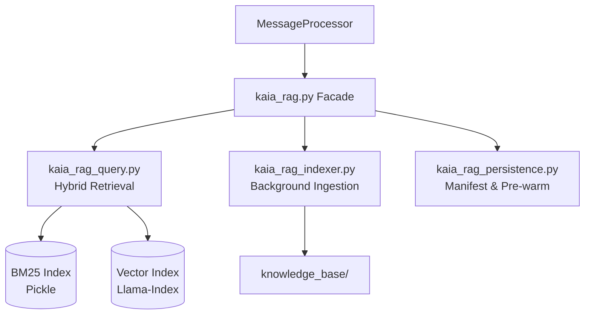

# Kaia RAG System Documentation

## Overview
The Retrieval-Augmented Generation (RAG) system is the core of Kaia's long-term memory. It allows her to recall past interactions, access uploaded documents, and maintain a consistent persona. After Phase 28, the system was split from a monolith into a modular architecture for better maintenance and performance.

## Architecture

### 1. Ingestion Pipeline (`kaia_rag_indexer.py`)
The ingestion pipeline handles the processing of files in `knowledge_base/`.
- **Parallel Processing**: Ingestion runs in a background thread to avoid blocking the Discord loop.
- **Text Extraction**: Converts PDFs and DOCX files to Markdown using `LlamaIndex` readers.
- **Chunking**: Splits text into configurable chunks (`config.rag_node_chunk_size`, default 1024) with overlap.
- **Embedding**: Generates vector embeddings using `nomic-embed-text` on **CPU** (`num_gpu: 0`). Zero GPU impact.
- **Indexing**: Synchronizes both a vector index and a BM25 keyword index.

### 2. Hybrid Retrieval (`kaia_rag_query.py`)
When a user queries Kaia, the system performs a hybrid search:
- **Vector Search**: Semantic similarity search for conceptual matches.
- **BM25 Search**: Keyword-based search for exact names, commands, or rare terms.
- **Reciprocal Rank Fusion (RRF)**: Merges results from both searches into a single ranked list, prioritizing nodes that appear high in both.
- **Intent-Aware Routing**: The Intelligence layer provides an "Intent" that informs which indices to search (e.g., `DREAM_RECALL` targets the reflections index).

### 3. Identity & Privacy
- **Identity Resolution**: Forum IDs and Discord IDs are cross-referenced to retrieve the correct user profile.
- **Strict Partitioning**: Persona nodes and user logs are indexed separately to prevent cross-user leakage while maintaining persona stability.

### 4. Persistence & Pre-warming (`kaia_rag_persistence.py`)
- **JSON Manifest**: Tracks file hashes and metadata. Nodes are only re-indexed if the file changes.
- **Consolidated Storage**: All indices are stored in `memory/rag_storage/`.
- **Pre-warming**: On startup, indices are loaded into memory and the BM25 pickle is hydrated to ensure the first query is fast.

### 5. Smart Filtering & Hallucination Guard
- **Fiction Filter**: Regex-based blocks for fictional story patterns during ingestion.
- **Adversarial Check**: Responses are scanned for hallucinated entities (e.g., "Juanita") before output.
- **Recency Boost**: Temporal nodes (user logs from the last 7 days) are given a retrieval boost.

## RAG Index Types

| Index Type | Source Path | Purpose |
|:-----------|:------------|:--------|
| `persona` | `config/kaia_persona.md` | Tone, rules, and core identity |
| `user_profiles` | `knowledge_base/user_profiles/` | Summarized facts about specific users |
| `user_logs` | `knowledge_base/user_logs/` | Raw conversation history |
| `knowledge` | `knowledge_base/general/` | Manual uploads and scraped URLs |
| `news` | `knowledge_base/news/` | Daily tech briefs |
| `dreams` | `knowledge_base/reflections/` | Nightly associative summaries |

## Technical Specs
- **Embeddings**: `nomic-embed-text` (CPU)
- **Top K**: Default 8 (balanced for context window)
- **RRF Weight**: k=60 (standard RRF parameter)
- **Locking**: Thread-safe locks ensure only one re-index happens at a time.
