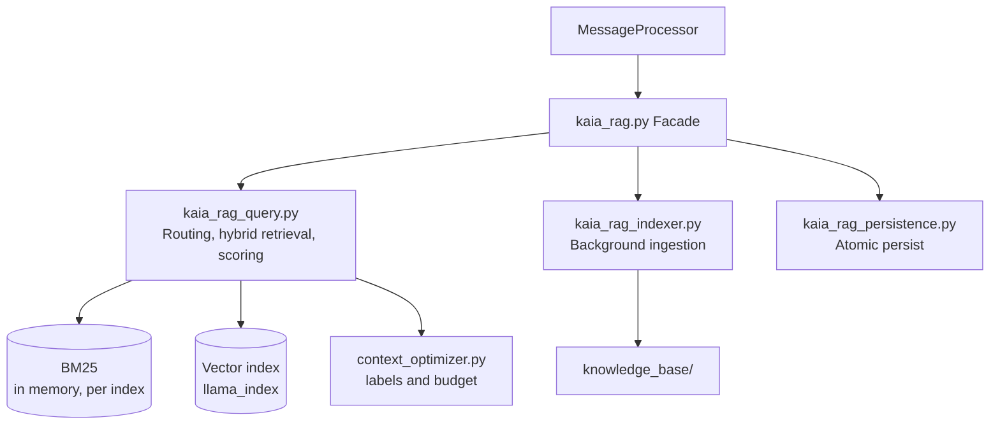

# Kaia RAG System Documentation

## Overview
The Retrieval-Augmented Generation (RAG) system is the core of Kaia's long-term memory. It allows her to recall past interactions, access uploaded documents, and maintain a consistent persona. After Phase 28, the system was split from a monolith into a modular architecture for better maintenance and performance.

## Architecture

```mermaid
flowchart TD
    MP[MessageProcessor] --> RF[kaia_rag.py Facade]
    RF --> Q[kaia_rag_query.py\nRouting, hybrid retrieval, scoring]
    RF --> I[kaia_rag_indexer.py\nBackground ingestion]
    RF --> P[kaia_rag_persistence.py\nAtomic persist]

    Q --> BM25[(BM25\nin memory, per index)]
    Q --> VEC[(Vector index\nllama_index)]

    I --> DOCS[knowledge_base/]
    Q --> CO[context_optimizer.py\nlabels and budget]
```

### 1. Ingestion (`kaia_rag_indexer.py`)
- **In the background**: a refresh runs off the event loop, two files at a time, and persists
  every changed index at the end.
- **Reading**: Markdown and text are read directly; PDF and DOCX through llama_index's reader. A
  PDF or DOCX that fails is converted to Markdown beside the original (pypdf, docx2txt), and the
  next sweep indexes that.
- **Chunking** (`_get_node_parser_for_doc`): documents in 1,024-token chunks with 200 of overlap,
  news briefs split at their `##` headings, conversation logs six turns at a time with one turn
  of overlap. Smaller book chunks were measured on 26 Sept 2026
  (`tools/maintenance/compare_book_chunking.py`): 12/16 known answers in the top five at 1024,
  13/16 at 512, 11/16 at 256 — not enough to justify a rebuild.
- **Logs are indexed by their tail**: only what was appended since the last pass, tracked as a byte
  offset with a hash of the indexed prefix; a log rewritten in place is re-indexed whole.
- **Typing**: every node gets a `source_type` from its path, most specific first — persona, user
  profile (a profile lives inside its user's log folder), user log, dream, news, her own note,
  snapshot, otherwise general knowledge.
- **Her own notes**: `knowledge_base/kaia_notes/` reaches the prompt labelled `YOUR OWN NOTE`, so
  she treats it as something she wrote, not something she read.
- **Embedding**: `nomic-embed-text` on the **CPU** (`num_gpu: 0`); zero GPU impact.

### 2. Retrieval (`kaia_rag_query.py`)
- **Routing**: the turn's intent picks the indices. A question about a person, a book or a fact
  searches knowledge, logs and profiles; an error or crash question searches knowledge (where the
  wiki and troubleshooting guides are) and logs; a dream question only her dreams; small talk
  only profiles and logs. A request naming a document returns that whole document instead.
- **Hybrid search** (`HybridRetriever`): vector similarity and BM25 per index, merged by
  Reciprocal Rank Fusion (k = 60).
- **Scoring**: per-type boosts, recency decay (a half-life per type: chat logs 90 days, news 30,
  dreams 180; knowledge does not age), and penalties for audit-flagged nodes.
- **Whose logs**: a question about "me" or about her is scoped to the asker. A question naming
  someone ("who is starkind") also reaches that person's logs and profile, found by their
  `user_logs/` folder name and linked accounts in the identity registry. A profile only ever
  reaches a turn about the asker or about someone the turn names.
- **News** is left out unless the turn is about news; a turn asking for what is current is also
  offered the newest briefs on its topic.

### 3. Into the prompt (`context_optimizer.py`)
Each retrieved chunk is labelled by what it is, because the label is how she knows whether she
said it, thought it or read it: `CONVERSATION HISTORY` (with speaker and date), `FORUM POST`,
`USER PROFILE SUMMARY`, `CONVERSATION SNAPSHOT`, `INTERNAL REFLECTION (DREAM)` for her
reflections, `YOUR OWN NOTE`, and `<recorded_knowledge>` for documents and the source fragment a
dream was about. Whatever does not fit the retrieval budget is dropped here; there is no second
budget downstream.

### 4. Persistence (`kaia_rag_persistence.py`)
- **JSON manifest** (`file_manifest.json`): each file's mtime, size, node ids and index. A file is
  re-indexed when its mtime or size changes.
- **Reconcile**: every refresh removes nodes with no embedding, no source file, a deleted or
  excluded file, or persona text — see CLAUDE.md §10, *The index*.
- **Storage**: all indices live in `memory/rag_storage/`, one directory per index, written
  atomically.
- **BM25** lives in memory only (no pickle): it is built from the docstore on first use, in a worker
  thread, and dropped from `bm25_cache` whenever its index changes. `--eager-rag-warm` builds them
  all at boot.

### 5. Checking it
`tools/diagnostics/ask_index.py "<question>"` runs the same retrieval a chat turn does against a
copy of the live index and prints what comes back. Ask it the way a user would: routing and
scoping depend on the wording.

## RAG Index Types

| Index Type | Source Path | Purpose |
|:-----------|:------------|:--------|
| `user_profiles` | `knowledge_base/user_logs/*/user_profile.md` | Summarised facts about specific users, Discord and forum |
| `logs` | `knowledge_base/user_logs/` | Raw conversation history |
| `dreams` | `knowledge_base/kaia_dreams/` | Nightly reflections, plus `consolidated/` — one document per book, person and topic |
| `knowledge` | everything else indexed: `books/`, `documents/`, `news/`, `wiki/`, `troubleshooting/`, `transcripts/`, `kaia_notes/`, `runtime/` | Books and documents, news, the P99 wiki and guides, her notes, and `!snapshot` conversations |

There are four populated indices, not one per folder — `index_types` in
`kaia_rag_indexer` still creates a fifth, `persona`, which stays empty because the
persona is injected whole rather than retrieved. An earlier
version of this table named `knowledge_base/user_profiles/`,
`knowledge_base/general/` and `knowledge_base/reflections/`, none of which have
ever existed; the folder layout is in `knowledge_base/README.md` and the code
wins over both.

Three trees are deliberately **not** indexed — `_ingress/` (staging),
`_quarantine/` (pulled out of the corpus), `forum_posts/` (scraped threads,
excluded from global retrieval so strangers' claims cannot surface as fact) —
along with any dot-directory, which is where compaction and consolidation keep
the originals they superseded, and `news_summary_*`, the `!news` quick reference
that condenses the same day's brief.

Only `title` and `user_name` are embedded with a chunk's text; the rest of a
node's metadata (path, offsets, timestamps, scores) is excluded from the vector.

## Technical Specs
- **Embeddings**: `nomic-embed-text` — CPU while the bot runs, GPU for an offline `reindex_rag.py` rebuild
- **Top K**: `performance.rag_top_k`, default 12; a diagnostic turn takes 15
- **RRF**: k = 60
- **Locking**: one refresh at a time; a refresh requested during one runs straight after it.
