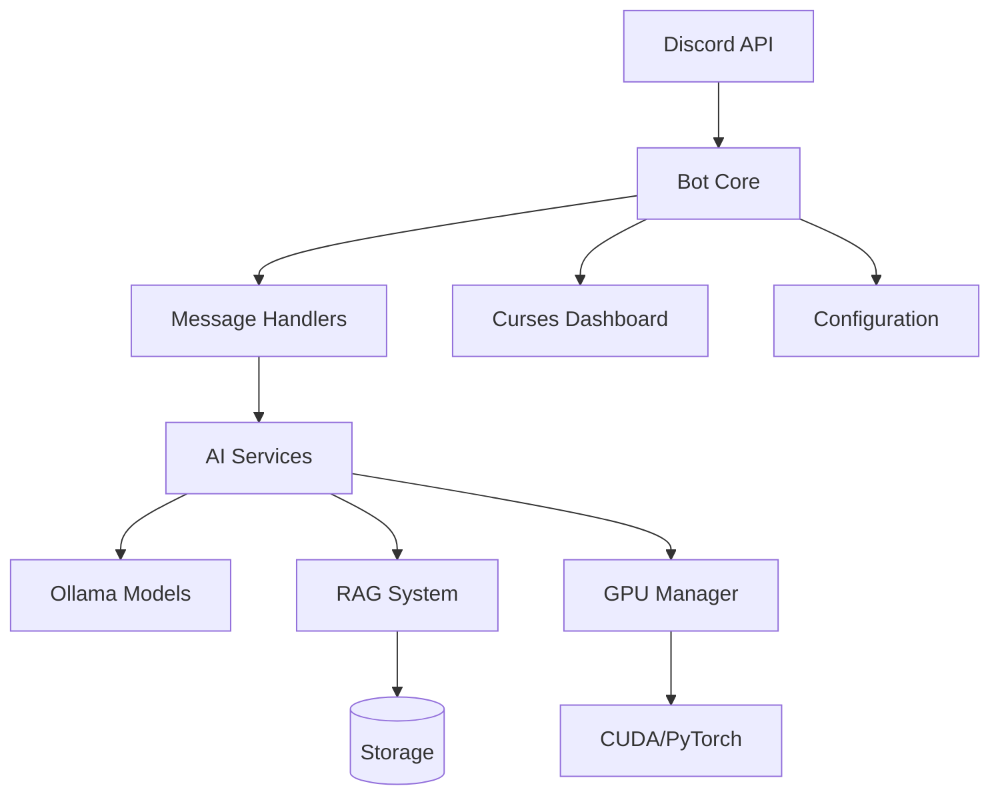
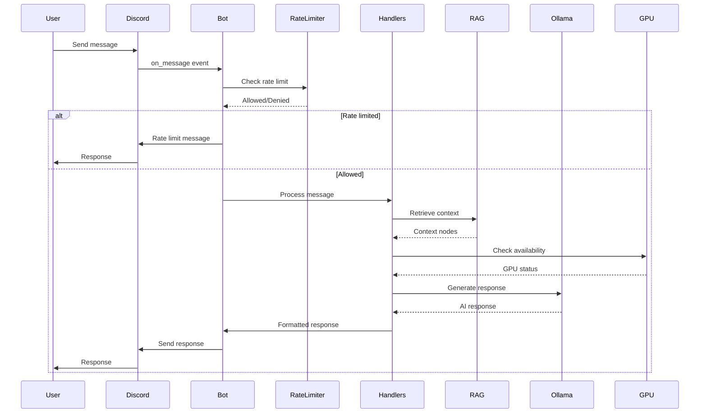
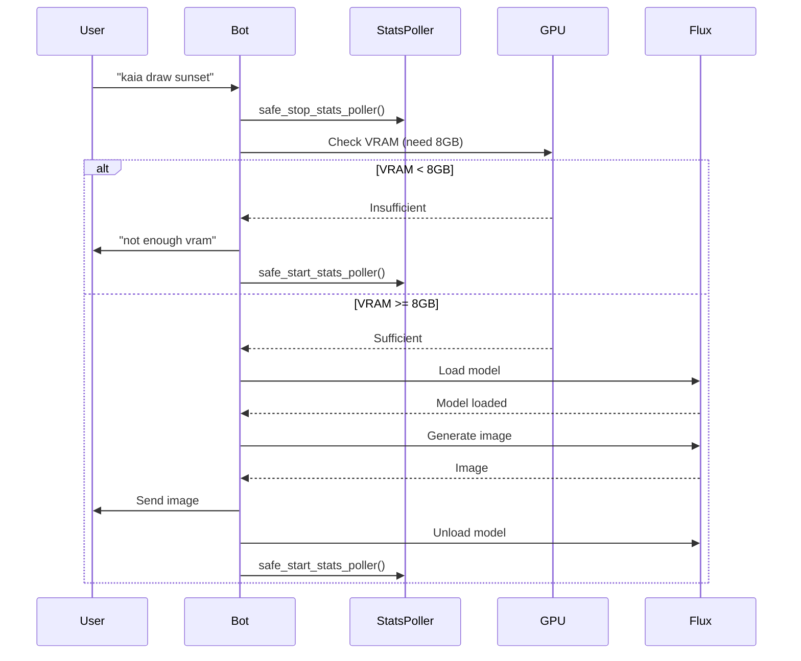

> [!WARNING]
> **ARCHIVED — DO NOT USE AS REFERENCE.**
> This document describes a planned `bot/` directory structure that was never built.
> The actual architecture uses `utils/` sub-packages. See `docs/03-architecture/overview.md`.
> Archived: February 26, 2026.

---

# Kaiacord — High-Level Architecture (Feb 3, 2026)

## Overview

Kaia is a self-hosted Discord AI bot with local inference, RAG-based memory, vision capabilities, and image generation. This document describes the technical architecture after the Phase 2+ overhaul.

## System Architecture



## Directory Structure

```
Kaiacord/
├── Kaiacord.py              # Main entry point (~800 lines, down from 2390)
├── bot/                     # Organized bot components (NEW)
│   ├── __init__.py
│   ├── core.py             # Bot class and Discord setup
│   ├── exceptions.py       # Exception hierarchy
│   ├── handlers/           # Event and message handlers
│   │   ├── message.py
│   │   ├── commands.py
│   │   └── events.py
│   ├── services/           # AI service wrappers
│   │   ├── rag_service.py
│   │   ├── vision_service.py
│   │   └── image_service.py
│   └── managers/           # State and configuration
│       ├── config.py       # ✅ DONE
│       ├── state.py        # ✅ DONE
│       └── rate_limiter.py # ✅ DONE
├── utils/                   # Core utilities
│   ├── kaia_rag.py         # RAG system
│   ├── kaia_vision.py      # Vision analysis
│   ├── kaia_image.py       # Image generation
│   ├── gpu_manager.py      # Ollama GPU management
│   ├── gpu_memory_manager.py # Unified GPU memory manager (NEW)
│   ├── stats_helpers.py    # Safe stats_poller access (NEW)
│   ├── logging_bridge.py   # Logging abstraction (NEW)
│   └── ...
├── config/                  # Configuration files
│   ├── kaia_persona.md     # Bot personality
│   ├── default_config.yaml # Default configuration (NEW)
│   └── cache_exceptions.json
├── knowledge_base/          # RAG knowledge storage
│   ├── news/
│   ├── user_logs/
│   └── user_profiles/
├── memory/                 # Persistent data
│   ├── bot_state.json
│   └── semantic_cache.json
├── tests/                   # Test suite
│   ├── conftest.py         # Pytest fixtures (NEW)
│   ├── integration/        # Integration tests (NEW)
│   └── ...
└── docs/                    # Documentation
    ├── ARCHITECTURE.md     # This file (NEW)
    ├── FIXES_SUMMARY.md
    └── utils_reference.md
```

## Core Components

### 1. Bot Core (`bot/core.py`)

**Responsibility**: Discord bot initialization, event loop management

**Key Classes**:
- `KaiaBot`: Main bot class extending `discord.Client`

**Functions**:
- Bot initialization
- Event loop setup
- Startup/shutdown orchestration

---

### 2. Configuration System (`bot/managers/config.py`)

**Responsibility**: Hierarchical configuration management

**Features**:
- ✅ Environment variable support
- ✅ Dataclass-based configuration ✅ Runtime validation
- ⏳ YAML configuration loading (Phase 3)
- ⏳ Hot-reload for safe settings (Phase 3)

**Configuration Hierarchy**:
1. `config/default_config.yaml` (defaults)
2. `config/kaia.yaml` (user overrides)
3. Environment variables (highest priority)

---

### 3. State Management (`bot/managers/state.py`)

**Responsibility**: Bot state persistence and channel memory

**State Tracked**:
- ✅ Channel memory (recent messages)
- ✅ Last interaction time  
- ✅ Consecutive quips counter
- ✅ Image generation status
- ✅ Active channel tracking

**Persistence**:
- JSON file (`memory/bot_state.json`)
- Automatic save on state changes

---

### 4. Rate Limiting (`bot/managers/rate_limiter.py`)

**Responsibility**: Per-user rate limiting

**Features**:
- ✅ Sliding window (60 seconds)
- ✅ Per-user tracking
- ✅ Automatic cleanup of inactive users
- ✅ Configurable limits

**Algorithm**:
- Track request timestamps per user
- Remove requests older than 60 seconds
- Allow if count < limit
- Deny and notify if limit exceeded

---

### 5. GPU Memory Manager (`utils/gpu_memory_manager.py`)

**Responsibility**: Unified GPU memory management

**Features**:
- ✅ VRAM reservation system
- ✅ Priority queue (Chat > Vision > Image Gen)
- ✅ Preemption of lower-priority tasks
- ✅ Memory pressure monitoring
- ✅ Lazy torch import

**Priority Levels**:
1. **CHAT** (Priority 1): Highest - chat model stays loaded
2. **VISION** (Priority 2): Medium - can preempt image gen
3. **IMAGE_GEN** (Priority 3): Lowest - yields to others

**Preemption Strategy**:
- When VRAM insufficient, check for lower-priority tasks
- Unload lower-priority tasks in order (lowest first)
- Grant reservation if enough VRAM freed

---

### 6. Exception Hierarchy (`bot/exceptions.py`)

**Responsibility**: Centralized error handling

**Structure**:
```
KaiaError (base)
├── GPUError
│   ├── GPUMemoryError
│   │   ├── CUDAOutOfMemoryError
│   │   └── VRAMInsufficientError
│   └── GPUNotAvailableError
├── ModelError
│   ├── ModelLoadError
│   ├── ModelUnloadError
│   └── ModelTimeoutError
├── VisionError
│   ├── VisionTimeoutError
│   ├── ImageDownloadError
│   └── ImageOptimizationError
├── ImageGenerationError
│   ├── ImageGenDisabledError
│   └── ImageGenTimeoutError
├── RAGError
│   ├── RAGLockTimeout
│   ├── RAGIndexError
│   └── RAGQueryError
├── ConfigError
│   ├── ConfigValidationError
│   └── ConfigLoadError
├── RateLimitError
└── NewsError
    ├── NewsUpdateError
    └── NewsRetrievalError
```

**Helper Functions**:
- `get_user_friendly_message(error)`: Convert exceptions to user-facing messages
- `should_auto_report(error)`: Determine if error needs reporting

---

### 7. Logging System

**Components**:
- ✅ `utils/unified_logging.py`: Core logging infrastructure
- ✅ `utils/kaia_logger.py`: Formatted logging functions
- ✅ `utils/logging_bridge.py`: Dashboard abstraction (NEW)
- ✅ `utils/stats_helpers.py`: Safe stats_poller access (NEW)

**Features**:
- ✅ Color-coded terminal output
- ✅ Dashboard integration via bridge pattern
- ✅ Rich formatting for tables/panels
- ⏳ Request ID tracking (Phase 4)
- ⏳ Structured JSON logging option (Phase 4)

**Logging Bridge Pattern**:
```python
# Logger doesn't import dashboard directly
from utils.logging_bridge import register_logging_bridge

# Dashboard implements LoggingBridge interface
class MyDashboard(LoggingBridge):
    def log(self, level, message, metadata):
        # Display in dashboard
        pass

# Register at startup
register_logging_bridge(my_dashboard)

# Logger automatically sends to all registered bridges
log_info("Message")  # -> Console + Dashboard
```

---

## Data Flow

### Message Processing Flow



### Image Generation Flow



---

## GPU Memory Management Strategy

### Problem Statement

Multiple AI models compete for limited VRAM:
- Chat model (gemma3:12b): ~6-8 GB
- Vision model (llama3.2-vision): ~4-6 GB
- Image gen model (FLUX.1): ~8-10 GB

**Total VRAM needed**: ~18-24 GB  
**Typical GPU VRAM**: 12-16 GB

### Solution: Priority-Based Reservation System

**Priority Levels**:
1. **CHAT** (P1): Always loaded, highest priority
2. **VISION** (P2): Loaded on demand, can preempt image gen
3. **IMAGE_GEN** (P3): Loaded on demand, lowest priority

**Rules**:
- Chat model NEVER unloaded (prevents instability)
- Image gen requires 8GB free VRAM (fail-fast)
- Vision can preempt image gen if needed
- Lower priority tasks yield to higher priority

**Example Scenario**:
```
1. Chat model loaded (6 GB used, 10 GB free)
2. User: "kaia draw sunset"
3. Check: 10 GB > 8 GB ✓ → Start image gen
4. Image model loads (14 GB used, 2 GB free)
5. User: "kaia what do you see?" (vision request)
6. Check: 2 GB < 6 GB (need vision model) ✗
7. Preempt image gen (priority 3 < priority 2)
8. Unload image model (6 GB used, 10 GB free)
9. Load vision model (10 GB used, 6 GB free)
10. Process vision request
```

---

## Circuit Breakers

### Image Generation Circuit Breaker

**Purpose**: Prevent repeated CUDA OOM errors

**States**:
- `enabled`: Normal operation
- `disabled`: Circuit open, all requests fail fast
- `recovering`: Attempting GPU recovery

**Trigger**:
- `torch.cuda.OutOfMemoryError` exception

**Behavior**:
1. Catch CUDA OOM
2. Set `_image_gen_disabled = True`
3. Attempt hard GPU recovery
4. Log detailed status messages
5. Return user-friendly error
6. Require restart to re-enable

**Recovery Process**:
```python
1. Delete model references
2. Run gc.collect() × 5
3. torch.cuda.empty_cache()
4. torch.cuda.synchronize()
5. Reset memory stats
6. Optional: torch.cuda.ipc_collect()
7. Check: allocated < 0.5 GB AND free > 4 GB
```

---

## Backward Compatibility

### Import Forwarding

All existing imports continue to work:

**Old (still works)**:
```python
from Kaiacord import config, bot_state, rate_limiter
```

**New (preferred)**:
```python
from utils.infrastructure.system.yaml_config import config
from utils.infrastructure.system.bot_state import bot_state
from utils.infrastructure.system.rate_limiter import RateLimiter
```

### Deprecation Warnings

⏳ Phase 2.3 will add deprecation warnings:
```python
import warnings
warnings.warn(
    "Importing from Kaiacord is deprecated. "
    "Use utils.infrastructure.system.yaml_config instead.",
    DeprecationWarning
)
```

---

## Testing Strategy

### Unit Tests

- ✅ `tests/test_stats_helpers.py`: Stats poller helpers
- ✅ `tests/test_logging_bridge.py`: Logging bridge
- ⏳ `tests/test_rate_limiter.py`: Rate limiting
- ⏳ `tests/test_gpu_manager.py`: GPU memory management

### Integration Tests

- ⏳ `tests/integration/test_image_generation.py`: End-to-end image gen
- ⏳ `tests/integration/test_vision.py`: End-to-end vision
- ⏳ `tests/integration/test_rag.py`: RAG retrieval

### Test Fixtures (`tests/conftest.py`)

```python
@pytest.fixture
def mock_ollama_client():
    """Mock Ollama client for testing"""
    
@pytest.fixture  
def temp_knowledge_base(tmp_path):
    """Temporary knowledge base for RAG tests"""

@pytest.fixture
def mock_gpu():
    """Mock GPU for testing without CUDA"""
```

---

## Performance Optimizations

### RAG Performance

- **Hierarchical indices**: Separate persona, user logs, and lore
- **Tail indexing**: Only index new log content
- **BM25 + semantic**: Hybrid retrieval
- **Configurable top_k**: Balance relevance vs. speed

### GPU Performance

- **Lazy model loading**: Only load when needed
- **Memory fraction**: Reserve headroom (0.80)
- **CPU offloading**: FLUX uses CPU offload
- **Garbage collection**: Aggressive cleanup after unload

### Caching

- **Semantic cache**: Cache similar queries
- **Persona cache**: Reload only when modified
- **News cache**: In-memory news storage

---

## Monitoring & Observability

### Dashboard Metrics

- CPU usage
- RAM usage  
- GPU utilization & VRAM
- Ollama status & active model
- RAG metrics (indices, docs)
- Bot stats (messages, uptime)
- Active GPU reservations (NEW)

### Logging Levels

- `DEBUG`: Detailed VRAM status, preemption events  
- `INFO`: Normal operations, model loading
- `WARNING`: Preemption, partial recovery
- `ERROR`: Failures, insufficient VRAM
- `CRITICAL`: Circuit breaker activation

---

## Configuration Management

### Current Status

✅ **Implemented**:
- Dataclass-based `Config` class
- Environment variable loading
- `should_use_cache()` logic

⏳ **Planned (Phase 3)**:
- YAML file loading
- Hierarchical merge (defaults → user → env)
- Runtime validation
- Hot-reload for safe settings

### Future: config/kaia.yaml

```yaml
# User overrides (optional)
performance:
  rag_top_k: 10  # Override default of 8

gpu:
  image_gen_min_vram_gb: 10.0  # Be more conservative
```

---

## Migration from v1.0

### Breaking Changes

**None** - 100% backward compatible

### Recommended Updates

1. **Update imports** to use new  `bot.managers.*`:
   ```python
   # Before
   from Kaiacord import config
   
   # After
   from utils.infrastructure.system.yaml_config import config
   ```

2. **Use new exceptions**:
   ```python
   from utils.infrastructure.system.bot_exceptions import VRAMInsufficientError
   
   try:
       await generate_image(prompt)
   except VRAMInsufficientError:
       # Handle gracefully
   ```

3. **Use GPU memory manager**:
   ```python
   from utils.gpu_memory_manager import (
       gpu_memory_manager, 
       GPUTaskPriority
   )
   
   if await gpu_memory_manager.request_vram(
       "task_123", 8.0, GPUTaskPriority.IMAGE_GEN, "FLUX"
   ):
       # Proceed with task
   ```

---

## Troubleshooting

See [`TROUBLESHOOTING.md`](file:///home/ekco/github/Kaiacord/TROUBLESHOOTING.md) for common issues and solutions.

---

## Future Enhancements

- [ ] Multi-GPU support
- [ ] Model hot-swapping without unload
- [ ] Persistent GPU reservation across restarts
- [ ] Auto-scaling based on load
- [ ] Distributed RAG (multiple bots sharing knowledge)
- [ ] WebUI for configuration and monitoring

---

## References

- [Implementation Plan](file:///home/ekco/.gemini/antigravity/brain/3fafc363-46ff-4541-bd1a-70f8eddca04a/implementation_plan.md)
- [Task Breakdown](file:///home/ekco/.gemini/antigravity/brain/3fafc363-46ff-4541-bd1a-70f8eddca04a/task.md)
- [Walkthrough](file:///home/ekco/.gemini/antigravity/brain/3fafc363-46ff-4541-bd1a-70f8eddca04a/walkthrough.md)
- [FIXES_SUMMARY.md](file:///home/ekco/github/Kaiacord/docs/FIXES_SUMMARY.md)
