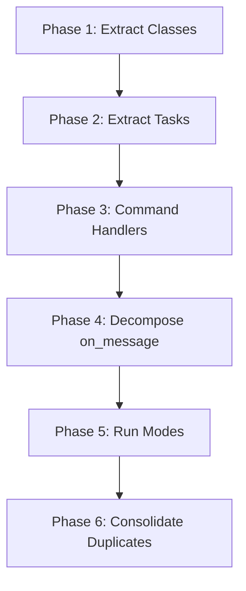

# Kaiacord Refactor Action Plan
## Technical Debt Assessment & Extraction Strategy

**Date:** February 5, 2026  
**Current State:** `Kaiacord.py` is 2,819 lines — a monolithic file that combines Discord bot logic, caching, filtering, file watching, background tasks, and two different run modes.

---

## Executive Summary

The codebase is **functional but bloated**. The main file contains 4 complete classes, 7 background tasks, 12+ helper functions, and an enormous 1,146-line `on_message` handler. The `utils/` directory already has good structure but the main file hasn't been decomposed to match.

### Health Metrics

| File | Lines | Verdict |
|------|-------|---------|
| `Kaiacord.py` | 2,819 | ❌ **Needs decomposition** |
| `utils/core/kaia_rag.py` | 1,564 | ⚠️ Large but focused |
| `utils/core/kaia_intelligence.py` | 934 | ✅ Well-structured |
| `utils/core/kaia_dream.py` | 477 | ✅ Good |
| `utils/core/kaia_image.py` | 349 | ✅ Good |
| `utils/core/kaia_vision.py` | 408 | ✅ Good |

---

## Phase 1: Extract Classes (Priority: High)

These classes are fully self-contained and should be moved to `utils/`:

### 1.1 `ImprovedSemanticCache` → `utils/core/semantic_cache.py`
**Lines:** 373-576 (203 lines)  
**Dependencies:** `difflib`, `json`, `re`, logging  
**Action:** Move class + merge with `SemanticCache` in `kaia_intelligence.py` (consolidate duplicate implementations)

### 1.2 `EmergencyContaminationFilter` → `utils/core/response_filter.py`
**Lines:** 578-734 (156 lines)  
**Dependencies:** `re`, logging  
**Action:** Move class as-is

### 1.3 `SelfHealingSystem` → `utils/infrastructure/system/self_healing.py`
**Lines:** 738-762 (24 lines)  
**Dependencies:** `asyncio`, logging  
**Action:** Move class as-is

### 1.4 `KnowledgeBaseWatcher` → `utils/infrastructure/system/file_watcher.py`
**Lines:** 777-846 (69 lines)  
**Dependencies:** `asyncio`, `watchdog`, logging  
**Action:** Move class + `start_watcher()` function

---

## Phase 2: Extract Background Tasks (Priority: High)

All 7 background tasks should move to `utils/infrastructure/tasks/`:

| Task | Lines | Target File |
|------|-------|-------------|
| `idle_quip_task` | 1027-1031 | `quip_task.py` |
| `rag_maintenance_task` | 1033-1041 | `maintenance_tasks.py` |
| `news_refresh_task` | 1043-1060 | `news_task.py` |
| `dream_engine_task` | 1062-1093 | `dream_task.py` |
| `social_mention_task` | 1095-1106 | `social_task.py` |
| `memory_audit_task` | 1164-1215 | `maintenance_tasks.py` |
| `sequenced_boot_tasks` | 931-990 | `boot_tasks.py` |

**Create:** `utils/infrastructure/tasks/__init__.py` that exports all tasks  
**Modify:** `Kaiacord.py` imports and registers tasks from this module

---

## Phase 3: Extract Command Handlers (Priority: Medium)

### 3.1 News Command System → `utils/commands/news_handler.py`
**Lines:** 881-928, 1217-1302 (130+ lines)  
**Includes:** `news_command()`, `handle_proper_news_query()`, `_format_news_response()`

### 3.2 Create Command Registry → `utils/commands/__init__.py`
**Pattern:** Central registration for all bot commands

---

## Phase 4: Decompose `on_message` (Priority: Critical)

The `on_message` handler (lines 1317-2463) is **1,146 lines** and does too much:

### Current Responsibilities:
1. Permission/channel filtering (lines 1320-1354)
2. Command dispatch (`!quip`, `!news`, `!dreams`, `!cache`) (lines 1355-1550)
3. Query classification (lines 1700-1800)
4. RAG retrieval (lines 1800-1950)
5. LLM response generation (lines 1950-2200)
6. Response filtering & sending (lines 2200-2463)

### Refactor Strategy:
```
utils/handlers/
├── __init__.py
├── permission_handler.py      # Channel/user filtering
├── command_dispatcher.py      # Route ! commands
├── query_processor.py         # Classification + RAG
├── response_generator.py      # LLM orchestration
└── response_formatter.py      # Filtering + Discord send
```

**Goal:** Reduce `on_message` to ~100 lines of orchestration

---

## Phase 5: Extract Run Modes (Priority: Low)

### 5.1 Curses Mode → `utils/dashboard/curses_mode.py`
**Lines:** 2652-2747 (95 lines)

### 5.2 Simple Mode → `utils/dashboard/simple_mode.py`
**Lines:** 2751-2794 (43 lines)

---

## Phase 6: Consolidate Duplicates (Priority: Medium)

### 6.1 Semantic Cache Consolidation
- `ImprovedSemanticCache` in `Kaiacord.py`
- `SemanticCache` in `kaia_intelligence.py`

**Action:** Merge into single `utils/core/semantic_cache.py`

### 6.2 Hallucination Detection Consolidation
- `EmergencyContaminationFilter` in `Kaiacord.py`
- `HallucinationDetector` in `kaia_rag.py`

**Action:** Consider merging or creating clear separation of concerns

---

## Technical Debt Summary

### Critical Issues
| Issue | Location | Impact |
|-------|----------|--------|
| 1146-line `on_message` | Kaiacord.py:1317-2463 | Unmaintainable |
| Duplicate cache classes | Main + kaia_intelligence | Confusion |
| Inline task definitions | Kaiacord.py | Can't unit test |
| Mixed concerns | on_message | Can't test RAG separately |

### Bare Exception Patterns
| File | Count | Severity |
|------|-------|----------|
| `kaia_rag.py` | 9 | Low (fallback contexts) |
| `tools/` (various) | 50+ | Low (utilities) |
| `Kaiacord.py` | 2 | Fixed (logged) |

### Missing Tests
- No unit tests for `ImprovedSemanticCache`
- No unit tests for `EmergencyContaminationFilter`
- No integration tests for `on_message` flow
- RAG tests are informal/diagnostic only

---

## Implementation Order



### Recommended Execution:
1. **Week 1:** Phase 1 (classes) + Phase 2 (tasks) — Low risk, high impact
2. **Week 2:** Phase 3 (commands) + Phase 6 (consolidation)
3. **Week 3:** Phase 4 (on_message decomposition) — Highest risk, requires careful testing
4. **Week 4:** Phase 5 (run modes) + Documentation

---

## Post-Refactor Target

```
Kaiacord.py (target: ~500 lines)
├── Imports
├── Global initialization
├── Bot event registration (@bot.event)
├── on_message (orchestration only, ~100 lines)
├── process_external_mention
├── Startup/cleanup functions
└── Main entry point

utils/
├── core/
│   ├── kaia_rag.py (1564 lines) — consider splitting persist/retrieve
│   ├── kaia_intelligence.py (934 lines) ✅
│   ├── semantic_cache.py (NEW — consolidated)
│   ├── response_filter.py (NEW)
│   └── ...
├── handlers/
│   ├── permission_handler.py (NEW)
│   ├── command_dispatcher.py (NEW)
│   ├── query_processor.py (NEW)
│   ├── response_generator.py (NEW)
│   └── response_formatter.py (NEW)
├── infrastructure/
│   ├── tasks/
│   │   ├── boot_tasks.py (NEW)
│   │   ├── maintenance_tasks.py (NEW)
│   │   ├── quip_task.py (NEW)
│   │   └── ...
│   └── system/
│       ├── file_watcher.py (NEW)
│       ├── self_healing.py (NEW)
│       └── ...
└── commands/
    ├── news_handler.py (NEW)
    └── ...
```

---

## Verification Plan

### For Each Phase:
1. **Before extraction:** Run bot, verify all features work
2. **After extraction:** Run bot, verify same behavior
3. **Smoke test commands:** `!quip`, `!news today`, `!dreams list`, `!cache stats`
4. **Check shutdown:** Ctrl+C should cleanly exit

### Future Tests (Post-Refactor):
- Unit test `SemanticCache.get()` and `SemanticCache.set()`
- Unit test `ResponseFilter.clean_response()`
- Integration test for full message flow

---

*Plan created: February 5, 2026*  
*Estimated total effort: 3-4 weeks for full decomposition*
